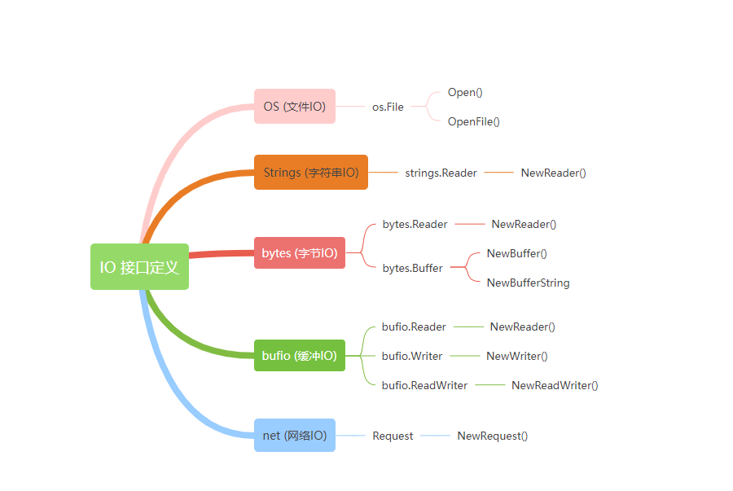
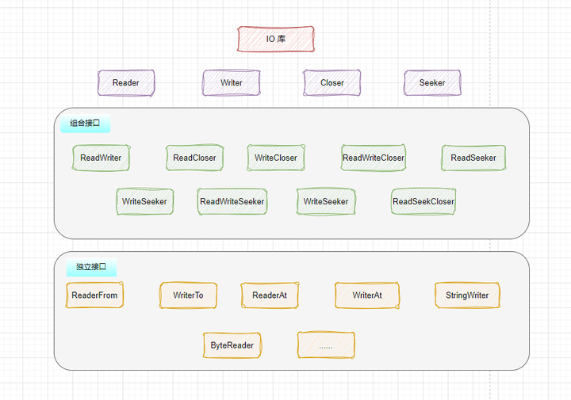

# 第四节课

***

## 前言


这节课我们主要学习Go语言标准库中常用的一些包。标准库提供了许多可靠、高效的基础功能，可以大大减少开发工作量。

*github上有那么多好用的外部库，为什么要学习标准库呢？*

##### 理解 Go 语言的核心设计和编程模式

Go 标准库是 Go 语言设计理念的直接体现，具有简洁、清晰和高效的特点。通过学习标准库，你能更好地理解 Go 语言的设计哲学

##### 增强解决问题的能力

标准库涵盖了很多基础但实用的功能，例如文件操作、网络编程、数据格式处理等。熟悉这些模块，意味着你可以在无需第三方库的情况下完成很多任务，甚至可以更灵活地应对一些细微差异和特殊情况 

##### 更好地理解外部库的实现

很多优秀的外部库是对标准库的进一步封装或优化。理解了标准库的基本功能，可以帮助你在使用外部库时更清楚它们的内部实现原理，更好地应对外部库的 bug 或限制

*标准库内容那么多，都要背下来吗？*

##### 不需要去背！

理解标准库中不同模块的用途和大概的使用方法就足够了，遇到具体需求时再去查文档或示例。标准库有很多包和函数，熟悉常用的即可


#### 文档

学习 Go 标准库可以从标准库文档入手：

- 中文： https://studygolang.com/pkgdoc
- 英文： https://pkg.go.dev/std

***
## fmt

fmt包实现了类似C语言printf和scanf的格式化I/O(input/output)

### 输出部分

**fmt.Print**：直接输出，不带格式，输出到标准输出

```go
func Print(a ...interface{}) (n int, err error)
```

```go
fmt.Print("Hello, Go!")
```

**fmt.Println**：在输出内容的末尾加一个换行符

```go
func Println(a ...interface{}) (n int, err error)
```

```go
fmt.Println("Hello, Go!")
```

**fmt.Printf**：格式化输出，支持使用格式化占位符

```go
func Printf(format string, a ...interface{}) (n int, err error)
```

```go
fmt.Printf("我的名字是 %s，我今年 %d 岁。\n", "小明", 20)
//输出：我的名字是小明，我今年20岁。

```

### 格式化占位符

`fmt.Printf` 函数支持多种格式化占位符，常用的包括：

- `%v`：值的默认格式。
- `%T`：类型的默认格式。
- `%s`：字符串。
- %b：二进制整数
- `%d`：十进制整数。
- %x：十六进制整数
- `%f`：浮点数。
- `%p`：指针。

%v和%T的示例

```go
m := map[string]int{"a": 1, "b": 2}
fmt.Printf("map的值: %v\n", m)
fmt.Printf("map的类型: %T\n", m)
输出：
map的值: map[a:1 b:2]
map的类型: map[string]int
```

**fmt.Sprintf()**:根据format参数生成格式化的字符串并返回该字符串

```go
func Sprintf(format string, a ...interface{}) string
```

```go
str := fmt.Sprintf("我的名字是 %s", "小明")
fmt.Println(str) // 输出：我的名字是小明
```

**fmt.Fprintf()**:将格式化的输出写入实现了 `io.Writer` 接口的对象

```go
func Fprintf(w io.Writer, format string, a ...interface{}) (n int, err error)
```

```go
// 创建或打开一个文件
  file, err := os.Create("output.txt")
  if err != nil {
      fmt.Println("文件创建失败:", err)
      return
  }
  defer file.Close()

  // 使用 Fprintf 将内容写入文件
  name := "小明"
  age := 20
  _, err = fmt.Fprintf(file, "我的名字是 %s，今年 %d 岁。\n", name, age)
  if err != nil {
      fmt.Println("写入文件失败:", err)
      return
  }

  fmt.Println("内容已成功写入文件")
```

同理还有Sprint，Sprintln，Fprint，Fprintln

### 输入部分

**fmt.Scan**：从标准输入中读取数据，以空格分隔，换行也视为空格（类似于c++中的cin）

```go
func Scan(a ...interface{}) (n int, err error)
```

```go
var name string
var age int

fmt.Print("请输入你的名字和年龄：")
_, err := fmt.Scan(&name, &age)
```

**fmt.Scanln**：读取一行输入，遇到换行符停止，支持多个空格分隔的值。

```go
func Scanln(a ...interface{}) (n int, err error)
```

```go
var sentence string

fmt.Print("请输入一句话：")
_, err := fmt.Scanln(&sentence)
```

**fmt.Scanf**:根据指定格式读取输入

```go
func Scanf(format string, a ...interface{}) (n int, err error)
```

```go
var name string
var age int

fmt.Print("请输入你的名字和年龄（格式：名字 年龄）：")
_, err := fmt.Scanf("%s %d", &name, &age)
```

**fmt.Fscanf**:从指定的 `io.Reader` 中根据指定格式读取输入

```go
func Fscanf(r io.Reader, format string, a ...interface{}) (n int, err error)
```

```go
file, err = os.Open("data.txt")
if err != nil {
    fmt.Println("无法打开文件:", err)
    return
}
defer file.Close()

var name string
var age int

// 从文件中读取数据
for {
    _, err := fmt.Fscanf(file, "%s %d\n", &name, &age)
    if err != nil {
        break // 读取完毕或出现错误
    }
    fmt.Printf("姓名: %s, 年龄: %d\n", name, age)
}
```

**fmt.Sscanf**:从字符串中读取格式化数据

```go
func Sscanf(str string, format string, a ...interface{}) (n int, err error)
```

```go
str := "Alice 30"

var name string
var age int

// 使用 Sscanf 从字符串中读取数据
n, err := fmt.Sscanf(str, "%s %d", &name, &age)
if err != nil {
    fmt.Println("解析错误:", err)
    return
}
```

同理还有Sscan,Sscanln,Fscan,Fscanln

### 错误处理

**fmt.Errorf**:根据format参数生成格式化字符串并返回一个包含该字符串的错误

```go
func Errorf(format string, a ...interface{}) error
```

```go
// 自定义函数，用于模拟错误场景
func divide(a, b float64) (float64, error) {
    if b == 0 {
        // 使用 fmt.Errorf 创建格式化的错误
        return 0, fmt.Errorf("不能将 %f 除以 0", a)
    }
    return a / b, nil
}
```

跟errors.New()功能类似，但是该方法提供了格式化的error类型，以及支持错误链的使用，有兴趣的同学自行了解


## io

`io` 库是 Go 里面 IO 相关的最核心的库，因为许多用于处理 I/O 操作的接口和函数定义在这个库里。虽然这个库不涉及具体 I/O 的实现，但是描述的是最核心的 I/O 接口语义。Go 语言的 `io` 包充分利用接口的特性，通过为不同的 I/O 操作提供一致的接口，提高了可扩展性和灵活性.

下面这张图充分体现了 Go 的 I/O 操作，都是以 io 库为中心发散的




#### 接口

> 基本接口

`io` 库中有两个最基本最重要的接口 `Reader` 和 `Writer`，它们各自拥有一个方法:

```go
type Reader interface {  
    Read(p []byte) (n int, err error)  
}

type Writer interface {  
    Write(p []byte) (n int, err error)  
}
```


- `Reader` 表示可读对象，`Read` 可以将最多 `len(p)` 个字节读入 `p`，返回读取到的字节数 `n`（0<=n<=len(p) 和遇到的任何错误
- `Writer` 表示可写对象，`Write` 将 `len(p)` 个字节从 `p` 写入底层数据流，返回成功写入的字节数 `n` (0<=n<=len(p)) 和遇到的任何错误

还有两个接口分别是

```go
type Closer interface {
	Close() error
}

type Seeker interface {
	Seek(offset int64, whence int) (int64, error)
}
```

- `Closer` 表示可以关闭的对象，`Close` 方法用于关闭对象，释放资源

- `Seeker` 接口定义了一个方法 `Seek`，其作用是改变文件、内存或其他数据源中的当前位置，通常用于随机访问文件或数据。

  `offset`：表示从 `whence` 开始移动的字节数

  `whence`：决定从哪个位置开始移动，支持以下三个常量

  - `io.SeekStart` (值为 0)：从文件或数据流的起始位置开始移动。
  - `io.SeekCurrent` (值为 1)：从当前位置开始移动。
  - `io.SeekEnd` (值为 2)：从文件或数据流的末尾位置开始移动。

Go通过组合这些接口的功能实现通用操作，比如将数据从一个`Reader`复制到一个`Writer`，这也是Go I/O操作简洁的关键。



- **Copy**：将数据从一个`Reader`复制到一个`Writer`，适合传输流数据。

  ```go
  func Copy(dst Writer, src Reader) (written int64, err error)
  ```

- **ReadAll**：将`Reader`中的所有数据读到一个字节切片中，适合一次性读取完整内容。

  ```go
  func ReadAll(r Reader) ([]byte, error)
  ```

  **ReadAtLeast**: 读取 `r` 中至少 `min` 字节数据，如果数据不足，会返回一个无法读取请求字节数的错误

  ```go
  func ReadAtLeast(r Reader, buf []byte, min int) (n int, err error)
  ```

  **ReadFull**: 读取 `r` 中 `len(buf)` 字节数据，如果数据不足，会返回一个无法读取请求字节数的错误

  ```
  func ReadFull(r Reader, buf []byte) (n int, err error)
  ```

- **TeeReader**：创建一个`Reader`，在读取数据时也会将数据写入一个`Writer`，常用于调试。

  ```go
  func TeeReader(r Reader, w Writer) Reader
  ```

注：去看go标准库资料你会发现有个包叫io/ioutil，在Go1.16以后，ioutil包被全面弃用，你可用io和os包中的方法替代其中的功能。（gpt生产的代码可能会含有ioutil包，能用，但是最好更换掉）

演示

```go
package main

import (
    "io"
    "os"
)

func main() {
    src, _ := os.Open("source.txt")
    defer src.Close()

    dst, _ := os.Create("destination.txt")
    defer dst.Close()

    io.Copy(dst, src) // 直接从src复制到dst
}

```


## os

负责与操作系统交互。文件操作、环境变量管理、进程控制等

### 文件操作

说到这里，就不得不提及一个非常常用的数据类型：`os.File`

从字面上来看，`os.File`类型代表了操作系统中的文件。但实际上，它可以代表的远不止于此。或许你已经知道，对于类Unix的操作系统（包括Linux、macOS、FreeBSD等），其中的一切都可以被看做是文件。

除了文本文件、二进制文件、压缩文件、目录这些常见的形式之外，还有符号链接、各种物理设备（包括内置或外接的面向块或者字符的设备）、命名管道，以及套接字（也就是socket），等等。

因此，可以说，我们能够利用`os.File`类型操纵的东西太多了。不过为了方便理解，我们在这里主要把`os.File`类型应用于常规的文件

#### 文件打开

**os.Open**：以只读模式打开文件(想要写入需要用OpenFile)

```go
func Open(name string) (file *File, err error)
```

**`os.Create`**：创建一个新文件，如果文件已存在则将其清空（验证一下）

```
func Create(name string) (file *File, err error)
```

**`os.OpenFile`**：提供更多的选项，可以自定义打开文件的模式。

```go
func OpenFile(name string, flag int, perm FileMode) (file *File, err error)
```

openfile是一个更具一般性的打开文件方法

perm是一个关于文件权限的参数，如果文件已存在会忽略，大家下去自行了解

`flag` 可以选下列的值:

- `os.O_RDONLY`：只读
- `os.O_WRONLY`：只写
- `os.O_RDWR`：读写
- `os.O_APPEND`：追加写
- `os.O_CREATE`：如果文件不存在则创建
- `os.O_TRUNC`：打开时清空文件
- `os.O_EXCL`: 和 `os.O_CREATE` 配合使用，文件必须不存在
- `os.O_TRUNC`: 打开时清空文件

例子

```go
file, err := os.OpenFile("example.txt", os.O_RDWR|os.O_CREATE, 0666)
if err != nil {
    // 处理错误
}
defer file.Close()
```

#### 文件读取/写入

**`File.Read`**：`os.File`类型实现了`io.Reader`接口，因此可以调用`Read`方法来读取数据。Read方法从f中读取最多len(b)字节数据并写入b，文件终止标志是读取0个字节且返回值err为io.EOF。（要读完整的文件得加个for）

```go
func (f *File) Read(b []byte) (n int, err error)
```

```go
buf := make([]byte, 1024) // 创建缓冲区
n, err := file.Read(buf)
if err != nil {
    // 处理错误
}
fmt.Println("Read bytes:", n, "Content:", string(buf[:n]))
```

**`os.ReadFile`**：直接读取整个文件并返回内容，适用于小文件。

```go
data, err := os.ReadFile("example.txt")
if err != nil {
    // 处理错误
}
fmt.Println("File content:", string(data))
```

**`File.Write`**：`os.File`类型实现了`io.Writer`接口,向文件写入字节切片数据。

```go
func (f *File) Write(b []byte) (n int, err error)
```

```go
n, err := file.Write([]byte("Hello, Go!"))
if err != nil {
    // 处理错误
}
fmt.Println("Wrote bytes:", n)
```

**`File.WriteString`**：向文件写入字符串数据。

```go
func (f *File) WriteString(s string) (ret int, err error)
```

```go
_, err := file.WriteString("Hello, Go!")
if err != nil {
    // 处理错误
}
```

**`os.WriteFile`**：直接写入数据到文件，适用于简单写入。

```go
err := os.WriteFile("output.txt", []byte("Hello, World!"), 0644)
if err != nil {
    // 处理错误
}
```

**`os.Stat`**：获取文件信息，返回`os.FileInfo`接口，包含文件的基本信息，如大小、模式、修改时间等。

```go
func Stat(name string) (fi FileInfo, err error)
```

```go
info, err := os.Stat("example.txt")
if err != nil {
    // 处理错误
}
fmt.Println("Name:", info.Name())
fmt.Println("Size:", info.Size())
fmt.Println("Mode:", info.Mode())
fmt.Println("ModTime:", info.ModTime())
```

### 文件目录操作

**Remove**：删除name指定的文件或目录。

```go
func Remove(name string) error
```

**Mkdir**：使用指定的权限和名称创建一个目录

**MkdirAll**：使用指定的权限和名称创建一个创建多层级目录

```go
func Mkdir(name string, perm FileMode) error
```

**Rename**：修改一个文件的名字，移动一个文件。可能会有一些个操作系统特定的限制。

```go
func Rename(oldpath, newpath string) error
```

### 环境变量

**Environ**：获取所有环境变量，并返回格式为 `key=value` 的字符串切片

```go
func Environ() []string
```

**Getenv**：获取指定的环境变量

```go
func Getenv(key string) string
```

**Setenv**：设置环境变量

```go
func Setenv(key, value string) error
```

### 命令行参数

假设我们想创建一个程序，它接受一个名字作为命令行参数，并输出一条欢迎消息。

```go
package main

import (
    "fmt"
    "os"
)

func main() {
  var args []string = os.Args
    if len(args) < 2 {
        fmt.Println("你没有提供名字哦")
        return
    }
    name := args[1] // 获取第一个命令行参数
    fmt.Printf("你好, %s!\n", name)
}
```

如果你在Go文件所在的目录中运行这个程序，可以使用以下命令，并传入一个名字参数：

```shell
go run main.go Alice
```

这样程序会输出：你好，Alice

想使用更丰富的命令行参数的功能，可自行学习flag包的使用


## bufio

`bufio` 包主要用于优化 I/O 操作，通过使用缓冲区在内存中临时存储数据，从而减少对文件或网络连接等底层数据流的频繁操作。这在处理大文件、网络连接或需要逐行读取的文本文件时非常有用。

`bufio` 提供了三种核心类型：`bufio.Reader`、`bufio.Writer` 和 `bufio.Scanner`，它们分别用于**缓冲读取**、**缓冲写入**和**逐行扫描**

### Reader

`bufio.Reader` 是一个带有缓冲区的 `io.Reader` 接口的实现，它会在内存中存储从底层 `io.Reader` 中读取到的数据，然后先从内存缓冲区中读取数据，这样可以减少访问底层 `io.Reader` 对象的次数以及减轻操作系统的压力。结构体定义：

```go
type Reader struct {  
    buf          []byte  
    rd           io.Reader // reader provided by the client  
    r, w         int       // buf read and write positions   
    err          error  
    lastByte     int // last byte read for UnreadByte; -1 means invalid  
    lastRuneSize int // size of last rune read for UnreadRune; -1 means invalid  
}
```

其中`r`，`w` 是两个偏移量表示缓冲区中读写的位置。当从缓冲区中读取数据时，`r` 增加，当调用底层 `io.Reader` 的 `Read` 方法读取数据到缓冲区时，`w` 增加

**NewReader**:创建Reader

**NewReaderSize:**创建自定义大小的缓冲

```go
func NewReader(rd io.Reader) *Reader
```

```go
file, err := os.Open("example.txt")
if err != nil {
    log.Fatal(err)
}
defer file.Close()

reader := bufio.NewReader(file)

```

**主要方法**

**Read**:读取数据写入p。本方法返回写入p的字节数。本方法一次调用最多会调用下层Reader接口一次Read方法，因此返回值n可能小于len(p)。读取到达结尾时，返回值n将为0而err将为io.EOF。

```go
func (b *Reader) Read(p []byte) (n int, err error)
```

**ReadByte**:读取并返回一个字节。如果没有可用的数据，会返回错误。

```go
func (b *Reader) ReadByte() (c byte, err error)。
```

**ReadRune**:读取一个utf-8编码的unicode码值，返回该码值、其编码长度和可能的错误。如果utf-8编码非法，读取位置只移动1字节，返回U+FFFD，返回值size为1而err为nil。如果没有可用的数据，会返回错误。

```go
func (b *Reader) ReadRune() (r rune, size int, err error)
```


### Writer

**NewWriter**:创建Writer

**NewWriterSize:**创建自定义大小的缓冲

```go
func NewWriter(w io.Writer) *Writer
```

```go
file, err := os.Create("output.txt")
if err != nil {
    log.Fatal(err)
}
defer file.Close()

writer := bufio.NewWriter(file)

```

**Writer**:Write将p的内容写入缓冲。返回写入的字节数。如果返回值nn < len(p)，还会返回一个错误说明原因。

```go
func (b *Writer) Write(p []byte) (nn int, err error)
```

**WriteString**:写入一个字符串。返回写入的字节数。如果返回值nn < len(s)，还会返回一个错误说明原因。

```go
func (b *Writer) WriteString(s string) (int, error)
```

**WriteByte**:WriteByte写入单个字节。

```go
func (b *Writer) WriteByte(c byte) error
```

**WriteRune**:WriteRune写入一个unicode码值（的utf-8编码），返回写入的字节数和可能的错误。

```go
func (b *Writer) WriteRune(r rune) (size int, err error)
```

**Flush**:Flush方法将缓冲中的数据写入下层的io.Writer接口。

```go
func (b *Writer) Flush() error
```

### sacanner

**Newscanner**:创建scanner

```go
func NewScanner(r io.Reader) *Scanner
```

**Scan**：获取当前位置的token（该token可以通过Bytes或Text方法获得），并让Scanner的扫描位置移动到下一个token。当扫描因为抵达输入流结尾或者遇到错误而停止时，本方法会返回false。在Scan方法返回false后，Err方法将返回扫描时遇到的任何错误；除非是io.EOF，此时Err会返回nil。

```go
func (s *Scanner) Scan() bool
```

**Bytes**：返回最近一次Scan调用生成的token。底层数组指向的数据可能会被下一次Scan的调用重写。

```go
func (s *Scanner) Bytes() []byte
```

**Text**：返回最近一次Scan调用生成的token，会申请创建一个字符串保存token并返回该字符串。

```go
func (s *Scanner) Text() string
```

**Err**返回Scanner遇到的第一个非EOF的错误

```go
func (s *Scanner) Err() error
```


示例

```go
package main

import (
    "bufio"
    "fmt"
    "os"
)

func main() {
    file, err := os.Open("example.txt")
    if err != nil {
        fmt.Println("Error opening file:", err)
        return
    }
    defer file.Close()

    scanner := bufio.NewScanner(file)
    for scanner.Scan() {
        line := scanner.Text()  // 读取一行数据
        fmt.Println(line)
    }

    if err := scanner.Err(); err != nil {
        fmt.Println("Error reading file:", err)
    }
}

```


## strconv

`strconv` 包用于在字符串和基本数据类型之间进行转换

### 字符串转整数/浮点数

**Atoi**:将字符串转换为 int 类型(Atoi是ParseInt(s, 10, 0)的简写)

```go
func Atoi(s string) (int, error)
```

**ParseInt**：字符串转任意进制整数

**ParseUint**：字符串转无符号整数

```go
func ParseInt(s string, base int, bitSize int) (i int64, err error)
func ParseUint(s string, base int, bitSize int) (uint64, error)
```

```go
num, err := strconv.ParseInt("1010", 2, 64)  // 解析二进制 "1010" 为 64 位整数
if err != nil {
    fmt.Println("Error:", err)
} else {
    fmt.Println("Binary to int:", num)  // 输出：Binary to int: 10
}
```

**ParseFloat**：字符串转浮点数

```go
func ParseFloat(s string, bitSize int) (f float64, err error)
```

### 整数/浮点数转字符串

**Itoa**：`int` 转字符串(Itoa是FormatInt(i, 10) 的简写)

```go
func Itoa(i int) string
```

**FormatInt**：任意进制整数转字符串

**FormatInt**:是FormatInt的无符号整数版本

```go
func FormatInt(i int64, base int) string
```

```go
func FormatUint(i uint64, base int) string
```

**FormatFloat**：浮点数转字符串

```go
func FormatFloat(f float64, fmt byte, prec, bitSize int) string
```

### 字符串扩展

```go
func AppendUint(dst []byte, i uint64, base int) []byte
```

```go
b := []byte("number:")
b = strconv.AppendInt(b, 123, 10)
fmt.Println(string(b))  // 输出：number:123
```

如 `AppendInt`，它实际上等价于 `append(dst, FormatInt(I, base)...)`

类似的函数还有 `AppendBool`、`AppendInt`、 `AppendUint`……


## strings & bytes

`bytes` 和 `strings` 包分别提供了对字节切片 (`[]byte`) 和字符串 (`string`) 的高效操作函数。这两个包中的许多函数名称、用法相似，适用于不同的数据类型，方便在处理文本、字符和字节时选择合适的工具

由于两个包的方法非常多，建议大家**自行查看标准库文档熟悉**,本文只列举一些可能重要一些的

### Strings

**contains**:判断字符串s是否包含子串substr

```go
func Contains(s, substr string) bool
```

**NewReader**：创建一个从s读取数据的Reader。本函数类似bytes.NewBufferString，但是更有效率，且为只读的。

（创建一个 `strings.Reader`，可以将字符串转换为 `io.Reader`）

```go
func NewReader(s string) *Reader
```

**ToUpper / ToLower**:将字符串转换为大写或小写

```go
func ToLower(s string) string
```

```go
func ToUpper(s string) string
```

```go
fmt.Println(strings.ToUpper("Hello")) // "HELLO"
fmt.Println(strings.ToLower("WORLD")) // "world"
```

**Split / SplitN**:将字符串按指定分隔符分割成切片，`SplitN` 限制分割的次数。

```go
func Split(s, sep string) []string
```

```go
func SplitN(s, sep string, n int) []string
```

```go
fmt.Println(strings.Split("a,b,c", ","))    // ["a" "b" "c"]
fmt.Println(strings.SplitN("a,b,c", ",", 2)) // ["a" "b,c"]
```

**Index / LastIndex**:查找子串在字符串中首次或最后一次出现的位置，找不到则返回 `-1`

```go
func Index(s, sep string) int
```

```go
func LastIndex(s, sep string) int
```

类似的还有IndexByte,IndexAny...

**Replace **:返回将s中前n个不重叠old子串都替换为new的新字符串，如果n<0会替换所有old子串。

```go
func Replace(s, old, new string, n int) string
```

**strings.Builder**: 是 Go 语言中用于高效构建字符串的结构体，特别适合频繁的字符串拼接操作

```go
func (b *Builder) Write(p []byte) (int, error) //字符串追加到缓冲区
func (b *Builder) WriteString(s string) (int, error)//将字节切片追加到缓冲区
func (b *Builder) Len() int // 返回缓冲区中的字节数
func (b *Builder) Reset() //将缓冲区长度重置为 0
func (b *Builder) String() string // 返回缓冲区的内容作为字符串
```

示例

```go
var b strings.Builder
b.Write([]byte("Hello"))
b.Write([]byte(", world!"))
fmt.Println(b.String()) // 输出 "Hello, world!"
```


### Bytes

**Equal / EqualFold**：`Equal` 用于检查两个字节切片内容是否完全相等。`EqualFold` 用于不区分大小写的比较。（byte切片不能用==直接比较）

```go
func Equal(a, b []byte) bool
```

bytes包的很多方法跟strings非常像，这里不一一列举了

同时跟 `strings.Reader` 差不多 `bytes.Reader` 也实现了读相关的接口


**Buffer**：是一个实现了读写方法的可变大小的字节缓冲。本类型的零值是一个空的可用于读写的缓冲。

**NewBuffer**：使用buf作为初始内容创建并初始化一个Buffer

大多数情况下，new(Buffer)（或只是声明一个Buffer类型变量）就足以初始化一个Buffer了。

```go
func NewBuffer(buf []byte) *Buffer
```

常用的方法

```go
func (b *Buffer) Write(p []byte) (n int, err error)    // 将 p 写入缓冲区
func (b *Buffer) WriteString(s string) (n int, err error)   // 将 s 写入缓冲区
func (b *Buffer) Read(p []byte) (n int, err error) // 从缓冲区读取数据到 p
```

常用的操作

```go
func (b *Buffer) Reset()   // 清空缓冲区的内容
func (b *Buffer) Len() int     // 返回缓冲区中未读取的字节数
func (b *Buffer) Cap() int      // 返回缓冲区的容量
func (b *Buffer) Bytes() []byte   // 以字节切片返回所有未读取的数据
func (b *Buffer) String() string    // 以字符串返回所有未读取的数据
```

性能优化：

面对大量拼接字符串的时候，减少使用+

转用strings.builder或者bytes.buffer，能减少花费的空间和时间


## time

### 时间

`time` 包中的时间使用结构体 `Time` 表示:

```go
type Time struct {
    wall uint64 // 表示墙上时钟时间（wall clock time），存储纳秒时间戳和时区信息
    ext  int64  // 扩展时间，存储Unix时间戳
    loc  *Location // 时区信息，指向Location结构体
}
```


**time.Now()**获取当前时间

```go
func Now() Time
```

```go
func (t Time) Clock() (hour, min, sec int) // 返回 t 对应的时、分、秒
func (t Time) Hour() int 
func (t Time) Minute() int
func (t Time) Second() int
func (t Time) Nanosecond() int

type Month int
func (t Time) Date() (year int, month Month, day int) // 返回 t 对应的年、月、日
func (t Time) Year() int
func (t Time) Month() Month
func (t Time) Day() int
```


### 操作

#### 格式化方法

**`Format` **方法将 `time.Time` 转换为格式化的字符串

```go
func (t Time) Format(layout string) string
```

**time.Parse**:将字符串通过格式转化成time.Time

```go
func Parse(layout, value string) (Time, error)
```

tips：Go语言中格式化时间模板不是常见的 `Y-m-d H:M:S` 而是使用Go语言的诞生时间 2006 年 1 月 2 号 15 点 04 分 05 秒，也就是 `2006-01-02 15:04:05`（记不住没关系，IDE会帮你的）

#### 时间操作

**Add**：时间点t1+时间段d，返回新的时间点t2

```go
func (t Time) Add(d Duration) Time
```

**Sub**：时间点t1-时间点t2，返回一个时间段

```go
func (t Time) Sub(u Time) Duration
```

```go
func (t Time) Equal(u Time) bool    // `Equal` 判断 t 和 u 是否相同，注意如果精度不同，两个时间也是不一样的
func (t Time) Before(u Time) bool   // `Before` 判断 t 是否在 u 之后
func (t Time) After(u Time) bool    // `After` 判断 t 是否在 u 之前
```


#### 时间段

time` 包中，用来表示时间段（纳秒为单位）的是 `Duration

```go
type Duration int64
```

`Duration` 最大大约能表示 290 年

常见操作

```go
func Since(t Time) Duration         // `Since` 返回 t 到现在经过的时间
func Until(t Time) Duration         // `Until` 返回现在到 t 的时间
func (t Time) Truncate(d Duration) Time  // `Truncate` 将时间阶段为某一精度
```

#### 时间戳 

**时间戳**是一种用于标记特定时间点的数字表示，通常表示自某个基准时间点（如 1970 年 1 月 1 日 00:00:00 UTC，即 Unix 纪元）以来的秒数或毫秒数。时间戳广泛应用于计算机系统中，用来记录事件的发生时间，便于排序、同步和计算时间间隔

时间转换到Unix时间戳

```go
func (t Time) Unix() int64        // 秒
func (t Time) UnixMilli() int64   // 毫秒
func (t Time) UnixMicro() int64   // 微秒
func (t Time) UnixNano() int64    // 纳秒
```


Unix时间戳转换到时间

```go
func Unix(sec int64, nsec int64) Time   // 秒和纳秒
func UnixMilli(msec int64) Time         // 毫秒
func UnixMicro(usec int64) Time         // 微秒
```


### 时区

在 Golang 的 `time` 包中，时区用结构体 `Location` 表示

UTC 标准时间是以 GMT（Greenwich Mean Time，格林尼治时间）这个时区为主，所以本地时间与 UTC 时间的时差就是本地时间与 GMT 时间的时差。

```
UTC + 时间差 = 本地时间
```


可以通过`FixedZone`和`LoadLocation方法来获取变量

```go
func FixedZone(name string, offset int) *Location
```

```go
package main

import (
    "fmt"
    "time"
)

func main() {
    // 创建一个固定偏移时区 (+8小时)
    loc := time.FixedZone("CST", 8*3600)

    // 获取当前时间并设置时区
    now := time.Now().In(loc)
    fmt.Println("自定义时区 (+8):", now)
}

```


```go
func LoadLocation(name string) (*Location, error)
```

```go
loc, err := time.LoadLocation("Asia/Shanghai")
if err != nil {
    fmt.Println("加载时区失败:", err)
    return
}

// 获取当前时间并转换为指定时区
now := time.Now().In(loc)
fmt.Println("上海时间:", now)
```

**`In`**: 返回采用 `loc` 指定的时区的时间

```go
func (t Time) In(loc *Location) Time
```


### 定时器

在 Go 语言中，`time` 包提供了 `Timer` 和 `Ticker` 两种类型，用于处理定时和周期性的时间事


Timer

```go
func NewTimer(d Duration) *Timer
```

`Timer` 类型表示一个单次事件。在未来的某个时间点，`Timer` 会发送一个值到它的 `C` 通道，使用 `ticker` 的 `Stop` 方法可以提前停止它

```go
timer := time.NewTimer(3 * time.Second)
    fmt.Println("等待 3 秒...")

    // 通过通道接收计时结束信号
    <-timer.C
    fmt.Println("计时结束！")
```


Ticker

```go
func NewTicker(d Duration) *Ticker
```

#### Ticker 使用方法

- 创建 `Ticker`：使用 `time.NewTicker(d)` 创建一个周期性触发的 `Ticker`，`d` 是时间间隔。
- 接收触发信号：每隔 `d` 时间，`Ticker` 的 `C` 通道会收到当前时间。
- 常用方法：
  - **`Stop()`**：停止 `Ticker`，不再发送信号。
  - **`Reset(d)`**：重置 `Ticker` 的间隔

```go
ticker := time.NewTicker(1 * time.Second)
for t := range ticker.C {
    fmt.Println("当前时间:", t)
}
```


***


## 作业


### LV0

将自己不熟悉的包敲一遍（无需提交）

### LV1

借助这节课学习的 `time` 包和 `bufio` 包自己验证一下带缓冲 I/O 写是否比不带缓冲 I/O 写的效率更高（通常写入次数越多差异越明显）

TIPS:用 `time.Since`记录花费的时间

### LV2

通过这节课的学习，相信你们都对 Go 语言的 I/O 有了比较清晰的认识。那么自己动手来实现一个日志 I/O 接口吧

需要实现的功能：

1. 将日志信息保存在文件
2. 日志信息中要包含时间和Unix时间戳

参考下面的代码

```go
func main() {
  
	// 打开一个日志文件，如果文件不存在则创建，追加写入
  file,err:=os.openFile......
	// 创建一个带时间戳的写入器
	logWriter := newTimestampWriter(file)
	
	// 模拟用户操作并记录日志
	fmt.Fprintln(logWriter, "用户登录")
	time.Sleep(2 * time.Second)
	fmt.Fprintln(logWriter, "用户执行操作A")
	time.Sleep(1 * time.Second)
	fmt.Fprintln(logWriter, "用户执行操作B")
}

// timestampWriter 是一个实现 io.Writer 接口的结构体，它在写入数据前添加时间和时间戳
type timestampWriter struct {
	logFile io.Writer
}
//传入一个io.writer,file实现了io.writer接口
func newTimestampWriter(w io.Writer) *timestampWriter {
	return &timestampWriter{logFile: w}
}

func (tw *timestampWriter) Write(p []byte) (n int, err error) {
	// 添加时间戳和时间
	
	// 输出到文件
}
```


### LV2 PLUS

将日志信息同时输出文件和控制台中

TIPS: `io.MultiWriter`

实现任何你想实现的功能：

1. 通过环境变量，命令行参数（可以自己了解一下 `flag` 包），配置文件等方式指定日志文件路径
2. 提供日志级别功能
3. 允许自定义日志格式
4. ……

### LV PRO MAX

实现一个文件同步工具，编写一个文件同步工具，可以监视目录中的文件变化，并在文件修改时自动将变化同步到另一个目录。

TIPS:

- 可以用 `os.Stat()` 获取文件信息
- 可以用 `os.File.Readdir` 获取目录下所有文件的信息
- `os.FileInfo.Modtime` 可以获取文件更新的时间，当然也可以通过别的方法判断文件是否被修改
- `time.Ticker` 实现周期事件，或者自己了解一下 `cron`

### LV ？（选做）

想提 PR 但是无从下手？来挑挑蓝山后端 Go 课件的毛病吧！可以是错别字、格式、代码错误……

欢迎各位提出意见


作业提交至heqimeng@lanshan.email

***

## 初识开源

### 什么是开源

开源项目是指通过公开可用的源代码，允许任何人查看、使用、修改和分享的项目。一些比较出名的开源项目有：

- Linux 内核
- Apache HTTP Server
- Python
- Docker
- K8S
- ……

开源项目有很多种组织模式，比如个人项目、开源社区……这里主要介绍开源社区，也是许多开源项目常见的组织形式。

开源社区是一个由志愿者组成的社群，致力于共同开发和分享开源软件、硬件或其他项目的社会集体。在开源社区中，人们可以自由地查看、使用、修改和分享项目的源代码，使用分散和协作的方式进行开源软件的开发。
### 开源项目的运作

>开源项目的一些重要角色和元素：

- 项目维护者Maintainer：维护者有一位或者多位，他们启动开源项目、管理项目、制定决策、集思广益并且和贡献者、用户以及营销平台密切接触。
- 项目贡献者Contributor：顾名思义对参与项目贡献的人，项目越大贡献者越多，具体的贡献方式下面会介绍到
- 用户User：开源项目的消费者、使用者
- 源代码和文档库Source Code & Documentation Library：维护者将项目源代码保存在一个中心化的源代码库（如 Github）。这样所有贡献者就可以访问代码并且参与贡献。开源项目的文档库包括安装指南、使用手册、贡献指南等，有助于新用户和开发者更好地理解和参与项目。
- 项目许可证License：每一个开源项目都必须指定一个分发许可证，主要作用是规定其他人使用、修改或分享你的开源项目的行为。一些常见的开源许可证包括MIT许可证、GNU通用公共许可证（GPL）、Apache许可证、BSD许可证等。
- 贡献指南：帮助贡献者理解合并请求（pull request）的流程、标准、范围等。

>什么是开源项目贡献

开源贡献就是使用一切办法提升开源项目，很多以为开源贡献只能贡献源代码（开始我也这么觉得）但其实还有很多其他方式：

- 优化项目文档，帮助贡献者和用户更容易参与和使用
- 测试应用，发现问题，提 issue
- 编写单元测试、端到端测试，使得应用的质量更高
- 写文章或制作视频等，为项目布道
- ……

>开源项目的开发流程

一个具有一定规模的开源项目一般有一套成熟的开发流程，主要包括以下步骤：

1. 新想法的提出，可以是一个新项目、新特性或是对现有项目的提升
2. 基于这个被提议的功能，社区里志愿的开发人员完成相关开发并创建一个对现有项目的合并请求（Pull Request）
3. 社区中更有经验的人（通常是 Maintainer 或 Reviewer）将审查被提交的代码更改并决定是否应将其合并到代码的主要版本中，也可能要求作出一定的修改
4. 将当前版本作为一个开发版本来发布，即使它可能包含已知和未知的 bugs。然后，该软件将由社区进行测试，并提供反馈，项目成员和维护人员会记录并考虑社区反馈并改进实施，然后将提供新的开发版本
5. 反馈的循环会发生多次，直到项目成员认为软件的执行足够稳定，最后作为稳定版本发布
### PR

一般来说，直接向主仓库（通常是上游仓库，即项目的原始仓库）推送修改是有限制的。这是因为直接推送可能会导致冲突、代码覆盖和其他问题。开源项目一般是通过 PR(Pull Request) 允许其他开发者为项目做出贡献同时确定代码质量的。

那么如何提一个 PR 呢？我们需要遵循以下步骤：

1. Fork 项目：访问你想要为其做出贡献的项目的 GitHub 页面，点击右上角的"Fork"按钮，将该项目复制到你的GitHub账户下，这会在你的账户中创建一个对应的 Fork 仓库
2. 克隆仓库：将上面说的 Fork 仓库克隆到本地
3. 创建分支：在你的本地仓库中，创建一个新的分支
4. 修改：在这个新的分支上进行修改和提交
5. 推送到 Fork 仓库：将这个本地分支推送到你账户上的  Fork 仓库中
6. 创建 PR：现在在你的仓库中出现了一个 `Compare & pull request` 按钮，单击创建一个 PR
7. 根据社区规范填写 PR 表单：提交 PR 时，你会看到一个表单，填写标题和描述，解释你的修改是什么，为什么需要这个修改等。
8. 等待审核：提交了 PR 之后，项目维护者会审查你的代码。可能会有讨论、修改的请求，直到最终合并或关闭。如果在审查中有修改，需要在本地更新分支，然后再次推送

### 怎么找到自己感兴趣的开源项目？

#### Github Explore

GitHub Explore 会向你展示你感兴趣的仓库，你可以给特定仓库设置提醒。

https://github.com/explore/

#### Github Trending

GitHub 提供了一个 "Trending" 页面，用于显示当前在 GitHub 上流行的开源项目。这个页面上列出了每日、每周和每月的趋势，涵盖了各种编程语言和主题。

https://github.com/trending

#### Github 直接搜索

- `in:name <关键字>` 仓库名称带关键字查询
- `in:description <关键字>` 仓库描述带关键字查询
- `in:readme <关键字>` README 文件带关键字查询
- `stars(fork): >(=) <数字> <关键字>` star 或 fork 数大于(或等于)指定数字的带关键字查询
- `stars(fork): 10..20 <关键词>` star 或 fork 数在 10 到 20 之间的带关键字查询
- `size:>=5000 <关键词>` 限定仓库大于等于 5000K 的带关键字查询
- `pushed(created):>2019-11-15 <关键字>` 更新 或 创建 日期在 2019 年 11 月 16 日之后的带关键字查询
- `license:apache-2.0 <关键字>` LICENSE 为 apache-2.0 的带关键字查询
- `language:java <关键词>` 仓库语言为 Java 的带关键字查询
- `user:<用户名>` 查询某个用户的项目
- `org:<组织名>` 查询某个组织的项目 这些可以混合使用，也可以先查找某一类的 awesome 仓库，然后从 awesome 库里找相关的资源，github 里有很多归纳仓库，可以先看看已有的收集，有时候会节省很多时间

可以根据下面几个标准判断项目热度：

1. Star 数量
2. Fort 数量
3. 项目代码更新日期

#### 技术论坛

- 掘金
- Stack Overflow
- Reddit
- ……

### 从开源项目中我们能学到什么

贡献开源项目对于开发者来说好处多多，但是主要的好处有：

- 抓住机会、提高技能水平
- 提高软件/应用的代码和文档水平
- 接触想法相似的朋友、建立人脉和社区
- 理解应用开发和维护的流程
- 从 Pull Request 反馈中学习
- 学习如何管理自己的开源项目

## 拓展阅读

1. [浅析Go IO 的知识框架](https://zhuanlan.zhihu.com/p/394888082)
2. [Golang 中的 io 包详解](https://blog.csdn.net/luduoyuan/article/details/131057066) 
3. [github 参与开源项目开发或贡献代码流程](https://www.cnblogs.com/yuejunasia/p/15161915.html)
4. [初学者开源项目参与指南](https://www.freecodecamp.org/chinese/news/a-practical-guide-to-start-opensource-contributions/)
