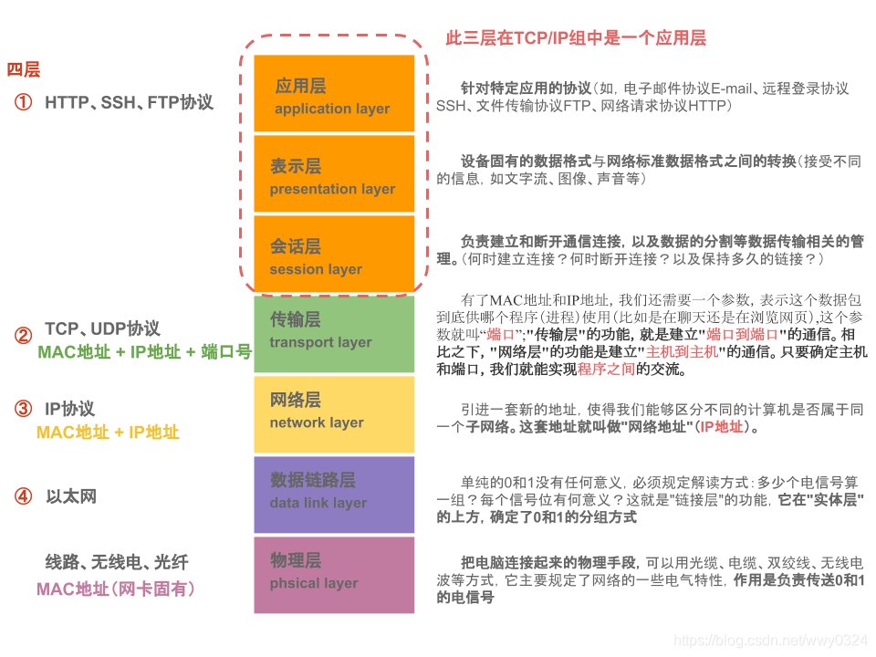
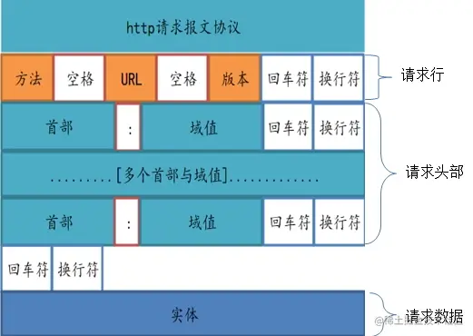
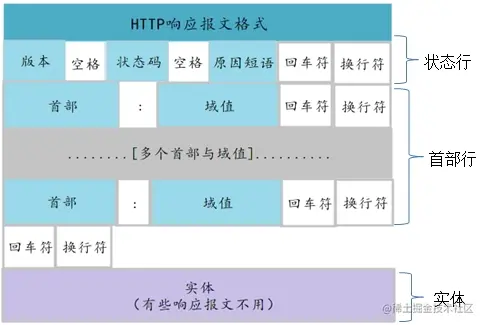
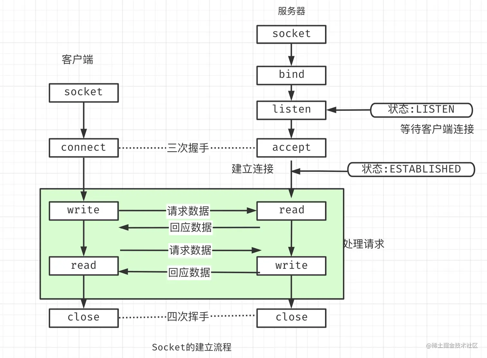
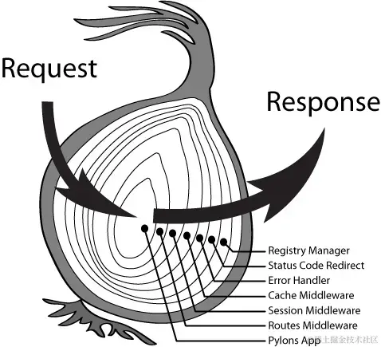
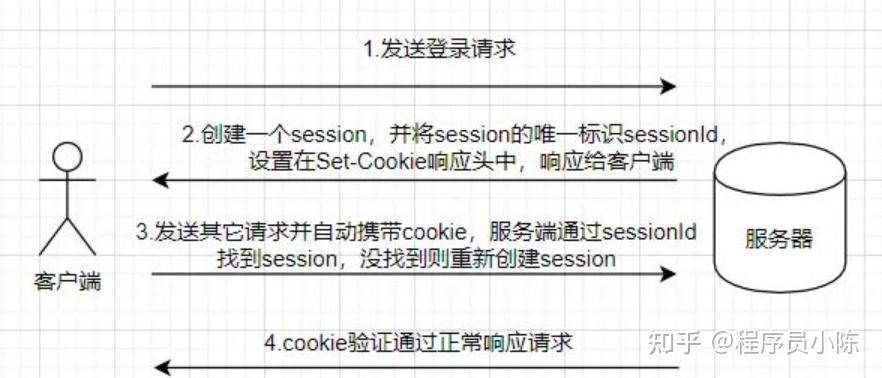
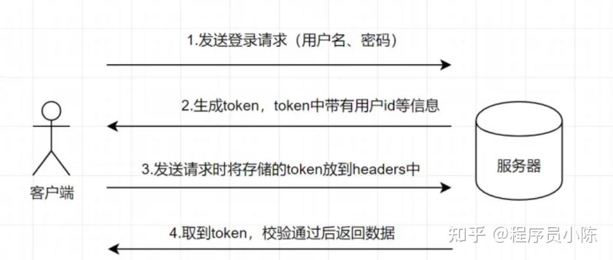
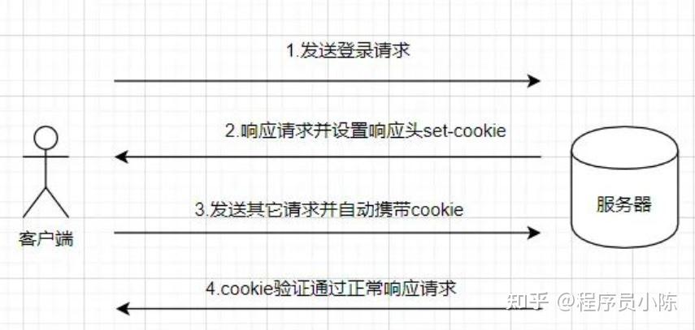

# 第六节课

# web基础

## 前言——计算机网络

计算机网络的核心目标是**在不同的计算设备之间高效、可靠地传递信息**。为了实现这一目标，网络系统被分成多个层次，每一层都解决传输过程中特定的问题。



最上层的，也是我们能直接接触到的就是应用层（*Application Layer*）我们电脑或手机使用的应用软件都是在应用层实现。那么，当两个不同设备的应用需要通信的时候，应用就把应用数据传给下一层，也就是传输层。

所以，应用层只需要专注于为用户提供应用功能，比如 HTTP、FTP、Telnet、DNS、SMTP等。

应用层是不用去关心数据是如何传输的，就类似于，我们寄快递的时候，只需要把包裹交给快递员，由他负责运输快递，我们不需要关心快递是如何被运输的。

其中，**HTTP（HyperText Transfer Protocol）超文本传输协议**，是应用层最重要的协议之一，支持我们访问万维网（World Wide Web）的资源。

本节课将教大家如何使用http通信开发web项目

***

## HTTP介绍

### HTTP报文与请求-响应模型

**请求-响应模型**是HTTP通信的核心机制：客户端发送请求报文，服务器处理后返回响应报文

#### http请求报文

一个HTTP请求报文由请求行（request line） 、请求头部（header）、空行和请求数据4个部分组成。



##### （1）请求行

请求行是请求报文的起始部分，包含以下内容：

- **HTTP方法**：描述请求的动作（如GET、POST、PUT等）。
- **目标路径（URI）**：资源的标识符，不包括域名。
- **HTTP版本**：使用的HTTP协议版本（如HTTP/1.1）。

| **方法**   | **功能**                                                     | **是否幂等** | **特点**                                                                                 |
|------------|--------------------------------------------------------------|--------------|------------------------------------------------------------------------------------------|
| **GET**    | 获取服务器上的资源（数据或页面）。                             | 是           | - 数据通过 URL 传递<br>- 不应修改服务器状态<br>- 适合只读操作                              |
| **POST**   | 向服务器发送数据以创建资源或触发操作。                         | 否           | - 数据在请求体中<br>- 用于表单提交、创建资源或触发逻辑                                    |
| **PUT**    | 更新或创建服务器上的资源（完全替换目标资源）。                 | 是           | - 数据在请求体中<br>- 更新时完全覆盖资源<br>- 常用于资源的创建或更新操作                  |
| **DELETE** | 删除服务器上的指定资源。                                      | 是           | - 删除操作<br>- 调用多次对结果无影响                                                     |
| **PATCH**  | 更新服务器上的资源（部分更新）。                              | 否           | - 对资源的部分字段进行修改<br>- 非幂等（取决于实现方式）                                 |
| **HEAD**   | 类似 GET，但不返回响应体，仅返回响应头。                      | 是           | - 用于检查资源是否存在或获取元信息                                                      |
| **OPTIONS**| 返回服务器支持的 HTTP 方法和选项。                            | 是           | - 用于探测服务器支持的能力<br>- 不对资源状态产生影响                                     |
| **TRACE**  | 回显收到的请求，主要用于调试和诊断。                          | 是           | - 直接返回请求内容<br>- 不常用，可能存在安全隐患                                         |
| **CONNECT**| 用于建立隧道连接，通常用于 HTTPS。                            | 否           | - 用于代理服务器，主要处理加密的 SSL/TLS 隧道                                           |

幂等操作的效果在执行一次和多次时是相同的
##### （2）请求头

**请求头部由关键字/值对组成，每行一对**

典型的请求头有：

● User-Agent：产生请求的浏览器类型;

● Accept：客户端可识别的响应内容类型列表;星号 “ * ” 用于按范围将类型分组，用 “ */* ” 指示可接受全部类型，用“ type/* ”指示可接受 type 类型的所有子类型; 比如 Accept：text/xml（application/json）表示希望接受到的是xml（json）类型。

● Accept-Language：客户端可接受的自然语言;

● Accept-Encoding：客户端可接受的编码压缩格式;

● Accept-Charset：可接受的应答的字符集;

● Host：请求的主机名，允许多个域名同处一个IP 地址，即虚拟主机;

● connection：连接方式(close 或 keepalive);

● Cookie：存储于客户端扩展字段，向同一域名的服务端发送属于该域的cookie;

● Content-Type：发送端发送的实体数据的数据类型。 比如，Content-Type：text/html（application/json）表示发送的是html类型。

##### (3) 空行

空行用于分隔请求头和请求体。如果没有请求体，空行直接结束报文。

##### (4) 请求体（可选）

请求体包含请求发送的数据，在某些方法（如POST、PUT）中使用。可以是表单数据，JSON数据或上传文件。

***

### http响应报文

响应报文由状态行，响应头，空行，响应体组成



##### （1）状态行

状态行是响应报文的起始部分，包含以下内容：

- **HTTP版本**：服务器使用的HTTP版本（如HTTP/1.1）。
- **状态码**：用数字表示请求的处理结果（如200、404）。
- **状态文本**：对状态码的简短描述（如OK、Not Found）。

状态码：由3位数字组成，第一个数字定义了响应的类别

### 状态码总结表

| 类别    | 含义       | 常见状态码及描述                                             |
| ------- | ---------- | ------------------------------------------------------------ |
| **1xx** | 信息性响应 | 100 Continue, 101 Switching Protocols                        |
| **2xx** | 成功       | 200 OK, 201 Created, 204 No Content                          |
| **3xx** | 重定向     | 301 Moved Permanently, 302 Found, 304 Not Modified           |
| **4xx** | 客户端错误 | 400 Bad Request, 401 Unauthorized, 403 Forbidden, 404 Not Found |
| **5xx** | 服务器错误 | 500 Internal Server Error, 502 Bad Gateway, 503 Service Unavailable |

##### (2) 响应头

常见响应头

- Date：消息产生的时间
- Age:（从最初创建开始）响应持续时间
- Server: 向客户端标明服务器程序名称和版本
- ETage：不透明验证者
- Location：URL备用的位置
- Content-Length：实体的长度
- Content-Tyep：实体的媒体类型

##### (3) 空行

空行用于分隔响应头和响应体。如果没有响应体，空行直接结束报文。

##### (4) 响应体（可选）

响应体包含返回的数据内容，例如HTML页面、JSON数据或文件内容。

***

## Go中的http/tcp包

了解完基本概念之后，接下来我们从go语言中的http/tcp包来详细讲讲怎么启动一个服务器

先上代码

```go
package main

import (
	"fmt"
	"net/http"
)

// PingHandler 是一个独立封装的处理函数
func PingHandler(w http.ResponseWriter, r *http.Request) {
	if r.Method != http.MethodGet {
		http.Error(w, "Method Not Allowed", http.StatusMethodNotAllowed)
		return
	}//判断请求方法是否是GET
	w.Write([]byte("pong"))
}

// HelloHandler 返回 "Hello, World!"
func HelloHandler(w http.ResponseWriter, r *http.Request) {
	w.Write([]byte("Hello, World!"))
}

func main() {
	// 创建自定义的多路复用器
	mux := http.NewServeMux()

	// 注册路由，使用封装的处理函数
	mux.HandleFunc("/ping", PingHandler)
	mux.HandleFunc("/hello", HelloHandler)

	// 创建自定义的 HTTP 服务器
	server := &http.Server{
		Addr:    ":8080", // 监听地址和端口
		Handler: mux,     // 使用自定义的多路复用器
	}

	// 启动服务器
	fmt.Println("Server is running at http://localhost:8080")
	if err := server.ListenAndServe(); err != nil {
		fmt.Println("Error starting server:", err)
	}
}

```

有些看不懂？我们慢慢解答

### 创建服务器（Sever）

http.ListenAndServe()有两个参数，当前监听的端口号和事件处理器Handler。

事件处理器的Handler接口定义如下：

```go
 type Handler interface {
     ServeHTTP(ResponseWriter, *Request)
 }
```

只要实现了这个接口，就可以实现自己的handler处理器。Go语言在net/http包中已经实现了这个接口的公共方法：

```go
 type HandlerFunc func(ResponseWriter, *Request)
 
 // ServeHTTP calls f(w, r).
 func (f HandlerFunc) ServeHTTP(w ResponseWriter, r *Request) {
     f(w, r)
 }
```

如果ListenAndServe()传入的第一个参数地址为空，则服务器在启动后默认使用`http://127.0.0.1:8080`地址进行访问；如果这个函数传入的第二个参数为nil，则服务器在启动后将使用默认的多路复用器`DefaultServeMux`。

### 多路复用器ServeMux

相当于路由注册器

多路复用器的基本原理：根据请求的URL地址，选择调用处理器对应的`ServeHTTP()`方法处理请求（多路分配）。

DefaultServeMux是net/http包的默认多路复用器，其实就是自动创建的ServeMux的一个全局实例。

```go
 //Go source code
 var DefaultServeMux = &defaultServeMux
 var defaultServeMux ServeMux
```

### 常用结构体

### type [Server](https://github.com/golang/go/blob/master/src/net/http/server.go?name=release#1581)

```go
type Server struct {
    Addr           string        // 监听的TCP地址，如果为空字符串会使用":http"
    Handler        Handler       // 调用的处理器，如为nil会调用http.DefaultServeMux
    ReadTimeout    time.Duration // 请求的读取操作在超时前的最大持续时间
    WriteTimeout   time.Duration // 回复的写入操作在超时前的最大持续时间
    MaxHeaderBytes int           // 请求的头域最大长度，如为0则用DefaultMaxHeaderBytes
    TLSConfig      *tls.Config   // 可选的TLS配置，用于ListenAndServeTLS方法
    // TLSNextProto（可选地）指定一个函数来在一个NPN型协议升级出现时接管TLS连接的所有权。
    // 映射的键为商谈的协议名；映射的值为函数，该函数的Handler参数应处理HTTP请求，
    // 并且初始化Handler.ServeHTTP的*Request参数的TLS和RemoteAddr字段（如果未设置）。
    // 连接在函数返回时会自动关闭。
    TLSNextProto map[string]func(*Server, *tls.Conn, Handler)
    // ConnState字段指定一个可选的回调函数，该函数会在一个与客户端的连接改变状态时被调用。
    // 参见ConnState类型和相关常数获取细节。
    ConnState func(net.Conn, ConnState)
    // ErrorLog指定一个可选的日志记录器，用于记录接收连接时的错误和处理器不正常的行为。
    // 如果本字段为nil，日志会通过log包的标准日志记录器写入os.Stderr。
    ErrorLog *log.Logger
    // 内含隐藏或非导出字段
}
```

Server类型定义了运行HTTP服务端的参数。Server的零值是合法的配置。

### type [Request](https://github.com/golang/go/blob/master/src/net/http/request.go?name=release#76)

```go
type Request struct {
    // Method指定HTTP方法（GET、POST、PUT等）。对客户端，""代表GET。
    Method string
    // URL在服务端表示被请求的URI，在客户端表示要访问的URL。
    //
    // 在服务端，URL字段是解析请求行的URI（保存在RequestURI字段）得到的，
    // 对大多数请求来说，除了Path和RawQuery之外的字段都是空字符串。
    // （参见RFC 2616, Section 5.1.2）
    //
    // 在客户端，URL的Host字段指定了要连接的服务器，
    // 而Request的Host字段（可选地）指定要发送的HTTP请求的Host头的值。
    URL *url.URL
    // 接收到的请求的协议版本。本包生产的Request总是使用HTTP/1.1
    Proto      string // "HTTP/1.0"
    ProtoMajor int    // 1
    ProtoMinor int    // 0
    // Header字段用来表示HTTP请求的头域。如果头域（多行键值对格式）为：
    //	accept-encoding: gzip, deflate
    //	Accept-Language: en-us
    //	Connection: keep-alive
    // 则：
    //	Header = map[string][]string{
    //		"Accept-Encoding": {"gzip, deflate"},
    //		"Accept-Language": {"en-us"},
    //		"Connection": {"keep-alive"},
    //	}
    // HTTP规定头域的键名（头名）是大小写敏感的，请求的解析器通过规范化头域的键名来实现这点。
    // 在客户端的请求，可能会被自动添加或重写Header中的特定的头，参见Request.Write方法。
    Header Header
    // Body是请求的主体。
    //
    // 在客户端，如果Body是nil表示该请求没有主体买入GET请求。
    // Client的Transport字段会负责调用Body的Close方法。
    //
    // 在服务端，Body字段总是非nil的；但在没有主体时，读取Body会立刻返回EOF。
    // Server会关闭请求的主体，ServeHTTP处理器不需要关闭Body字段。
    Body io.ReadCloser
    // ContentLength记录相关内容的长度。
    // 如果为-1，表示长度未知，如果>=0，表示可以从Body字段读取ContentLength字节数据。
    // 在客户端，如果Body非nil而该字段为0，表示不知道Body的长度。
    ContentLength int64
    // TransferEncoding按从最外到最里的顺序列出传输编码，空切片表示"identity"编码。
    // 本字段一般会被忽略。当发送或接受请求时，会自动添加或移除"chunked"传输编码。
    TransferEncoding []string
    // Close在服务端指定是否在回复请求后关闭连接，在客户端指定是否在发送请求后关闭连接。
    Close bool
    // 在服务端，Host指定URL会在其上寻找资源的主机。
    // 根据RFC 2616，该值可以是Host头的值，或者URL自身提供的主机名。
    // Host的格式可以是"host:port"。
    //
    // 在客户端，请求的Host字段（可选地）用来重写请求的Host头。
    // 如过该字段为""，Request.Write方法会使用URL字段的Host。
    Host string
    // Form是解析好的表单数据，包括URL字段的query参数和POST或PUT的表单数据。
    // 本字段只有在调用ParseForm后才有效。在客户端，会忽略请求中的本字段而使用Body替代。
    Form url.Values
    // PostForm是解析好的POST或PUT的表单数据。
    // 本字段只有在调用ParseForm后才有效。在客户端，会忽略请求中的本字段而使用Body替代。
    PostForm url.Values
    // MultipartForm是解析好的多部件表单，包括上传的文件。
    // 本字段只有在调用ParseMultipartForm后才有效。
    // 在客户端，会忽略请求中的本字段而使用Body替代。
    MultipartForm *multipart.Form
    // Trailer指定了会在请求主体之后发送的额外的头域。
    //
    // 在服务端，Trailer字段必须初始化为只有trailer键，所有键都对应nil值。
    // （客户端会声明哪些trailer会发送）
    // 在处理器从Body读取时，不能使用本字段。
    // 在从Body的读取返回EOF后，Trailer字段会被更新完毕并包含非nil的值。
    // （如果客户端发送了这些键值对），此时才可以访问本字段。
    //
    // 在客户端，Trail必须初始化为一个包含将要发送的键值对的映射。（值可以是nil或其终值）
    // ContentLength字段必须是0或-1，以启用"chunked"传输编码发送请求。
    // 在开始发送请求后，Trailer可以在读取请求主体期间被修改，
    // 一旦请求主体返回EOF，调用者就不可再修改Trailer。
    //
    // 很少有HTTP客户端、服务端或代理支持HTTP trailer。
    Trailer Header
    // RemoteAddr允许HTTP服务器和其他软件记录该请求的来源地址，一般用于日志。
    // 本字段不是ReadRequest函数填写的，也没有定义格式。
    // 本包的HTTP服务器会在调用处理器之前设置RemoteAddr为"IP:port"格式的地址。
    // 客户端会忽略请求中的RemoteAddr字段。
    RemoteAddr string
    // RequestURI是被客户端发送到服务端的请求的请求行中未修改的请求URI
    // （参见RFC 2616, Section 5.1）
    // 一般应使用URI字段，在客户端设置请求的本字段会导致错误。
    RequestURI string
    // TLS字段允许HTTP服务器和其他软件记录接收到该请求的TLS连接的信息
    // 本字段不是ReadRequest函数填写的。
    // 对启用了TLS的连接，本包的HTTP服务器会在调用处理器之前设置TLS字段，否则将设TLS为nil。
    // 客户端会忽略请求中的TLS字段。
    TLS *tls.ConnectionState
}
```

Request类型代表一个服务端接受到的或者客户端发送出去的HTTP请求。

### type [ResponseWriter](https://github.com/golang/go/blob/master/src/net/http/server.go?name=release#51)

```go
type ResponseWriter interface {
    // Header返回一个Header类型值，该值会被WriteHeader方法发送。
    // 在调用WriteHeader或Write方法后再改变该对象是没有意义的。
    Header() Header
    // WriteHeader该方法发送HTTP回复的头域和状态码。
    // 如果没有被显式调用，第一次调用Write时会触发隐式调用WriteHeader(http.StatusOK)
    // WriterHeader的显式调用主要用于发送错误码。
    WriteHeader(int)
    // Write向连接中写入作为HTTP的一部分回复的数据。
    // 如果被调用时还未调用WriteHeader，本方法会先调用WriteHeader(http.StatusOK)
    // 如果Header中没有"Content-Type"键，
    // 本方法会使用包函数DetectContentType检查数据的前512字节，将返回值作为该键的值。
    Write([]byte) (int, error)
}
```

ResponseWriter接口被HTTP处理器用于构造HTTP回复。

### 服务监听及响应的过程



了解完路由分配之后，接下来我们了解一下建立socket, 以及最后取到已经注册到的路由, 将正确的响应信息从handler中取出来返回给客户端的大致过程（了解即可，有兴趣可以深入）

#### 1.创建 socket

Socket 可以看作是一个端点，它连接两个设备（通常是客户端和服务器）之间的通信通道，支持在它们之间传输数据

```go
// net/http/server.go:L2752-2765
func (srv *Server) ListenAndServe() error {
    // ... 省略代码
    ln, err := net.Listen("tcp", addr) // <-----看这里，listen它会创建一个底层的套接字（Socket），并绑定到指定的地址和端口
    if err != nil {
      return err
    }
    return srv.Serve(tcpKeepAliveListener{ln.(*net.TCPListener)})
}
```

#### 2. Accept 等待客户端链接

```go
// net/http/server.go:L2805-2853
func (srv *Server) Serve(l net.Listener) error {
    // ... 省略代码
    for {
      rw, e := l.Accept() // <----- 看这里accept
      if e != nil {
        select {
        case <-srv.getDoneChan():
          return ErrServerClosed
        default:
        }
        if ne, ok := e.(net.Error); ok && ne.Temporary() {
          if tempDelay == 0 {
            tempDelay = 5 * time.Millisecond
          } else {
            tempDelay *= 2
          }
          if max := 1 * time.Second; tempDelay > max {
            tempDelay = max
          }
          srv.logf("http: Accept error: %v; retrying in %v", e, tempDelay)
          time.Sleep(tempDelay)
          continue
        }
        return e
      }
      tempDelay = 0
      c := srv.newConn(rw)
      c.setState(c.rwc, StateNew) // before Serve can return
      go c.serve(ctx) // <--- 这里开了一个新的goroutine来处理请求
    }
}
```

#### 3. 提供回调接口 ServeHTTP

```go
// net/http/server.go:L1739-1878
func (c *conn) serve(ctx context.Context) {
    // ... 省略代码
    serverHandler{c.server}.ServeHTTP(w, w.req)
    w.cancelCtx()
    if c.hijacked() {
      return
    }
    w.finishRequest()
    // ... 省略代码
}
// net/http/server.go:L2733-2742
func (sh serverHandler) ServeHTTP(rw ResponseWriter, req *Request) {
    handler := sh.srv.Handler
    if handler == nil {
      handler = DefaultServeMux
    }
    if req.RequestURI == "*" && req.Method == "OPTIONS" {
      handler = globalOptionsHandler{}
    }
    handler.ServeHTTP(rw, req)
}
// net/http/server.go:L2352-2362
func (mux *ServeMux) ServeHTTP(w ResponseWriter, r *Request) {
    if r.RequestURI == "*" {
      if r.ProtoAtLeast(1, 1) {
        w.Header().Set("Connection", "close")
      }
      w.WriteHeader(StatusBadRequest)
      return
    }
    h, _ := mux.Handler(r) // <--- 看这里，这里从多路复用器获取到对应的事件处理器（你自己写的事件处理函数）
    h.ServeHTTP(w, r)
}
```

#### 4. 回调到实际要执行的 ServeHTTP

```go
go复制代码// net/http/server.go:L1963-1965
func (f HandlerFunc) ServeHTTP(w ResponseWriter, r *Request) {
	  f(w, r)
}
```

这基本是整个过程的代码了

1. `ln, err := net.Listen("tcp", addr)`做了`初试化了socket`, `bind`, `listen`的操作
2. `rw, e := l.Accept()`进行accept, 等待客户端进行连接
3. `go c.serve(ctx)` 启动新的goroutine来处理本次请求. 同时主goroutine继续等待客户端连接, 进行高并发操作
4. `h, _ := mux.Handler(r)` 获取注册的路由, 然后拿到这个路由的handler, 然后将处理结果返回给客户端

从这里也能够看出来, `net/http`基本上提供了全套的服务

***

## 如何发送Http请求

### 1.通过apipost,postman等工具调用

### 2.使用http包或者其他第三方工具库

（1）方法简单调用

```go
resp, err := http.Get("http://example.com")
```

（2）使用 `http.NewRequest` 和 `http.Client` 发起请求

```go
// 创建一个新的 POST 请求
req, err := http.NewRequest("POST", "http://example.com", bytes.NewBuffer([]byte(`{"key":"value"}`)))
if err != nil {
  log.Fatal(err)
}
// 设置自定义请求头
req.Header.Set("Content-Type", "application/json")
// 创建一个客户端并发起请求
client := &http.Client{}
resp, err := client.Do(req)
if err != nil {
  log.Fatal(err)
}
defer resp.Body.Close()
```

（3）使用第三方库，如gorequest，resty等

### 3.使用命令行

#### GET 请求

```shell
curl http://example.com
```

#### POST 请求

发送带有数据的 POST 请求，可以使用 `-d` 参数指定请求体数据：

```shell
curl -X POST http://example.com -d "name=John&age=30"
```

也可以发送 JSON 数据：

```shell
curl -X POST http://example.com -H "Content-Type: application/json" -d '{"name": "John", "age": 30}'
```

#### **添加请求头**

使用 `-H` 参数来添加自定义请求头：

```shell
curl -X GET http://example.com -H "Authorization: Bearer YOUR_TOKEN"
```

#### 

***

## gin框架

gin的文档：https://gin-gonic.com/zh-cn/docs/introduction/

gin的api文档：https://pkg.go.dev/github.com/gin-gonic/gin#section-readme

尽管`http` 包虽然功能齐全，但编写完整的 Web 应用需要重复写大量的基础代码，Web框架对其进行了封装，提供了：

更强大的路由功能，更简洁的api

更方便的中间件支持，更快的开发效率


老规矩，先上示例

```go
package main

import (
  "net/http"

  "github.com/gin-gonic/gin"
)

func main() {
  r := gin.Default()
  r.GET("/ping", func(c *gin.Context) {
    c.JSON(http.StatusOK, gin.H{
      "message": "pong",
    })
  })
  r.Run() // listen and serve on 0.0.0.0:8080
}
```

使用postman简单测试一下得到预期返回

接下来尝试对案例进行分析

首先我们通过gin.Default() 也就是默认方法启动了一个engine

engine是gin框架的入口，我们可以通过它来定义服务路由信息、组装插件、运行服务等。

```go
// Default returns an Engine instance with the Logger and Recovery middleware already attached.
func Default() *Engine {
	debugPrintWARNINGDefault()
	engine := New()
	engine.Use(Logger(), Recovery())
	return engine
}
```


```go
// Engine is the framework's instance, it contains the muxer, middleware and configuration settings.
// Create an instance of Engine, by using New() or Default()
type Engine struct {
	RouterGroup
	RedirectTrailingSlash bool
	ForwardedByClientIP bool
	UseRawPath bool
	UnescapePathValues bool
	RemoveExtraSlash bool
	RemoteIPHeaders []string
	TrustedPlatform string
	MaxMultipartMemory int64
	UseH2C bool
	ContextWithFallback bool

	delims           render.Delims
	secureJSONPrefix string
	HTMLRender       render.HTMLRender
	FuncMap          template.FuncMap
	allNoRoute       HandlersChain
	allNoMethod      HandlersChain
	noRoute          HandlersChain
	noMethod         HandlersChain
	pool             sync.Pool
	trees            methodTrees
	maxParams        uint16
	maxSections      uint16
	trustedProxies   []string
	trustedCIDRs     []*net.IPNet
}
```


其中可以看到engine中有一个RouterGroup，RouterGroup 是对路由树的包装，所有的路由规则最终都是由它来进行管理。Engine 结构体继承了 RouterGroup ，所以 Engine 直接具备了 RouterGroup 所有的路由管理功能。这是为什么在例子中，可以直接使用 Engine 对象来定义路由规则。

RouterGroup 实现了 IRouter 接口，暴露了一系列路由方法，这些方法最终都是通过调用 Engine.addRoute 方法将请求处理器挂接到路由树中。

```go
// IRoutes defines all router handle interface.
type IRoutes interface {
	Use(...HandlerFunc) IRoutes
	Handle(string, string, ...HandlerFunc) IRoutes
	Any(string, ...HandlerFunc) IRoutes
	GET(string, ...HandlerFunc) IRoutes
	POST(string, ...HandlerFunc) IRoutes
	DELETE(string, ...HandlerFunc) IRoutes
	PATCH(string, ...HandlerFunc) IRoutes
	PUT(string, ...HandlerFunc) IRoutes
	OPTIONS(string, ...HandlerFunc) IRoutes
	HEAD(string, ...HandlerFunc) IRoutes
	Match([]string, string, ...HandlerFunc) IRoutes

	StaticFile(string, string) IRoutes
	StaticFileFS(string, string, http.FileSystem) IRoutes
	Static(string, string) IRoutes
	StaticFS(string, http.FileSystem) IRoutes
}
```

我们可以推出，Get方法之后的string是url，后面的handlerfunc是类似于http包里面的Servehandler

不过因为经过了封装所以略有不同

```go
type HandlerFunc func(*Context)
```

Context的中文意思是上下文，在gin中非常重要，它允许我们在中间件之间传递变量

```go
type Context struct {
	Request *http.Request
	Writer  ResponseWriter 

	Params Params

	// Keys is a key/value pair exclusively for the context of each request.
	Keys map[string]any

	// Errors is a list of errors attached to all the handlers/middlewares who used this context.
	Errors errorMsgs

	// Accepted defines a list of manually accepted formats for content negotiation.
	Accepted []string
	// contains filtered or unexported fields
}
```

Request *http.Request，Writer  ResponseWriter 是不是很熟悉，这不就是http包的r和w吗？

由此可见，gin框架确实是对http包的再封装，其核心仍是http包的逻辑


***

## 中间件

**中间件（Middleware）** 是在请求被处理之前或之后对请求进行预处理或后处理的一种机制。它充当了请求与响应之间的“拦截器”，通常用于执行诸如验证、日志记录、错误处理、跨域资源共享（CORS）设置、限流等常见任务。



如上图所示，一个中间件是把响应夹在内部的

我们在gin中可以很方便的使用中间件

```go
package main

import (
	"github.com/gin-gonic/gin"
	"log"
	"time"
)

// 自定义中间件，记录请求的处理时间
func Logger() gin.HandlerFunc {
	return func(c *gin.Context) {
		// 请求开始时间
		start := time.Now()

		// 请求处理前的操作
		log.Println("请求开始")

		// 执行请求处理
		c.Next()

		// 请求处理后的操作
		duration := time.Since(start)
		log.Printf("请求 %s %s 花费了 %v\n", c.Request.Method, c.Request.URL.Path, duration)
	}
}

func main() {
	r := gin.Default()

	// 使用 Logger 中间件
	r.Use(Logger())

	// 定义一个路由
	r.GET("/hello", func(c *gin.Context) {
		c.String(200, "Hello, World!")
	})

	// 启动 HTTP 服务
	r.Run(":8080")
}

```

gin中的中间件操作

### 1. **`c.Next()`**

- **作用：** 让请求继续流转到下一个中间件或路由处理器。如果不调用 `Next()`，请求将不会继续流转，后续的中间件或处理器将不会执行。

### 2. **`c.Abort()`**

- **作用：** 中断请求的进一步处理。调用 `Abort()` 后，后续的中间件和处理器都不会再执行。

### 3. **`c.AbortWithStatus(code int)`**

- **作用：** 立即终止请求处理并返回指定的 HTTP 状态码。

### 4. **`c.AbortWithStatusJSON(code int, jsonObj interface{})`**

- **作用：** 中止请求处理并返回指定的 HTTP 状态码及 JSON 格式的响应内容。

```go
func main() {
	r := gin.Default()
	//在这里使用了三个中间件
	r.Use(mid1(), mid2(), mid3())
	r.GET("/abc", func(context *gin.Context) {
		fmt.Println("1")
	})
	_ = r.Run(":8081")
}

func mid1() gin.HandlerFunc {
	return func(c *gin.Context) {
		fmt.Println("mid1 before")
		//先执行next,后执行after
		c.Next()
		fmt.Println("mid1 after")
	}
}
func mid2() gin.HandlerFunc {
	return func(c *gin.Context) {
		fmt.Println("mid2 before")
		//c.Abort()
		c.Next()
		fmt.Println("mid2 after")
	}
}

func mid3() gin.HandlerFunc {
	return func(c *gin.Context) {
		fmt.Println("mid3 before")
		c.Next()
		fmt.Println("mid3 after")
	}
}
```

可以试一试输出顺序是什么

***

## 身份校验

### 1.概述

我们都知道 HTTP 协议是**无状态**的，所谓的无状态就是客户端每次想要与服务端通信，都必须重新与服务端链接，意味着请求一次客户端和服务端就连接一次，下一次请求与上一次请求是**没有关系**的。

这种无状态的方式就会存在一个问题：如何判断两次请求的是同一个人？就好比用户在页面 A 发起请求获取个人信息，然后在另一个页面同样发起请求获取个人信息，我们如何确定这俩个请求是同一个人发的呢？

为了解决这种问题，我们就迫切需要一种方式知道发起请求的客户端是谁？此时，cookie、token、session 就出现了，它们就可以解决客户端标识的问题，在扩大一点就是解决权限问题。

它们就好比让每个客户端或者说登录用户有了自己的身份证，我们可以通过这个身份证确定发请求的是谁！

### 2 什么是cookie

#### 2.1 概念

Cookie 是一种在客户端存储数据的技术，它是由服务器发送给客户端的小型文本文件，存储在客户端的浏览器中,大小限制大致在 4KB 左右。在客户端发送请求时，浏览器会自动将相应的 Cookie 信息发送给服务器，服务器通过读取 Cookie 信息，就可以判断该请求来自哪个客户端。Cookie 可以用于存储用户的登录状态、购物车信息等。

在以前很多开发人员通常用 cookie 来存储各种数据，后来随着更多浏览器存储方案的出现，cookie 存储数据这种方式逐渐被取代，主要原因有如下:

1、cookie 有存储大小限制，4KB 左右。

2、字符编码为 Unicode，不支持直接存储中文。

3、数据可以被轻易查看。

#### 2.2 使用流程



#### 2.3 使用方法

在gin中，直接c.SetCookie("auth", Value, 3600, "/", "yourdomain.com", true, true)

从左到右的参数分别是，key，value，过期时间，作用域路径，作用域名，是否启用 `Secure` 属性，是否启用 `HttpOnly` 属性

`Secure` 表示该 Cookie 仅在 HTTPS 环境下有效，`HttpOnly` 表示该 Cookie 不能被 JavaScript 等客户端脚本访问

### 3 **什么是 session**

#### **3.1 概念**

session 由服务端创建，当一个请求发送到服务端时，服务器会检索该请求里面有没有包含 sessionId 标识，如果包含了 sessionId，则代表服务端已经和客户端创建过 session，然后就通过这个 sessionId 去查找真正的 session，如果没找到，则为客户端创建一个新的 session，并生成一个新的 sessionId 与 session 对应，然后在响应的时候将 sessionId 给客户端，通常是存储在 cookie 中。如果在请求中找到了真正的 session，验证通过，正常处理该请求。

每一个客户端与服务端连接，服务端都会为该客户端创建一个 session，并将 session 的唯一标识 sessionId 通过设置 Set-Cookie 头的方式响应给客户端，客户端将 sessionId 存到 cookie 中。

### 3.2 流程图

通常情况下，cookie 和 session 都是结合着来用，当然你也可以单独只使用 cookie 或者单独只使用 session，这里我们就将 cookie 和 session 结合着来用。如下图，具体流程介绍看上面cookie流程即可。



#### 3.3 使用方法

不同的web框架应该提供了自己的session设置方法，不过其底层大多都是c.SetCookie("session_id", sessionID, 1800, "/", "localhost", false, true)这样的，将加密后的sessionid放在cookie里面

### 4 **token 是什么**

#### **4.1 概念**

Token 是一种在客户端和服务端之间传递身份信息的方式。当用户登录成功后，服务端会生成一个 Token，将其发送给客户端。客户端在后续的请求中，需要将 Token 携带在请求头或请求参数中。服务端通过验证 Token 的合法性，就可以确定该请求来自哪个用户，并且可以根据用户的权限进行相应的操作。Token 可以有效地避免了 Cookie 的一些安全问题，比如 CSRF 攻击。

#### 4.2 token的组成

Token是一个由一串字符组成的令牌，用于在[计算机系统](https://zhida.zhihu.com/search?content_id=228431327&content_type=Article&match_order=1&q=计算机系统&zhida_source=entity)中进行身份验证和授权。它通常由三个部分组成：标头、有效载荷、签名。

1. 标头（Header）：包含了[算法](https://zhida.zhihu.com/search?content_id=228431327&content_type=Article&match_order=1&q=算法&zhida_source=entity)和类型，用于指定如何对有效载荷进行编码和签名。常用的算法有HMAC、RSA、SHA等。
2. 有效载荷（Payload）：包含了一些信息，如用户ID、角色、权限等，用于验证身份和授权。有效载荷可以是加密的，也可以是明文的。
3. 签名（Signature）：是对标头和有效载荷进行签名后得到的值，用于验证token的完整性和真实性。签名通常使用私钥进行签名，并使用公钥进行验证。

一个完整的token包含了标头、有效载荷和签名三个部分，它们一起构成了一个安全的令牌，用于进行身份验证和授权。

#### 4.3 Access Token 的认证流程

1. 客户端使用用户名跟密码请求登录
2. 服务端收到请求，去验证用户名与密码
3. 验证成功后，服务端会签发一个 token 并把这个 token 发送给客户端
4. 客户端收到 token 以后，会把它存储起来，比如放在 localStorage 里
5. 客户端每次发起请求的时候需要把 token 放到请求的 Header 里传给服务端
6. 服务端收到请求，然后去验证客户端请求里面带着的 token ，如果验证成功，就向客户端返回请求的数据




#### 4.4 **Refresh Token**

另外一种 token——refresh token

refresh token 是专用于刷新 access token 的 token。如果没有 refresh token，也可以刷新 access token，但每次刷新都要用户输入登录用户名与密码，会很麻烦。有了 refresh token，可以减少这个麻烦，客户端直接用 refresh token 去更新 access token，无需用户进行额外的操作。

Access Token 的有效期比较短，当 Acesss Token 由于过期而失效时，使用 Refresh Token 就可以获取到新的 Token，如果 Refresh Token 也失效了，用户就只能重新登录了。

Refresh Token 及过期时间是存储在服务器的数据库中，只有在申请新的 Acesss Token 时才会验证，不会对业务接口响应时间造成影响，也不需要向 Session 一样一直保持在内存中以应对大量的请求。

### JWT

JSON Web Token（简称 JWT）是目前最流行的跨域认证解决方案。是一种认证授权机制，是token的一种实现形式。

JWT 是为了在网络应用环境间传递声明而执行的一种基于 JSON 的开放标准。JWT 的声明一般被用来在身份提供者和服务提供者间传递被认证的用户身份信息，以便于从资源服务器获取资源。比如用在用户登录上。 可以使用 HMAC 算法或者是 RSA 的公/私秘钥对 JWT 进行签名。因为数字签名的存在，这些传递的信息是可信的。

#### 用户登陆时

- **服务器：**

    1. 验证用户凭据（如查询数据库验证用户名和密码是否匹配）。
    2. 如果验证成功，生成一个 JWT：
        - **Header（头部）：**定义算法和类型。
        - **Payload（载荷）：**包含用户信息和一些声明（如用户ID、角色、Token过期时间等）。
        - **Signature（签名）：**使用指定的签名算法（如 HMAC SHA256）和密钥，生成 Token 的签名。

- **JWT 生成示例：**

  ```json
  Header:
  {
    "alg": "HS256",
    "typ": "JWT"
  }
  
  Payload:
  {
    "user_id": 114514,
    "role": "admin",
    "exp": 1716579600
  }
  ```


- **生成的 JWT：**

  ```
  eyJhbGciOiJIUzI1NiIsInR5cCI6IkpXVCJ9
  .
  eyJ1c2VyX2lkIjoxMjMsInJvbGUiOiJhZG1pbiIsImV4cCI6MTcxNjU3OTYwMH0
  .
  abc123signature
  ```

- **响应示例：**

  ```
  HTTP/1.1 200 OK
  Content-Type: application/json
  
  {
    "token":"eyJhbGciOiJIUzI1NiIsInR5cCI6IkpXVCJ9.eyJ1c2VyX2lkIjoxMjMsImV4cCI6MTY3OTg4ODAwMH0.signature"
  }
  ```

- **客户端：**
    - 接收到服务器返回的 JWT，将其存储在客户端（通常是 `localStorage` 或 `sessionStorage`也可以是cookie）。
    - 后续请求中，客户端会将 JWT 作为凭证发送给服务器。

#### 用户访问被保护的资源时

- **客户端：**

    - 在请求受保护资源时，客户端通过 HTTP 请求头将 JWT 发送到服务器。

    - 请求头中通常使用 `Authorization: Bearer <token>` 格式。

- **服务端**：

  1.检查请求头中的 `Authorization` 是否包含 JWT。

  2.提取 JWT 并验证：

    - **签名验证：**使用密钥验证签名是否正确，确保 Token 未被篡改。
    - **过期时间验证：**检查 `exp` 字段是否未过期。
    - **其他验证：**检查 `iss`（发行者）和 `aud`（受众）是否匹配。

  验证成功后，解析 `Payload`，提取用户信息和权限。

  如果 Token 无效或过期，返回 401 Unauthorized 错误

因为 JWT 是自包含的（内部包含了一些会话信息），因此减少了需要查询数据库的需要

因为用户的状态不再存储在服务端的内存中，所以这是一种无状态的认证机制生成


#### **如何使用JWT**

在go语言中使用JWT一般使用https://github.com/golang-jwt/jwt这个库

或者https://github.com/dgrijalva/jwt-go这个库，不过第二个库已经不再维护了

在gin中是使用一个中间件去验证jwt的（注意一般登陆，注册接口不需要验证jwt）

当然可能有些web框架提供了自己的jwt实现

现在网上的在gin中使用jwt的文章可以参考，不过注意甄别版本

因为很多文章用的第一个库的v4版本，不过现在那个库已经更新到v5版本了

jwt库的文档：https://golang-jwt.github.io/jwt/

jwt库的api文档：https://pkg.go.dev/github.com/golang-jwt/jwt/v5


## cors跨域

自己本地调试不会有跨域问题

但是如果与前端配合，很可能会有跨域的问题

我个人感觉这篇文章写的很好：https://blog.csdn.net/Stromboli/article/details/143749708

***

## 年轻人的第一个web project

### 单体架构

此前可能一个main.go文件便可以满足需求，但在后续开发中一个文件不太现实。所以或许可以尝试简单的分包

```
├── README.md
├── api
├── dao
├── go.mod
├── model
└── utils
```

- README.md：项目的说明文档
- api：接口层，在里面是详细的逻辑实现以及路由。
- dao：全名为 data access object，进行数据库操作。
- model：模型层，主要放数据库实例的结构体。
- utils：一些常用的工具函数，封装在这里减少代码的重复使用。
- go.mod：依赖管理

**开始开发**

先编写model

在 model 文件夹下我们创建一个 `user.go` 文件，内容如下

```go
package model

type User struct {
	Username string
	Password string
}
```

model包一般存放需要用的结构体

然后可以开始考虑考虑具体逻辑

注册：验证用户是否注册->已注册则退出，未注册则注册

登录：验证用户是否存在->验证密码是否正确->登录

在这过程中我们会发现存在与数据库的交互，例如写入新注册用户，查找用户和密码等，将与数据库有关的抽离出来，在dao层实现

```go
package api

import (
	"gin-demo/dao"
	"github.com/gin-gonic/gin"
	"net/http"
)

func register(c *gin.Context) {
	// 传入用户名和密码
	username := c.PostForm("username")
	password := c.PostForm("password")

	// 验证用户名是否重复
	flag := dao.SelectUser(username)
	// 重复则退出
	if flag {
		// 以 JSON 格式返回信息
		c.JSON(http.StatusInternalServerError, gin.H{
			"status":  500,
			"message": "user already exists",
		})
		return
	}

	dao.AddUser(username, password)
	// 以 JSON 格式返回信息
	c.JSON(http.StatusOK, gin.H{
		"status":  200,
		"message": "add user successful",
	})
}

func login(c *gin.Context) {
	// 传入用户名和密码
	username := c.PostForm("username")
	password := c.PostForm("password")

	// 验证用户名是否存在
	flag := dao.SelectUser(username)
	// 不存在则退出
	if !flag {
		// 以 JSON 格式返回信息
		c.JSON(http.StatusInternalServerError, gin.H{
			"status":  500,
			"message": "user doesn't exists",
		})
		return
	}

	// 查找正确的密码
	selectPassword := dao.SelectPasswordFromUsername(username)
	// 若不正确则传出错误
	if selectPassword != password {
		// 以 JSON 格式返回信息
		c.JSON(http.StatusInternalServerError, gin.H{
			"status":  500,
			"message": "wrong password",
		})
		return
	}
	// 正确则登录成功 设置 cookie（也可以不设）
  c.SetCookie("gin_demo_cookie", "test", 3600, "/", "localhost", false, true)
  //返回结果
  c.JSON(http.StatusOK, gin.H{
  "status":  200,
  "message": "login successful",
	})
}
```


dao包内的代码负责与数据库交互，因为未学数据库固使用map记录

```go
package dao

// 假数据库，用 map 实现
var database = map[string]string{
	"yxh": "123456",
	"wx":  "654321",
}

func AddUser(username, password string) {
	database[username] = password
}

// 若没有这个用户返回 false，反之返回 true
func SelectUser(username string) bool {
	if database[username] == "" {
		return false
	}
	return true
}

func SelectPasswordFromUsername(username string) string {
	return database[username]
}
```


目前实现基本功能，接下来完成路由组定义

api包负责写路由，也就是接口

```go
package api

import "github.com/gin-gonic/gin"

func InitRouter() {
	r := gin.Default()

	r.POST("/register", register) // 注册
	r.POST("/login", login)       // 登录

	r.Run(":8088") // 跑在 8088 端口上
}
```

最后在 `main.go` 将其跑起来

```go
package main

import "gin-demo/api"

func main() {
	api.InitRouter()
}
```


后续还需要添加两个中间件，cors跨域中间件和jwt验证中间件，当然还有jwt颁发函数功能，留给大家下来自己研究


***

## 作业

### Lv0

查找资料，了解 [RESTful API](https://zhuanlan.zhihu.com/p/334809573)，了解不同请求方法的区别，了解 Query 与 PostFrom 的[区别](https://gin-gonic.com/zh-cn/docs/examples/query-and-post-form/)。

### Lv1

给这个项目添加修改密码的功能

### Lv2

使这个项目的“数据库”数据持久化，可以考虑使用文件操作完成。（禁止使用数据库）

### Lv3

使用jwt进行身份校验，如果不是本人登陆或者没有登陆，不允许他修改密码

tips：可以把token放在请求头，请求体，url里面

### LvX

发挥你天马行空的想象力，实现你力所能及的任何功能。

作业提交至 heqimeng@lanshan.email