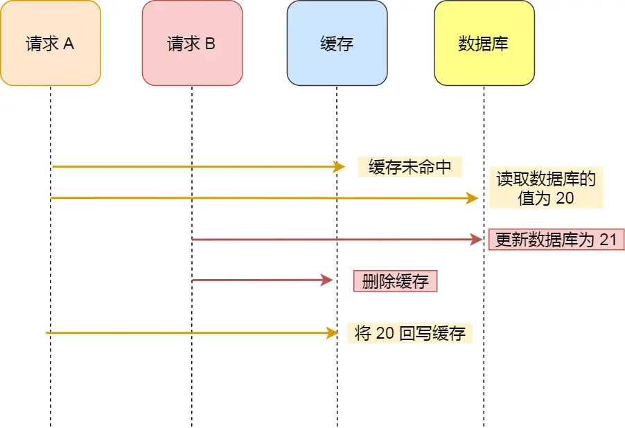

## 第八节课

上节课我们学习了一个关系型数据库MySQL，这里我们介绍一下非关系型数据库。

首先我们要了解一下什么是非关系型数据库

#### 非关系型数据库

NoSQL：一类不使用传统的关系模型来存储和检索数据的数据库管理系统。

> 与关系型数据库不同，NoSQL数据库不要求固定的表结构、通常不需要预定义模式，并且可以横向扩展以处理大量数据和高并发操作。比如在MySQL中的用户表，可能有id，name，pwd等固定字段，但是在非关系型数据库中，不要求严格的表结构或预定义模式。它们可以灵活地存储不同类型的数据，允许文档、键值对、列族或图结构等形式。

#### Redis

Redis全称为：Remote Dictionary Server（远程数据服务），该软件使用C语言编写，Redis是一个key-value存储系统，其有以下特点。

- 1:性能高,单线程非常适合**读多写少**的场景,可以减轻数据库压力,
- 2.集群分布式存储,可以横向拓展,可以做到高可用.
- 3.数据结构类型丰富数据类型
- 4.支持数据持久化
- 5.支持事务（一般不用）一般通过lua脚本去实现

#### Redis数据类型和命令

Redis 目前有9种数据类型和

- **5种常见类型：**String（字符串），Hash（哈希），List（列表），Set（集合）、Zset（有序集合）

- **4种新增类型：**BitMap（2.2 版新增）、HyperLogLog（2.8 版新增）、GEO（3.2 版新增）、Stream（5.0 版新增）

------

**接下来我们进入redis的操作，这里推荐使用docker，以后用中间件都会方便一点**

进入redis，如果你安装的是docker，那么用如下方式进入

```cmd
root@lihaoyu:/mnt/c/Users/17219# docker exec -it redis redis-cli
127.0.0.1:6379>
```

如果你是在本地直接安装的redis，那么可以

```cmd
root@bc2c25de5155:/data# redis-cli
127.0.0.1:6379>
```

选择数据库，一般默认是0，上限是15

```cmd
127.0.0.1:6379[15]> select 15
OK
127.0.0.1:6379[15]> select 0
OK
```

##### 字符串

String 是最基本的 key-value 结构，key 是唯一标识，value 是具体的值，value其实不仅是字符串， 也可以是数字（整数或浮点数），value 最多可以容纳的数据长度是 512MB。

当我们输入一个set的时候，可以看到后面出现了很多解释命令

```cmd
127.0.0.1:6379> set key value [NX|XX] [GET] [EX seconds|PX milliseconds|EXAT unix-time-seconds|PXAT unix-time-millisecon
```

- `key`: 要设置的键。

- `value`: 与键关联的值。

- `[NX|XX]`

  - `NX`: 只有当键不存在时才设置键值 。
  - `XX`: 只有当键已经存在时才设置键值 。

- `[GET]`: 如果设置了这个选项，`SET`命令还会返回键原本的值，如果键不存在则返回`nil` 。

- `[EX seconds|PX milliseconds]`

  设置键的过期时间。

  - `EX seconds`: 键将在指定的秒数后过期 。
  - `PX milliseconds`: 键将在指定的毫秒数后过期 。

- `[EXAT unix-time-seconds|PXAT unix-time-milliseconds]`

  设置键在特定的UNIX时间戳后过期。

  - `EXAT unix-time-seconds`: 键将在指定的UNIX时间戳（秒）对应的时间后过期 。
  - `PXAT unix-time-milliseconds`: 键将在指定的UNIX时间戳（毫秒）对应的时间后过期

**基本的SET与GET操作**

```cmd
127.0.0.1:6379> set xiaoming 18
OK
127.0.0.1:6379> get xiaoming
"18"
```

**NX与XX**

```cmd
127.0.0.1:6379> set xiaoming 19 nx
(nil)
127.0.0.1:6379> set xiaoming 19 xx
OK
127.0.0.1:6379> get xiaoming
"19"
```

**GET操作**

```cmd
127.0.0.1:6379> set lanshan 18
OK
127.0.0.1:6379> set lanshan 19 get
"18"
```

**设置key的过期时间并查看剩余时间**

```cmd
127.0.0.1:6379> set lanshan 18 ex 60
OK
127.0.0.1:6379> ttl lanshan
(integer) 55
#这里如果键没有设置过期时间，TTL命令将返回-1。如果键不存在，TTL命令将返回-2
```

**SETEX与GETEX操作**

setex key [seconds] value = set key value ex [seconds]

```cmd
127.0.0.1:6379> setex lanshan 60 18
OK
127.0.0.1:6379> ttl lanshan
(integer) 56
127.0.0.1:6379> getex lanshan ex 20
"go"
127.0.0.1:6379> ttl lanshan
(integer) 15
```

**MSET与MGET,同时设置，获取多个值**

```cmd
127.0.0.1:6379> mset lanshan1 go lanshan2 java
OK
127.0.0.1:6379> mget lanshan1 lanshan2
1) "go"
2) "java"
```

##### STRLEN

strlen key 返回键key存储的值的长度，**不存在的k返回0**

```cmd
127.0.0.1:6379> set lanshan go
OK
127.0.0.1:6379> strlen lanshan
(integer) 2
```

##### APPEND

将append后的值加在原来的后面

```cmd
127.0.0.1:6379> set lanshan go
OK
127.0.0.1:6379> append lanshan -java
(integer) 7
127.0.0.1:6379> get lanshan
"go-java"
```

**DEL操作**

删除key

```cmd
127.0.0.1:6379> set lanshan go
OK
127.0.0.1:6379> del lanshan
(integer) 1
127.0.0.1:6379> get lanshan
(nil)
```

##### INCR、DECR、INCRBY、DECRBY、INCRBYFLOAT 操作

**INCR**：将键的值解析为整数并增加 1。如果键不存在，则在进行操作之前将其设置为 0。如果键存在但不是有效的整数，那么将返回一个错误。

**DECR**：与 `INCR` 类似，但是是减少 1 的操作。

**INCRBY increment**：将键的值解析为整数，并增加指定的增量 `increment`。`increment` 参数可以是正数也可以是负数。如果需要减少一个特定的数值，可以使用负数作为 `increment` 的值。

**DECRBY decrement**：与 `INCRBY` 类似，但是是减少指定的 `decrement` 值。

**INCRBYFLOAT increment**：将键的值解析为浮点数，并增加指定的浮点数增量 `increment`。`increment` 参数可以是正数也可以是负数。这个命令允许你对浮点数执行加法和减法。

```cmd
127.0.0.1:6379> incr lanshan
(integer) 19
127.0.0.1:6379> decr lanshan
(integer) 18
127.0.0.1:6379> incrby lanshan 2
(integer) 20
127.0.0.1:6379> decrby lanshan 2
(integer) 18
127.0.0.1:6379> incrbyfloat lanshan 2.5
"20.5"
127.0.0.1:6379> incrbyfloat lanshan -2.5
"18"
```

#### 应用场景

##### 缓存对象

使用 String 来缓存对象有两种方式：

- 直接缓存整个对象的 JSON，命令例子： `SET user:1 '{"name":"go", "age":18}'`。
- 采用将 key 进行分离为 user:ID:属性，采用 MSET 存储，用 MGET 获取各属性值，命令例子： `MSET user:1:name go user:1:age 18 user:2:name java user:2:age 18`。

##### 常规计数

因为 Redis 处理命令是单线程，所以执行命令的过程是原子的。因此 String 数据类型适合计数场景，比如计算访问次数、点赞、转发、库存数量等等。

##### 分布式锁

SET 命令有个 NX 参数可以实现「key不存在才插入」，可以用它来实现分布式锁：

- 如果 key 不存在，则显示插入成功，可以用来表示加锁成功；
- 如果 key 存在，则会显示插入失败，可以用来表示加锁失败。

### 列表

List 列表是简单的字符串列表，**按照插入顺序排序**，可以从头部或尾部向 List 列表添加元素。

列表的最大长度为 `2^32 - 1`，也即每个列表支持超过 `40 亿`个元素。

##### 内部实现

List 类型的底层数据结构是由**双向链表或压缩列表**实现的：

- 如果列表的元素个数小于 `512` 个（默认值，可由 `list-max-ziplist-entries` 配置），列表每个元素的值都小于 `64` 字节（默认值，可由 `list-max-ziplist-value` 配置），Redis 会使用**压缩列表**作为 List 类型的底层数据结构；
- 如果列表的元素不满足上面的条件，Redis 会使用**双向链表**作为 List 类型的底层数据结构；

但是**在 Redis 3.2 版本之后，List 数据类型底层数据结构就只由 quicklist（快速表） 实现了，替代了双向链表和压缩列表**。

接下来我们进入列表的一些基本操作

##### LPUSH与LRANGE

语法： ` LPUSH key element [element ...]`

- 将一个或多个值插入到列表的头部。
- 如果列表不存在，创建一个新的列表。

语法： `LRANGE key start stop`

-1是倒数第一个 依次类推

```cmd
127.0.0.1:6379> lpush lanshan go java python
(integer) 3
127.0.0.1:6379> lrange lanshan 0 -1
1) "python"
2) "java"
3) "go"
```

##### LPOP和RPOP

语法：`LPOP key [count]`

移除列表key的表头元素，出队列 counts是出队次数

语法：`RPOP key [count]`

移除列表key的尾元素，出队列 counts是出队次数

```cmd
127.0.0.1:6379> lrange lanshan 0 -1
1) "python"
2) "go"
3) "java"
127.0.0.1:6379> lpop lanshan 2
1) "python"
2) "go"
127.0.0.1:6379> lrange lanshan 0 -1
1) "java"
2) "python"
3) "go"
127.0.0.1:6379> rpop lanshan 2
1) "go"
2) "python"
```

##### LSET

语法： `lset key index element`

通过索引设置列表元素的值

```cmd
127.0.0.1:6379> lrange lanshan 0 -1
1) "java"
2) "go"
3) "python"
127.0.0.1:6379> lset lanshan 2 js
OK
127.0.0.1:6379> lrange lanshan 0 -1
1) "java"
2) "go"
3) "js"
```

##### LLEN

语法：`LLEN key`

获取列表长度

```cmd
127.0.0.1:6379> lrange lanshan 0 -1
1) "java"
2) "go"
3) "js"
127.0.0.1:6379> llen lanshan
(integer) 3
```

##### BLPOP

语法： `blpop key [key ...] timeout`

移出并获取列表的第一个元素， 如果列表没有元素会阻塞列表直到等待超时或发现可弹出元素为止

```cmd
127.0.0.1:6379> blpop lanshan 10
1) "lanshan"
2) "java"
127.0.0.1:6379> blpop lanshan 10
1) "lanshan"
2) "go"
127.0.0.1:6379> blpop lanshan 10
1) "lanshan"
2) "js"
127.0.0.1:6379> blpop lanshan 10
(nil)
(10.07s)
```

应用场景 消息队列

### 哈希

Hash 是一个键值对（key - value）集合，其中 value 的形式入： `value=[{field1，value1}，...{fieldN，valueN}]`。Hash 特别适合用于存储对象。

#### 内部实现

Hash 类型的底层数据结构是由**压缩列表或哈希表**实现的：

- 如果哈希类型元素个数小于 `512` 个（默认值，可由 `hash-max-ziplist-entries` 配置），所有值小于 `64` 字节（默认值，可由 `hash-max-ziplist-value` 配置）的话，Redis 会使用**压缩列表**作为 Hash 类型的底层数据结构；
- 如果哈希类型元素不满足上面条件，Redis 会使用**哈希表**作为 Hash 类型的 底层数据结构。

**在 Redis 7.0 中，压缩列表数据结构已经废弃了，交由 listpack (紧凑列表)数据结构来实现了**。

然后我们进入到基本命令

##### HSET和HGET

语法 `HSET key field value [field value ...]`

语法 ` hget key field`

一个key的可以有多个field-value对

```cmd
127.0.0.1:6379> hset lanshan go 18 java 20 python 22
(integer) 3
127.0.0.1:6379> hget lanshan go 
"18"
```

##### HSETNX

语法 `hsetnx key field value`

设置哈希的一个字段，当指定的字段不存在时才会被设置,跟之前字符串讲的一样

```cmd
127.0.0.1:6379> hsetnx lanshan name go
(integer) 1
127.0.0.1:6379> hsetnx lanshan name go
(integer) 0
```

##### HGETALL

获取哈希的所有字段的值

```cmd
127.0.0.1:6379> hset lanshan go 18 java 20
(integer) 2
127.0.0.1:6379> hgetall lanshan
1) "go"
2) "18"
3) "java"
4) "20"
```

##### HKEYS

语法：`hkeys key`

该命令的作用是：获取哈希的所有字段，但是不获取值

```cmd
127.0.0.1:6379> hkeys lanshan
1) "go"
2) "java"
```

##### HEXISTS

语法：`hexists key field`

该命令的作用是：判断字段是否存在于指定哈希中

```cmd
127.0.0.1:6379> hexists lanshan python
(integer) 0
```

##### HLEN

语法： `hlen key`

获取指定哈希中字段的数量

```cmd
127.0.0.1:6379> hlen lanshan
(integer) 2
```

##### HVALS

语法： `hvals key`

获取指定哈希的所有值，不获取字段名称

```cmd
127.0.0.1:6379> hvals lanshan
1) "18"
2) "20"
```

#### 应用场景

##### 缓存对象

### 集合

Set 类型是一个无序并唯一的键值集合，它的存储顺序不会按照插入的先后顺序进行存储。

一个集合最多可以存储 `2^32-1` 个元素。概念和数学中个的集合基本类似，可以交集，并集，差集等等，所以 Set 类型除了支持集合内的增删改查，同时还支持多个集合取交集、并集、差集。

Set 类型和 List 类型的区别如下：

- List 可以存储重复元素，Set 只能存储非重复元素；
- List 是按照元素的先后顺序存储元素的，而 Set 则是无序方式存储元素的。

#### 内部实现

Set 类型的底层数据结构是由**哈希表或整数集合**实现的：

- 如果集合中的元素都是整数且元素个数小于 `512` （默认值，`set-maxintset-entries`配置）个，Redis 会使用**整数集合**作为 Set 类型的底层数据结构；
- 如果集合中的元素不满足上面条件，则 Redis 使用**哈希表**作为 Set 类型的底层数据结构。

我们进入基本命令

##### SADD和SREM

语法：`SADD key member [member ...]`

往集合key中存入元素，元素存在则忽略，若key不存在则新建

语法：`SREM key member [member ...] `

从集合key中删除元素

```cmd
127.0.0.1:6379> sadd lanshan go java python
(integer) 3
127.0.0.1:6379> srem lanshan python
(integer) 1
```

##### SMEMBERS

语法：`SMEMBERS key`

查看所有的members

```cmd
127.0.0.1:6379> smembers lanshan
1) "go"
2) "java"
```

##### SCARD

语法：`SCARD key`

查看元素个数

```cmd
127.0.0.1:6379> scard lanshan
(integer) 2
```

##### SISMEMBER

语法：`SISMEMBER key member`

判断元素是否是在集合中

```cmd
127.0.0.1:6379> sismember lanshan go
(integer) 1
127.0.0.1:6379> sismember lanshan python
(integer) 0
```

##### SRANDMEMBER

语法： `SRANDMEMBER key [count]`

从集合key中随机选出count个元素，元素不从key中删除

```cmd
127.0.0.1:6379> srandmember lanshan 1
1) "java"
127.0.0.1:6379> srandmember lanshan 1
1) "go"
```

##### SPOP

语法： ` SPOP key [count]`

从集合key中随机选出count个元素，元素从key中删除

```cmd
127.0.0.1:6379> spop lanshan 1
1) "go"
127.0.0.1:6379> smembers lanshan
1) "java"
```

##### SINTER

语法： `SINTER key [key ...]`

交集运算返回两个set的交集

##### SINTERSTORE

语法： `SINTERSTORE destination key [key ...]`

将交集结果存入新集合destination中

##### SUNION

语法： `SUNION key [key ...]`

并集运算

##### SUNIONSTORE

语法： `SUNIONSTORE destination key [key ...]`

将并集结果存入新集合destination中

##### SDIFF

差集运算 `SDIFF key [key ...]`

##### SDIFFSTORE

将差集结果存入新集合destination中 `SDIFFSTORE destination key [key ...]`

### 有序集合

Zset 类型（有序集合类型）相比于 Set 类型多了一个排序属性 score（分值），对于有序集合 ZSet 来说，每个存储元素相当于有两个值组成的，一个是有序结合的元素值，一个是排序值。

有序集合保留了集合不能有重复成员的特性（分值可以重复），但不同的是，有序集合中的元素可以排序。

##### 内部实现

Zset 类型的底层数据结构是由**压缩列表或跳表**实现的：

- 如果有序集合的元素个数小于 `128` 个，并且每个元素的值小于 `64` 字节时，Redis 会使用**压缩列表**作为 Zset 类型的底层数据结构；
- 如果有序集合的元素不满足上面的条件，Redis 会使用**跳表**作为 Zset 类型的底层数据结构；

**在 Redis 7.0 中，压缩列表数据结构已经废弃了，交由 listpack 数据结构来实现了。**

进入基本命令

##### ZADD

语法 ：`ZADD key [NX|XX] [GT|LT] [CH] [INCR] score member [score member ...]`

往有序集合key中加入带分值元素 ,core必须是浮点数或者整型，添加成功后返回被成功添加的新成员的数量

```cmd
127.0.0.1:6379> zadd lanshan 1 go 2 java
(integer) 2
```

##### ZREM

语法 ：`ZREM key member [member...]`

往有序集合key中删除元素

```cmd
127.0.0.1:6379> zrem lanshan go
(integer) 1
```

##### ZSCORE

语法： `ZSCORE key member`

返回有序集合key中元素member的分值

```cmd
127.0.0.1:6379> zscore lanshan java
"2"
```

##### ZCARD

语法： `ZCARD key `

返回有序集合元素个数

```cmd
127.0.0.1:6379> zcard lanshan
(integer) 1
```

##### ZINCRBY

语法:ZINCRBY key increment member 

为有序集合key中元素member的分值加上increment

```cmd
127.0.0.1:6379> zadd lanshan 10 go
(integer) 1
127.0.0.1:6379> zincrby lanshan 10 go
"20"
```

##### ZRANGE

语法:`ZRANGE key start stop [WITHSCORES]`

正序获取有序集合key从start下标到stop下标的元素

```cmd
127.0.0.1:6379> zrange lanshan 0 -1
1) "go"
2) "java"
3) "python"
```

##### ZREVRANGE

语法:`ZREVRANGE key start stop [WITHSCORES]`

倒序获取有序集合key从start下标到stop下标的元素

```cmd
127.0.0.1:6379> zrevrange lanshan 0 -1
1) "python"
2) "jav
3) "go"
```

##### ZRANGEBYSCORE

语法:`ZRANGEBYSCORE key min max [WITHSCORES] [LIMIT offset count]`

返回有序集合中指定分数区间内的成员，分数由低到高排序。

```cmd
127.0.0.1:6379> zrangebyscore lanshan 0 2
1) "go"
2) "java"
```

##### ZRANGEBYLEX

语法:`ZRANGEBYLEX key min max  [LIMIT offset count]`

- **`min` 和 `max`**：

  定义了要返回的成员范围。

  可以是以下几种形式之一：

  - **闭区间 `[value]`**：包含边界值 `value`
  - **开区间 `(value)`**：不包含边界值 `value`
  - **负无穷大 `-`**：表示最小可能的字符串
  - **正无穷大 `+`**：表示最大可能的字符串

- **`LIMIT offset count`**（可选）

  用于分页，限制返回的结果数量。

  - **`offset`**：跳过的成员数量（从0开始）
  - **`count`**：返回的成员数量

返回指定成员区间内的成员，按字典正序排列, 分数必须相同

```cmd
127.0.0.1:6379> zrangebylex lanshan - [z
1) "go"
2) "java"
3) "python"
```

#### 应用场景

Zset 类型（Sorted Set，有序集合） 可以根据元素的权重来排序，我们可以自己来决定每个元素的权重值。比如说，我们可以根据元素插入 Sorted Set 的时间确定权重值，先插入的元素权重小，后插入的元素权重大。

在面对需要展示最新列表、排行榜等场景时，如果数据更新频繁或者需要分页显示，可以优先考虑使用 Sorted Set。

##### 排行榜

有序集合比较典型的使用场景就是排行榜。例如学生成绩的排名榜、游戏积分排行榜、视频播放排名、电商系统中商品的销量排名等。

##### 电话、姓名排序

使用有序集合的 `ZRANGEBYLEX` 或 `ZREVRANGEBYLEX` 可以帮助我们实现电话号码或姓名的排序，我们以 `ZRANGEBYLEX` （返回指定成员区间内的成员，按 key 正序排列，分数必须相同）为例。

### 位图

Bitmap，即位图，是一串连续的二进制数组（0和1），可以通过偏移量（offset）定位元素。BitMap通过最小的单位bit来进行`0|1`的设置，表示某个元素的值或者状态，时间复杂度为O(1)。

由于 bit 是计算机中最小的单位，使用它进行储存将非常节省空间，特别适合一些数据量大且使用**二值统计的场景**。

##### 内部实现

Bitmap 本身是用 String 类型作为底层数据结构实现的一种统计二值状态的数据类型。

String 类型是会保存为二进制的字节数组，所以，Redis 就把字节数组的每个 bit 位利用起来，用来表示一个元素的二值状态，你可以把 Bitmap 看作是一个 bit 数组。

##### 常用命令

自己去看

##### 应用场景

1.签到统计 2.判断用户登陆态 3.连续签到用户总数 等等

### GEO

Redis GEO 是 Redis 3.2 版本新增的数据类型，主要用于存储地理位置信息，并对存储的信息进行操作。

在日常生活中，我们越来越依赖搜索“附近的餐馆”、在打车软件上叫车，这些都离不开基于位置信息服务（Location-Based Service，LBS）的应用。LBS 应用访问的数据是和人或物关联的一组经纬度信息，而且要能查询相邻的经纬度范围，GEO 就非常适合应用在 LBS 服务的场景中

##### 内部实现

GEO 本身并没有设计新的底层数据结构，而是直接使用了 Sorted Set 集合类型。

GEO 类型使用 GeoHash 编码方法实现了经纬度到 Sorted Set 中元素权重分数的转换，这其中的两个关键机制就是「对二维地图做区间划分」和「对区间进行编码」。一组经纬度落在某个区间后，就用区间的编码值来表示，并把编码值作为 Sorted Set 元素的权重分数。

这样一来，我们就可以把经纬度保存到 Sorted Set 中，利用 Sorted Set 提供的“按权重进行有序范围查找”的特性，实现 LBS 服务中频繁使用的“搜索附近”的需求。

##### 应用场景

1.找附加的人 车 物品

### 设计和使用规范

#### 键值对设计

在Redis中，良好的键值设计可以达成事半功倍的效果，而不好的键值设计可能会带来Redis服务停滞，网络阻塞，CPU使用率飙升等一系列问题，下面来给大家介绍键值对的设计

##### key 命名规范

Redis的Key虽然可以自定义，但最好遵循下面的几个最佳实践约定：

- **遵循基本格式**：`[业务名称]:[数据名]:[id]` 或 `[业务名称]:[数据名]:[id]:[字段名]`

  各个命名域之间一般使用冒号做分割符，这是不成文的规矩。

  例如我们的登录业务，需要保存用户信息，其key可以设计成如下格式：

  ```cmd
  login:user:10
  ```

- **Key的长度不超过44字节**

  无论是哪种数据类型， key都是string类型，string类型的底层编码包含int、embstr和raw三种。如果key中全是数字，那么就会直接以int类型去存储，而int占用的空间也是最小的，当然出于业务需求，我们不可能将key设计为一个全数字的，而如果不是纯数字，底层存储的就是SDS内容，如果小于44字节，就会使用embstr类型，embstr在内存中是一段连续的存储空间，内存占用相对raw来说较小，而当字节数大于44字节时，会转为raw模式存储，在raw模式下，内存空间不是连续的，而是采用一个指针指向了另外一段内存空间，在这段空间里存储SDS内容，这样空间不连续，访问的时候性能也就会收到影响，还有可能产生内存碎片

  需要注意的是，如果你的redis版本低于4.0，那么界限是39字节而非44字节

- **Key中不包含一些特殊字符**

  包含空格、换行、单双引号以及其他转义字符

##### value 设计

▐ **拒绝 Big Key ！！！**

BigKey顾名思义就是一个很大的Key-value，这里的大并不是指Key本身很大，而是指包括这个Key的Value在内的一整个键值对很大

BigKey通常以Key-Value的大小或者Key中成员的数量来综合判定，例如：

- 字符串类型：它的big体现在**单个value值很大**，一般认为超过10KB就是bigkey
- 非字符串类型：哈希、列表、集合、有序集合，它们的big体现在**元素个数太多（5000以上）**

▐ **Big Key 的危害**

- **网络阻塞**

  bigkey也就意味着每次获取要产生的网络流量较大，假设一个bigkey为1MB，客户端每秒访问量为1000，那么每秒产生1000MB的流量，对于普通的千兆网卡（按照字节算是128MB/s）的服务器来说简直是灭顶之灾，而且一般服务器会采用单机多实例方式来部署，也就是说一个bigkey可能会对其他实例造成影响，其后果不堪设想。

- **数据倾斜**

  集群环境下，由于所有插槽一开始都是均衡分配的，因此BigKey所在的Redis实例内存使用率会远超其他实例，从而无法使数据分片的内存资源达到均衡，最后不得不手动重新分配插槽，增加运维人员的负担

- **阻塞工作线程**

  对元素较多的hash、list、zset等做运算会耗时较久，而且由于Redis是单线程的，在运算过程中会导致服务阻塞，无法接收其他用户请求，例如：使用 del 删除大 key 时，会阻塞工作线程，这样就没办法处理后续的命令

- **CPU压力**

  对BigKey的数据进行序列化或反序列化都会导致CPU的使用率飙升，影响Redis实例和本机其它应用

▐ **Big Key 产生**

一般来说bigkey的产生都是由于程序设计不当，或者对于数据规模预料不清楚造成的

▐ **发现 Big Key**

利用以下命令，可以遍历分析所有key，并返回Key的整体统计信息与每种数据类型中Top1的BigKey

```cmd
redis-cli -a 密码 --bigkeys
redis-cli -h 127.0.0.1 -p 6379 -a 密码 -- bigkeys
```

那么如何判断元素的大小呢？redis中为我们提供了相应的命令，语法如下：

```cmd
memory usage 键名
```

条命令会返回一条数据占用内存的总大小，这个大小不仅包括Key和Value的大小，还包括数据存储时的一些元信息，因此可能你的Key与Value只占用了几十个字节，但最终的返回结果是几百个字节

但是我们一般不推荐使用memory指令，因为这个指令对CPU的占用率是很高的，实际开发中我们一般只需要衡量Value的大小或者Key中的成员数即可

例如如果我们使用的数据类型是String，就可以使用以下命令，返回的结果是Value的长度

```cmd
strlen 键名
```

如果们使用的数据类型是List，就可以使用以下命令，返回的结果是List中成员的个数

```cmd
llen 键名
```

▐ **删除 Big Key**

BigKey内存占用较多，因此即便我们使用的是删除操作，删除BigKey也需要耗费很长时间，导致Redis主线程阻塞，引发一系列问题。

如果redis版本在4.0之后，我们可以通过异步删除命令unlink来删除一个BigKey，该命令会先把数据标记为已删除，然后再异步执行删除操作。

如果redis版本在4.0之前，针对集合类型，我们可以先遍历BigKey中所有的元素，先将子元素逐个删除，最后再删除BigKey。至于如何遍历，针对不同的集合类型，可以参考以下不同的命令：

- HSCAN，SCAN，SSCAN，ZSCAN

▐ **优化 Big Key**

找出BigKey中，我们应该如何对BigKey进行优化呢？

- 选择合适的数据类型

  例如：实体类型（要合理控制和使用数据结构，但也要注意节省内存和性能之间的平衡）

  反例：

  ```cmd
  set user:1:name zhangsan
  set user:1:age 20
  set user:1:favor pingpong
  ```

正例：

```cmd
hset user:1 name zhangsan age 19 favor pingpong
```

- 控制 key 的生命周期

  建议使用expire设置过期时间（条件允许可以打散过期时间，防止集中过期）。

- hash

  使用hash结构来存储对象，对象的一个属性对应集合中的一个成员

  | user:1 | name | jack |
  | ------ | ---- | ---- |
  | age    | 21   |      |

##### 反例

- 反例1：

  ```cmd
  redis> SET registryservice:userid:string:100123 "zhangsan"
  ```

  key 太长，这个key的长度甚至大于value长度，优点是描述信息很明确，缺点就是浪费内存

- 反例2：

  ```cmd
  SET 6B1B0C32-C2C5-4E48-B6BC-DEFA25E41919 "zhangsan"
  ```

  在反例1的基础上，KEY本身是个UUID，缺点：key 太长、含义无可读性

- 反例3：

  ```cmd
  SET "!@#/:$%^&*()+100123" "zhangsan"
  ```

  在反例2的基础上，增加了特殊字符，缺点：无可读性，部分场景下会引发业务异常

- 反例4：

  ```cmd
  SET "a b c d 100123" "sometext"
  ```

  key 中包含了空格，缺点：无可读性，部分场景下引发业务歧义

### 缓存策略

常见的缓存更新策略。

- Cache Aside（旁路缓存）策略；
- Read/Write Through（读穿 / 写穿）策略；
- Write Back（写回）策略

实际开发中，Redis 和 MySQL 的更新策略用的是 Cache Aside，另外两种策略应用不了。

#### Cache Aside（旁路缓存）策略

Cache Aside（旁路缓存）策略是最常用的，应用程序直接与「数据库、缓存」交互，并负责对缓存的维护，该策略又可以细分为「读策略」和「写策略」。


**写策略的步骤：**

- 先更新数据库中的数据，再删除缓存中的数据。

**读策略的步骤：**

- 如果读取的数据命中了缓存，则直接返回数据；
- 如果读取的数据没有命中缓存，则从数据库中读取数据，然后将数据写入到缓存，并且返回给用户。

为什么写策略要先更新数据库再删除缓存呢，我们来探讨下面两个场景。

**先删除缓存再更新数据库**

假设某个用户的年龄是 20，请求 A 要更新用户年龄为 21，所以它会删除缓存中的内容。这时，另一个请求 B 要读取这个用户的年龄，它查询缓存发现未命中后，会从数据库中读取到年龄为 20，并且写入到缓存中，然后请求 A 继续更改数据库，将用户的年龄更新为 21。


最终，该用户年龄在缓存中是 20（旧值），在数据库中是 21（新值），缓存和数据库的数据不一致。

**先更新数据库再删除缓存**

假如某个用户数据在缓存中不存在，请求 A 读取数据时从数据库中查询到年龄为 20，在未写入缓存中时另一个请求 B 更新数据。它更新数据库中的年龄为 21，并且清空缓存。这时请求 A 把从数据库中读到的年龄为 20 的数据写入到缓存中。最终，该用户年龄在缓存中是 20（旧值），在数据库中是 21（新值），缓存和数据库数据还是不一致。



**但是在实际中，这个问题出现的概率并不高**。 **因为缓存的写入通常要远远快于数据库的写入！**所以在实际中很难出现请求 B 已经更新了数据库并且删除了缓存，请求 A 才更新完缓存的情况。而一旦请求 A 早于请求 B 删除缓存之前更新了缓存，那么接下来的请求就会因为缓存不命中而从数据库中重新读取数据，所以不会出现这种不一致的情况。

所以说在A写入缓存18的速度 远远快于 B写入数据库19的速度。

Cache Aside 策略适合**读多写少**的场景，不适合写多的场景，因为当写入比较频繁时，缓存中的数据会被频繁地清理，这样会对缓存的命中率有一些影响。如果业务对缓存命中率有严格的要求，那么可以考虑两种解决方案：

- 一种做法是在更新数据时也更新缓存，只是在更新缓存前先加一个分布式锁，因为这样在同一时间只允许一个线程更新缓存，就不会产生并发问题了。当然这么做对于写入的性能会有一些影响；
- 另一种做法同样也是在更新数据时更新缓存，只是给缓存加一个较短的过期时间，这样即使出现缓存不一致的情况，缓存的数据也会很快过期，对业务的影响也是可以接受。

## MongoDB

MongoDB最大的特点就是模式自由，你可以将结构完全不同的文档存储在一个集合里面，适用于在业务初期，表结构十分不稳定的时候

相比与MySQL，MongoDB更适合存储大尺寸，低价值的数据，大文档的读写性能比MySQL好

| SQL术语/概念 | MongoDB术语/概念 | 解释/说明                           |
| ------------ | ---------------- | ----------------------------------- |
| database     | database         | 数据库                              |
| table        | collection       | 数据库表/集合                       |
| row          | document         | 数据记录行/文档                     |
| column       | field            | 数据字段/域                         |
| index        | index            | 索引                                |
| table joins  |                  | 表连接,MongoDB不支持                |
| primary key  | primary key      | 主键,MongoDB自动将_id字段设置为主键 |

#### 数据库

在MongoDB中，多个文档组成集合，而多个集合可以组成数据库，一个MongoDB实例可以建立多个数据库。

有一些数据库名是保留的，可以直接访问这些有特殊作用的数据库。

- admin： 从权限的角度来看，这是"root"数据库。要是将一个用户添加到这个数据库，这个用户自动继承所有数据库的权限。一些特定的服务器端命令也只能从这个数据库运行，比如列出所有的数据库或者关闭服务器。
- local: 这个数据永远不会被复制，可以用来存储限于本地单台服务器的任意集合
- config: 当Mongo用于分片设置时，config数据库在内部使用，用于保存分片的相关信息。

##### 进入mongodb（这里使用的是docker）

```cmd
root@lihaoyu:/mnt/c/Users/17219# docker exec -it mongo /bin/mongosh
```

切换数据库进行认证

```cmd
test> use admin
switched to db admin
admin> db.auth("admin","123456")
{ ok: 1 }
```

**show dbs** 命令可以显示所有数据的列表。

执行 **db** 命令可以显示当前数据库对象或集合。

运行**use**命令，可以连接到一个指定的数据库。

```cmd
admin> show dbs
admin   148.00 KiB
config   84.00 KiB
local    72.00 KiB
test      8.00 KiB
admin> db
admin
admin> use test
```

**集合（collection)**

##### 集合就是 一组文档，类似于 RDBMS （关系数据库管理系统：Relational Database Management System)中的表格。

集合是动态模式的，也就意味着集合没有固定的结构，集合可以插入不同格式和类型的数据，但通常情况下我们插入集合的数据都会有一定的关联性。

##### 文档（Document）

文档MongoDB核心概念。文档就是键值对的一个有序集合。MongoDB 的文档不需要设置相同的字段，并且相同的字段不需要相同的数据类型，这与关系型数据库有很大的区别，也是 MongoDB 非常突出的特点。

一个简单的文档例子如下：

```go
{"zhangsan":"hello","lisi":3}
```

文档中的键是字符串，文档中的值可以是多种不同的数据类型，甚至可以是一个完整的内嵌文档。

MongoDB的文档不能有重复的键。

MongoDB不但区分类型，而且区分大小写。

```go
{"Foot":"3"}
{"foot":"3"}
{"foot": 3 }
 
这三个文档是不同的
```

#### MongoDB 数据类型

在概念上MongoDB的文档与JavaScript中的对象相近，因而可以认为它类似与JSON。MongoDB在JSON六种数据类型（null，布尔，数字、字符长、对象和数组）的基础上上添加了一些其他数据类型，以实现对时间、浮点数、正则函数等的操作。

| 数据类型  | 例子                       | 描述                                                         |
| --------- | -------------------------- | ------------------------------------------------------------ |
| String    | { "x" : "foot" }           | 字符串。存储数据常用的数据类型。在 MongoDB 中，UTF-8 编码的字符串才是合法的。 |
| Integer   | { "x" : 1 }                | 整型数值。用于存储数值。根据你所采用的服务器，可分为 32 位或 64 位。 |
| Boolean   | { "x" : true }             | 布尔值。用于存储布尔值（真/假）。                            |
| Double    | { "x" : 3.14 }             | 双精度浮点值。用于存储浮点值。                               |
| Array     | { "x" : [ "a" , "b" ] }    | 用于将数组或列表或多个值存储为一个键。                       |
| Timestamp |                            | 时间戳。记录文档修改或添加的具体时间。                       |
| Object    | { "x" : { "y" : "foot" } } | 用于内嵌文档。                                               |
| Null      | { "x" : null }             | 用于创建空值。                                               |

## Go 操作Redis

这里使用的是 `github.com/go-redis/redis/v9` 这个库

首先安装库

```go
go get github.com/go-redis/redis/v9
```

连接池以及链接设置

```go
func InitRedis() {
	Rdb = redis.NewClient(&redis.Options{
		//连接信息
		Network:  "tcp",            //网络类型，tcp or unix，默认tcp
		Addr:     "127.0.0.1:6379", //主机名+冒号+端口，默认localhost:6379
		Password: "123456",         //密码
		DB:       0,                // redis数据库index

		//连接池容量及闲置连接数量
		PoolSize:     15,          // 连接池最大socket连接数，默认为4倍CPU数， 4 * runtime.NumCPU
		MinIdleConns: 10,          //在启动阶段创建指定数量的Idle连接，并长期维持idle状态的连接数不少于指定数量
		MaxIdleConns: 10,          // 设置连接池中最大空闲连接数

		//超时
		DialTimeout:  5 * time.Second, //连接建立超时时间，默认5秒。
		ReadTimeout:  3 * time.Second, //读超时，默认3秒， -1表示取消读超时
		WriteTimeout: 3 * time.Second, //写超时，默认等于读超时
		PoolTimeout:  4 * time.Second, //当所有连接都处在繁忙状态时，客户端等待可用连接的最大等待时长，默认为读超时+1秒。

		//闲置连接检查包括ConnMaxIdleTime和ConnMaxLifetime
		ConnMaxIdleTime: 5 * time.Minute,  //闲置超时，默认5分钟，-1表示取消闲置超时检查
		ConnMaxLifetime: 0,                //连接存活时长，从创建开始计时，超过指定时长则关闭连接，默认为0，即不关闭存活时长较长的连接

		//命令执行失败时的重试策略
		MaxRetries:      0,                      // 命令执行失败时，最多重试多少次，默认为0即不重试
		MinRetryBackoff: 8 * time.Millisecond,   //每次计算重试间隔时间的下限，默认8毫秒，-1表示取消间隔
		MaxRetryBackoff: 512 * time.Millisecond, //每次计算重试间隔时间的上限，默认512毫秒，-1表示取消间隔

		//可自定义连接函数
		Dialer: func(ctx context.Context, network, addr string) (net.Conn, error) {
			netDialer := &net.Dialer{
				Timeout:   5 * time.Second,
				KeepAlive: 5 * time.Minute,
			}
			return netDialer.Dial("tcp", "127.0.0.1:6379")
		},

		//钩子函数
		OnConnect: func(ctx context.Context, conn *redis.Conn) error { //仅当客户端执行命令时需要从连接池获取连接时，如果连接池需要新建连接时则会调用此钩子函数
			fmt.Printf("conn=%v\n", conn)
			return nil
		},
	})

	_, err := Rdb.Ping(context.Background()).Result()
	if err != nil {
		log.Fatal(err) // 使用 log.Fatal 以便在连接失败时程序终止
	}
	fmt.Println("redis 连接成功")
}
```

一般这样就行

```go
	Rdb = redis.NewClient(&redis.Options{
		Addr:     "127.0.0.1:6379",
		Password: "123456", 
		DB:       0,        
	})
```

#### 字符串

```go
func GetRedisValue(ctx context.Context, key string) (string, error) {
	GetKey := Rdb.Get(ctx, key)
	if GetKey.Err() != nil {
		return "", GetKey.Err()
	}
	return GetKey.Val(), nil
}

func SetRedisValue(ctx context.Context, key string, value string, expiration time.Duration) error {
	SetKV := Rdb.Set(ctx, key, value, expiration)
	return SetKV.Err()
}
```

#### 集合

```go
type RedisSet struct {
	Id      int64
	Object  string
	Conn    *redis.Client
	Context context.Context
}

func NewRedisSet(context context.Context, Object string, Id int64, Conn *redis.Client) *RedisSet {
	return &RedisSet{
		Id:      Id,
		Object:  Object,
		Conn:    Conn,
		Context: context,
	}
}


func Set() {
	rs := NewRedisSet(context.Background(), "article:1", 1, Rdb)
	_, err := rs.Conn.SAdd(rs.Context, rs.Object, rs.Id).Result()
	if err != nil {
		fmt.Println(err)
	}
}
```

## Go操作mongodb

go操作mongodb离不开BSON，BSON是JSON的二进制格式。

这里用到的库有

```
"go.mongodb.org/mongo-driver/bson"
"go.mongodb.org/mongo-driver/mongo"
"go.mongodb.org/mongo-driver/mongo/options"
```

在Go中mongo-driver/bson包下，有一个bson.go，里面描述了MongoDB中关于BSON得几种格式。

- 第一种：bson.D：D（Document）格式代表了一个BSON文档。也是使用比较多的一种格式。

```go
bson.D{
    {"foo", "bar"},
    {"hello", "world"},
    {"pi", 3.14159},
}
```

- 第二种：bson.E：E（Element）格式代表了一个BSON文档的一个元素，通常在D内进行使用。

```go
bson.D{
  bson.E{Key: "foo", Value: "bar"},
  bson.E{Key: "hello", Value: "world"},
  bson.E{Key: "pi", Value: 3.14159},
}
```

- 第三种：bson.M：M（Map）格式也代表了一个BSON文档，与D不同的是，D是有序的，M是无序的（可以理解为Map）。

```go
bson.M{
  "foo": "bar",
  "hello": "world", 
  "pi": 3.14159,
}
```

- 第四种：bson.A：A（Array）格式代表了一个BSON数组。

```go
bson.A{
  "bar",
  "world",
  3.14159,
  bson.D{{"qux", 12345}},
}
```

安装MongoDB的Go驱动

```go
go get go.mongodb.org/mongo-driver/mongo
go get go.mongodb.org/mongo-driver/bson
go get go.mongodb.org/mongo-driver/mongo/options
```

接下来我们就来使用MongoDB进行增删改查

连接mongodb

```
type Student struct {
	Name  string
	City  string
	Score float32
}


func main() {
	ctx := context.Background()

	option := options.Client().ApplyURI("mongodb://localhost:27017").
		SetConnectTimeout(10 * time.Second).
		SetAuth(options.Credential{Username: "admin", Password: "123456", AuthSource: "admin"})

	client, _ := mongo.Connect(ctx, option)

	err := client.Ping(ctx, nil) //ping成功才代表连接成功
	if err != nil {
		log.Fatal(err)
		return
	}
	defer client.Disconnect(ctx)

	collection := client.Database("test").Collection("student")
	create(ctx, collection)
	update(ctx, collection)
	delete(ctx, collection)
	query(ctx, collection)

}
```

定义增删改查的函数

```
func create(ctx context.Context, collection *mongo.Collection) {
	//插入一个docs
	doc := Student{Name: "张三", City: "北京", Score: 20}
	res, err := collection.InsertOne(ctx, doc)
	if err != nil {
		log.Fatal(err)
		return
	}
	fmt.Printf("insert many ids %v\n", res.InsertedID) //每个doc都会有一个全世界唯一的id
	//插入多个docs
	docs := []interface{}{Student{Name: "李四", City: "北京", Score: 24}, Student{Name: "王五", City: "南京", Score: 23}}
	manyRes, err := collection.InsertMany(ctx, docs)
	fmt.Printf("insert many ids %v\n", manyRes.InsertedIDs)
}
```

```
func update(ctx context.Context, collection *mongo.Collection) {
	filter := bson.D{{Key: "city", Value: "北京"}} // bson.D是由bson.E构成的切片，即过滤条件可以有多个

	update := bson.D{{Key: "$inc", Value: bson.D{{Key: "score", Value: 5}}}} // score在原来的基础上加5
	res, err := collection.UpdateMany(ctx, filter, update)                   // 或用UpdateOne
	// UpdateMany表示只要满足过滤条件的全部修改

	if err != nil {
		log.Fatal(err)
		return
	}
	fmt.Printf("update %d doc\n", res.ModifiedCount)
}
```

```
func delete(ctx context.Context, collection *mongo.Collection) {
	filter := bson.D{{Key: "name", Value: "张三"}}   // bson.D是由bson.E构成的切片，即过滤条件可以有多个
	res, err := collection.DeleteMany(ctx, filter) // 或用DeleteOne。DeleteMany表示只要满足过滤条件的全部删除
	if err != nil {
		log.Fatal(err)
		return
	}
	fmt.Printf("delete %d doc\n", res.DeletedCount)
}
```

```
func query(ctx context.Context, collection *mongo.Collection) {
	sort := bson.D{{Key: "name", Value: 1}} // 查询结果按name排序，1升序，-1降序。可以按多列排序

	filter := bson.D{{Key: "score", Value: bson.D{{Key: "$gt", Value: 3}}}} // score>3, gt代表greater than。bson.D是由bson.E构成的切片，即过滤条件可以有多个

	findOption := options.Find()
	findOption.SetSort(sort)
	findOption.SetLimit(10) // 最多返回10个
	findOption.SetSkip(3)   // 跳过前3个

	cursor, err := collection.Find(ctx, filter, findOption)
	if err != nil {
		log.Fatal(err)
		return
	}

	defer cursor.Close(ctx) // 关闭迭代器

	for cursor.Next(ctx) {
		var doc Student
		err := cursor.Decode(&doc)
		if err != nil {
			log.Fatal(err)
			return
		}
		fmt.Printf("%+v\n", doc) // 打印查询到的文档
	}
}

```

## 作业

**LV1：**

熟悉一下redis，mongodb的命令，了解一下redis的内存淘汰策略等等，无需提交

**LV2:**

设计一个用户信息接口，并使用一种缓存策略

**LV3:**

用redis设计一个锁，并模拟一种高并发的情况(比如多个用户同时抢购某件商品)，确保数据一致性

**LV4:**

了解一下PUBLISH和SUBSCRIBE命令，实现一个简单的发布/订阅系统

### 提交作业

**格式** `第八次作业-学号-姓名`

发送到邮箱[lihaoyu@lanshan.email]()
