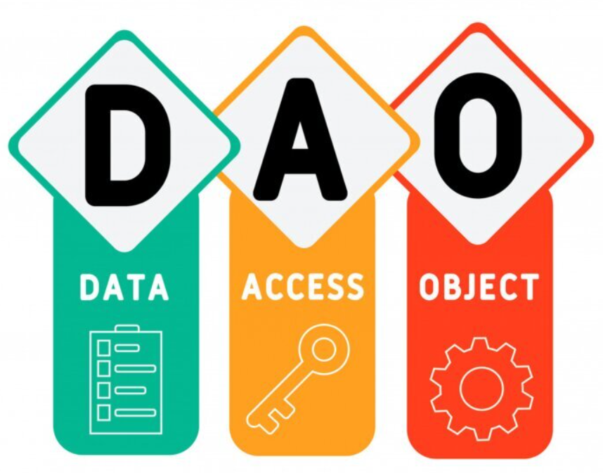

# 单体架构实战


上了之前的课但是还没听懂？感觉会用但是写起来感到寸步难行？本节课会教大家从0开始写一个完整的好项目

## 前置知识


在上本节课之前，你需要了解到的一些前置知识。

### viper (配置管理)


[](https://github.com/LanshanTeam/Courseware-Backend-Go-2023/blob/main/lesson11/images/viper.PNG)

通常，在一个或多个项目中我们需要使用定义一些配置（数据库的配置，项目功能的参数配置），从而我们可以在项目的开发或上线过程中可以快速的自定义项目的一些功能，以便满足我们的一些特定需求，那么项目中的配置如何管理呢，在 Go 中我们需要用到叫做 Viper 配置管理器。 尽管 Go 有官方库可以读取配置，但是通常情况下，推荐使用viper库来读取配置文件， viper 支持以下功能：

- 支持 yaml、json、toml、hcl 等格式的配置文件

- 可以从文件、io.Reader 、环境变量、cli命令行 中读取配置

- 支持自动转换的类型解析

- 可以远程从Key/Value中读取配置，需要导入 viper/remote 包

- 监听配置文件。以往我们修改配置文件后需要重启服务生效，而Viper使用watch函数可以让配置自动生效

  [Go语言配置管理神器——Viper中文教程](https://www.liwenzhou.com/posts/Go/viper_tutorial/)

### logger(日志管理）


[](https://github.com/LanshanTeam/Courseware-Backend-Go-2023/blob/main/lesson11/images/zap.PNG)

> 程序员的日常离不开日志，日志就好比私人秘书，负责运行周期一切 trace 工作。优秀的日志实践能极大帮助地程序员快速定位问题，减少在线错误报警。 在 Go 中我们用到 zap 作为日志记录器

Go 在 1.21.3 中新推出了 slog ，但是无论从自由度还是性能上都比不过已有的一些第三方库，其中 zap 就是非常好用的一款日志管理组件

[日志实践准则](http://www.yunweipai.com/23766.html)

[在Go语言项目中使用Zap日志库](https://www.liwenzhou.com/posts/Go/zap/)

[Zap 日志库实践](https://juejin.cn/post/7032091256457003044)

## 后端到底是怎么工作的？


通常情况下，后端的工作就是**解析前端的数据，处理对应的业务逻辑然后返回操作结果**。

上了前面的课，大家应该能够明白后端其实就是负责业务逻辑与数据处理的，但是在实际生产环境中，后端是如何在互联网中发挥作用的呢？

我们都知道，gin 是一个 http 框架，http 是传输协议，那么 gin 框架也就是和 web（World Wide Web) 息息相关，也是 Go 作为一款擅长于后端编程的核心框架之一（当然 http 框架还有很多），为什么我们用 gin 框架写一个接口（API）就能处理请求呢，最后又把消息返回给谁了呢，这些问题都会在这节课得到解答。

我们以一个真实场景作为示例 [](https://github.com/LanshanTeam/Courseware-Backend-Go-2023/blob/main/lesson11/images/bilibili1.PNG) 打开 B 站会看到一个页面，上面有很多功能和分类，看起来十分眼花缭乱，但是其实如果我们只以简单的功能为目的实现去做一个这样的 web 项目其实不是很难，我们只要一点点去完成基础功能——CRUD（增删改查)即可，但是如果有更高要求比如应对高并发，性能优化等等可能就比较困难了

进入正题，我们打开首页会看到这样一个界面，那么为什么我们可以看到这个界面？ 后端有一个很好的伙伴，他就是前端，前端负责直接与客户端交互，而前端为了拿到一些数据需要和后端进行交互 这里的数据可以是，视频封面图，视频播放链接，用户信息令牌，用户头像等等

[](https://github.com/LanshanTeam/Courseware-Backend-Go-2023/blob/main/lesson11/images/bilibili2.png) 按下 f12 进入开发者模式然后刷新页面，我们可以看到第一个请求为 [](https://github.com/LanshanTeam/Courseware-Backend-Go-2023/blob/main/lesson11/images/bilibili3.png) 所以当我们敲下这个网址，整个页面才会为我们加载，剩下的很多乱七八糟的就不多赘述了，学后端的不懂这些（

那我们后端需要为前端提供哪些东西呢？还是以 B 站首页为例，首先第一个我们需要提供很多视频给用户看 我们需要这么一个接口，简化如下

> http_method : GET
>
> Path : /video/feed

前端来请求这个接口，就可以获得视频流 那么请求的参数我们假设为 token ，返回的参数设为 videoList

这个 videoList 可以直接返回结构体吗，前端可以直接接收后端的数据类型吗？ 这个时候就需要 json 登场了 什么是 **JSON** ？

- JSON 指的是 JavaScript 对象表示法（JavaScript Object Notation）

- JSON 是轻量级的文本数据交换格式

- JSON 独立于语言：JSON 使用 Javascript语法来描述数据对象，但是 JSON 仍然独立于语言和平台。JSON 解析器和 JSON 库支持许多不同的编程语言。 目前非常多的动态（PHP，JSP，.NET）编程语言都支持JSON。

- JSON 具有自我描述性，更易理解

  ```
  {
    "video_list": [
      { "video_name":"1111","video_path":"https://xxxx" , "username":"张三" },
      { "video_name":"2222","video_path":"https://xxxx" , "username":"李四" },
      { "video_name":"3333","video_path":"https://xxxx" , "username":"王五" }
    ]
  }
  ```

  

  简单来说后端和前端就可以通过 json 来进行传递消息

除了返回视频流，我们还需要写其他的接口，比如获取用户信息、获取封面轮播图、获取直播间、上传视频等等 简单来说前端要什么接口我们就提供什么接口，至于什么点击跳转、界面美化、花里胡哨的特效大部分情况下不归后端管，我们只需要专注于接口的内部实现即可

## 如何写一个单体项目


一个后端软件工程师的基本工作是**完成后端程序的设计与开发**。而后端开发的工作流程往往包括以下几个方面。

**确定需求**：后端的需求从产品经理来，在确定产品需求的过程中，后端工程师必须**确定产品需求是否存在逻辑问题，并有一套实现方案**。当然，一般情况下产品需求是没问题的，只是实现的难易程度不同而已。但不排除产品经理不会提出“app主题颜色跟随手机外壳变化而变化”这种需求。

**开发排期**：在确定需求之后，后端工程师要**对自己即将的开发工作做一个时间计划**，以便跟进计划。产品经理往往最在意你的时间节点。不过，最终的时间节点一般和前端工程师一起定的。

**设计接口**：在开发之前我们后端的同学要**和前端的同学沟通接口的设计**，以此来使前后端的开发工作能够并行，不要等到后端的接口写完了之后前端才开始开发工作

**技术方案选择**：确定项目需求和设计完接口之后以后，我们就需要**确定自己的技术方案**，比如说，选择什么开发框架，选择什么数据库里，运行在什么环境里。在一些复杂和高并发的场景中，不仅要考虑程序的功能，更重要的是健壮性和安全性。实际上，在程序开发中，第一重要是安全，其次是健壮，最后才是功能。整个项目架构需要后端工程师进行合理设计，当然了，除了上面说的这些特性，项目应当还要做到易维护。如果做出来的系统只有你自己能搞定，显然是不行的。

**设计数据库**：在项目开发之前，先**设计好数据库**。一般把需要存储的结构化数据进行表结构的设计。数据库设计时需要注意**语意化**，需要给予备注的添加合理的备注。

**项目开发**：在项目开发前，一定要**把开发的功能点整理出来**，并挨个实现。编码开发是整个项目最核心的部分，也是最花时间的部分。

**项目对接**：在开发过程中，要**编写开发文档，接口文档，与前端工程师一起对接功能**。项目后期，配合测试工程师进行项目质量检测，功能测试。最后，配合运维同事进行项目上线。

实际上，要高效高质量地完成后端开发工作，需要学习和作用很多知识。这些技能包括：Linux操作能力，编码能力，数据库设计能力，文档编写能力，英文阅读能力，组织和设计能力。等等，需要在平时工作和生活中不断学习，不断提高自己。

当然，专业技术能力是需要用心学习和总结，如果说技术很容易地学会，很容易登达顶峰，那就不是技术了！

## 项目架构

软件行业和建筑行业比较像，如果说我们的产品是一栋高楼大厦，那么程序代码就是建筑高楼的砖坯（我们每天的工作就像是在不停"搬砖"）。

[](https://github.com/LanshanTeam/Courseware-Backend-Go-2022/blob/main/class08-单体项目实战/images/brick.png)

如果说软件架构是高屋建瓴，那么程序代码是软件架构能够准确落地的关键构成。

[](https://github.com/LanshanTeam/Courseware-Backend-Go-2022/blob/main/class08-单体项目实战/images/building.png)

程序代码如此重要，那么有一个好的代码架构的重要性不言而喻。一个好的软件架构能够让开发人员快速响应业务变化、提高软件的整体开发和维护效率。

一个好的架构，其终极目标应当是，**用最小的人力成本满足构建和维护该系统的需求**。

也就是说，**好的架构目标应当是降低人力成本**，这里包括的不仅仅是开发成本，还有构建运维成本。而增加软件可变性就是架构达到最终目标的核心途径，即架构主要是通过增加软件的可变性来降低人力成本，毕竟，捏橡皮泥比你在石头上雕刻要轻松得多。

### 如何做好架构设计


▐ **行为和架构哪个重要？**

一个软件的行为固然是很重要的，因为**一个不能按预定行为工作的软件是不会产生价值的**，所以很多程序员认为能实现软件行为是最重要的，根本不该关心架构，反正坏的架构也不是实现不了行为，出了 bug 修复即可。我认为，他们忽略的是随着软件行为的改动，坏的架构将导致他们自己的工作越来越难以进行，改动的代码越来越大，bug 越来越多，项目最终可能不可维护。

一个软件的架构虽然不直接表现在行为上，但其最大的特点就是良好的**可变性**，即使目前行为不符合预期，也能通过低成本的改动将行为改变到预期。

可运行不可变的软件，最终会因为无法改变而导致行为无法迭代或者迭代慢而变成没有价值。可变不可运行的软件，可通过迭代，变成可运行可变软件，所以**架构比行为更重要**。

▐ **恶魔小时候也可爱**

[](https://github.com/LanshanTeam/Courseware-Backend-Go-2023/blob/main/lesson11/images/demon.png)

一个不太好的架构，在项目初期有时难以察觉，因为此时项目模块少，功能少，依赖关系显而易见，一切显得毫无恶意，甚至有点简洁美。但是，恶魔小时候往往也很可爱。随着项目的增长，模块增加了，开发人员变多了，恶魔长大了。架构带来的问题逐渐暴露了出来，混乱的层次关系，毫无章法的依赖关系，模块权责不清等问题接踵而至。

对开发人员而言，项目理解成本不断增加，添加小功能都要先理清好几个模块的调用关系，难以测试导致上线后 bug 防不胜防，组件无法复用。项目逐渐长成大家闻风丧胆，避而不及的“大恶魔”。

虽然我们也反对过度设计，但是识别，或者说猜测项目未来符合逻辑的可能变动，将架构设计考虑进项目早期是十分有必要的，**架构设计和调整应该贯穿项目的整个成长过程。**

▐ **架构的理解成本**

架构是有一定理解成本的，甚至架构设计之初会增加一定的系统理解成本，但是一个好的架构理解成本一定不会很高，因为架构的理解也是人力成本。在理解架构设计的意图之前，因为其增加系统的理解成本而否定它的必要性是不合逻辑的。

好的架构，其关键意义在于降低项目发展过程中整体理解成本。

也就是说，架构良好的项目随着业务复杂度增加，项目理解成本增长也是缓慢的。架构不合理的项目随着业务复杂度的增加，整体理解成本可能是指数增长的。

[](https://github.com/LanshanTeam/Courseware-Backend-Go-2023/blob/main/lesson11/images/structure3.png)

### 如何做架构设计


#### **解耦**


在软件工程中，耦合指的就是对象之间的依赖性。对象之间的耦合度越高，维护成本越高。因此对象的设计应使类和构件之间的耦合最小。软件设计中通常用耦合度和内聚度作为衡量模块独立程度的标准。**划分模块的一个准则就是高内聚低耦合。**

- 内聚是从功能角度来度量模块内的联系，一个好的**内聚模块应当恰好做一件事**，它描述的是模块内的功能联系；
- 耦合是软件结构中各模块之间相互连接的一种度量，耦合强弱取决于模块间接口的复杂程度、进入或访问一个模块的点以及通过接口的数据。

耦合性存在于各个领域，而非软件设计中独有的，理论上说绝对的零耦合是做不到的，但可以通过一些方法将耦合降至最低，降低耦合度即可理解为解耦，在设计上解耦的核心思想是【彼此独立，互不依赖】。

#### **分层**


分层结构是最为流行、应用最广泛的应用软件的设计方式。在应用了分层结构的系统中，各个子系统按照层次的形式组织起来，上层使用下层的各种服务，而下层对上层一无所知。每一层都对自己的上层隐藏其下层的细节。


#### **封装**


假设我们有一个程序，它在逻辑上有一些不同的对象，并且这些对象彼此之间会相互交流。

**在一个类中，当每个对象的状态保持相对孤立，就实现了封装**。其余的对象并不能观察到这个对象的状态。他们能做到的只有调用一些被称作“方法”的通用功能。

因此，对象使用方法掌控着自己的状态，除非明确允许，没有其他人可以接触到它。如果你想和某个对象交流，你需要使用提供的方法。但在默认情况下，你无法改变对象的状态。


听不懂？我以软件设计中常见的三层架构为例进行讲解：


三层架构就是为了符合“高内聚，低耦合”思想，把各个功能模块划分为表示层（UI）、业务逻辑层（BLL）和数据访问层（DAL）三层架构，各层之间采用接口相互访问，并通过对象模型的实体类（Model）作为数据传递的载体，不同的对象模型的实体类一般对应于数据库的不同表，实体类的属性与数据库表的字段名一致。

三层架构区分层次的目的是为了 “高内聚，低耦合”。开发人员分工更明确，将精力更专注于应用系统核心业务逻辑的分析、设计和开发，加快项目的进度，提高了开发效率，有利于项目的更新和维护工作。

 服务员、厨师、采购员。

  这不就是个典型的三层架构吗？？？


### 什么是三层？

  **UI(表现层):** 主要是指与用户交互的界面。用于接收用户输入的数据和显示处理后用户需要的数据。

  **BLL:(业务逻辑层):** UI层和DAL层之间的桥梁。实现业务逻辑。业务逻辑具体包含：验证、计算、业务规则等等。

  **DAL:(数据访问层):** 与数据库打交道。主要实现对数据的增、删、改、查。将存储在数据库中的数据提交给业务层，同时将业务层处理的数据保存到数据库。（当然这些操作都是基于UI层的。用户的需求反映给界面（UI），UI反映给BLL，BLL反映给DAL，DAL进行数据的操作，操作后再一一返回，直到将用户所需数据反馈给用户）


每一层都各负其责，那么该如何将三层联系起来呢？

  1、单项引用（见下图）

  2、这时候实体层（Entity）来了。（注：当然，实体层的作用不止这些）

**Entity(实体层)**:它不属于三层中的任何一层，但是它是必不可少的一层。

**Entity在三层架构中的作用：**

- 1、实现面向对象思想中的"封装";

- 2、贯穿于三层，在三层之间传递数据;（注：确切的说实体层贯穿于三层之间，来连接三层）

- 3、对于初学者来说，可以这样理解：每张数据表对应一个实体，即每个数据表中的字段对应实体中的属性（注：当然，事实上不是这样。为什么？1＞，可能我们需要的实体在数据表对应的实体中并不存在；2＞，我们完全可以将所有数据表中的所有字段都放在一个实体里）

- 4、每一层（UI—>BLL—>DAL）之间的数据传递（单向）是靠变量或实体作为参数来传递的，这样就构造了三层之间的联系，完成了功能的实现。

  综上所述:三层及实体层之间的依赖关系:

  

    思想来源于生活：

  

  **服务员**:只管接待客人；

  **厨师**:只管做客人点的菜；

  **采购员**:只管按客人点菜的要求采购食材；

    他们各负其职，服务员不用了解厨师如何做菜，不用了解采购员如何采购食材；厨师不用知道服务员接待了哪位客人，不用知道采购员如何采购食材；同样，采购员不用知道服务员接待了哪位客人，不用知道厨师如何做菜。

  **他们三者是如何联系的？**

    比如：厨师会做：炒茄子、炒鸡蛋、炒面——此时构建三个方法（ cookEggplant()、cookEgg()、cookNoodle())

    顾客直接和服务员打交道，顾客和服务员（UI层）说：我要一个炒茄子，而服务员不负责炒茄子，她就把请求往上递交，传递给厨师（BLL层），厨师需要茄子，就把请求往上递交，传递给采购员（DAL层），采购员从仓库里取来茄子传回给厨师，厨师响应cookEggplant()方法，做好炒茄子后，又传回给服务员，服务员把茄子呈现给顾客。

    这样就完成了一个完整的操作。

    在此过程中，茄子作为参数在三层中传递，如果顾客点炒鸡蛋，则鸡蛋作为参数（这是变量做参数）。如果，用户增加需求，我们还得在方法中添加参数，一个方法添加一个，一个方法设计到三层；何况实际中并不止设计到一个方法的更改。所以，为了解决这个问题，我们可以把茄子、鸡蛋、面条作为属性定义到顾客实体中，一旦顾客增加了炒鸡蛋需求，直接把鸡蛋属性拿出来用即可，不用再去考虑去每层的方法中添加参数了，更不用考虑参数的匹配问题。

  ### 为什么使用三层？

    使用三层架构的目的：解耦！！！

    同样拿上面饭店的例子来讲：

    （1）服务员（UI层）请假——另找服务员；
       厨师（BLL层）辞职——招聘另一个厨师；
       采购员（DAL）辞职——招聘另一个采购员；

    （2）顾客反映：

  - 1、你们店服务态度不好——服务员的问题。开除服务员；
  - 2、你们店菜里有虫子——厨师的问题。换厨师；

    任何一层发生变化都不会影响到另外一层！！！

  

**还是听不懂？我就以一个实际分层的例子来讲：**

1. 三层概念：

   - **API 层**：解析来自前端的数据，转化成 Go 的数据结构
   - **Service 层**：包含业务逻辑，将解析后的请求数据进一步处理
   - **Dao 层**：根据业务逻辑从数据库中存取数据，进行数据持久化

   当然，这三层逻辑并不绝对，会因为项目特点有所调整，但整体的**分层思路**是不会变化的。我认为，如果你能真正地理解web的分层，对项目的框架就能掌握得很棒了。

2. **API 层**

   

   通常来说，**API 层**只做三件事：

   - **根据路由规则，调用具体的处理函数**，常见的 `RESTful API` 就是由 `URL` + `Method` 作为路由规则
   - **解析` 文本` 或 `二进制数据` 到 Go 结构体**，创建的使用 `json` 或 `proto` 反序列化
   - **调用下一层 `Service` 的函数**

   在开发的过程中，我对 API 层的开发会重点关注以下几点：

   - **可读性**：可以快速地根据命名了解功能，如 `RESTful`，`函数命名`
   - **复用性**：引入各种中间件，如 `日志打印`，`recovery 中间件`，`用户认证中间件` 等
   - **简洁性**：不做或少做业务逻辑处理，复杂处理都丢到 `service` 层

   再强调一下API层的重要性：**API层是程序最关键的入口和出口，能很好地追踪到数据的前后变化情况。** 一个优秀的API层实现，不仅能让我们少写很多重复性代码，也能大幅度地降低我们排查问题的效率。

3. **Service 层**

   

   Service 层可以理解为服务层，是整个项目中最复杂、也是代码比重往往是最多的。它是一个项目最核心的业务价值所在。

   Service是最灵活、也是最考验设计能力的，虽说**没有一套固定的模式**，但还是会有一定的**套路**。

   我分享一下个人的三个见解：

   1. 单元测试覆盖率要尽量高，这是一个**高频迭代与重构**的模块，也是最容易出现问题的部分；
   2. 深入实践 **面向[对象](https://zhuanlan.zhihu.com/p/75265007)与[DDD](https://developer.aliyun.com/article/863048)** ，最锻炼工程师抽象、解耦等能力的模块；
   3. 选择合适的 **[设计模式](http://lailin.xyz/post/go-design-pattern.html)** 可大幅度地提升研发效率；

   再提一句，Service层是和业务一起成长的，前期没必要过度设计。我们把重点放在**单元测试的编写**上即可，适当地选用一些库来提高效率，如开源的 `stretchr/testify`，内部的 `reflect` 等。

4. **Dao 层**

   

   **Dao层**常被理解为**数据持久化层**，但我们可以将它进行一定的延伸：**将RPC调用也当做Dao层**（不妨认为将数据持久化到了另一个服务），来适配微服务架构的场景。

   > 严格意义上，RPC调用和普通的Dao差异有不少，但为了收敛话题，我们暂且不细分。

   今天，我们不关注分布式场景下的各种数据问题，也不考虑各种存储中间件的特点，而是聚焦于一个问题：**如何将内存中的对象持久化到数据库中**。在编程领域，这部分的工具被称为**ORM**。

   以Go语言对接MySQL为例，最常见的为 [Gorm](https://github.com/go-gorm/gorm)，它能很便捷地将一个Go语言中的结构体，映射到MySQL数据库某个表中的一行数据。

   > 请自行对比一下，用go官方的 `sql` 库写增删改查，与用 `Gorm` 写增删改查的工作量差异。

   关于Dao层，我认为有部分的实践是比较通用的：

   1. **选用官方或社区高频使用的库**，避免后期出现功能缺失或性能瓶颈的问题；
   2. **灵活性比易用性更重要**，通过一层浅封装，往往能更适配项目，达到更棒的易用性；
   3. **关注数据库的原理、而不是ORM工具的实现方式**，数据库的原理是长期的积累，对技术选型和排查故障很有帮助。

到这里，我们对这三层有了初步的了解，可以总结为**两边薄（API、Dao），中间厚（Service)**。

#### API 层、Service 层、DAO 层能等价于三层架构吗？

在现代开发中，尤其是在 Web 应用程序的开发中，常常会看到 API 层、Service 层、DAO 层等层次的设计。那么，它们是否能够等价于传统的三层架构呢？

#### **API 层**

- API 层通常是指 **表示层**的一部分，用于接收客户端的请求并返回响应。在 RESTful API 或 GraphQL API 中，API 层充当了客户端和后端服务之间的桥梁。
- API 层负责接收 HTTP 请求、解析请求参数、调用 **业务逻辑层（Service）** 进行处理，最后返回响应结果。它处理请求和响应格式（如 JSON、XML）以及与客户端的交互。

#### **Service 层**

- Service 层通常对应 **业务逻辑层**，它包含了应用的核心业务逻辑。在 **Service 层** 中，通常会实现不同的服务接口方法，调用数据访问层（DAO 层）来进行数据操作，并根据需要执行业务规则或业务流程。
- Service 层可能会对数据进行一些计算和处理后再传递给 API 层，或者调用其他外部服务（如消息队列、第三方支付 API 等）。

#### **DAO 层**

- DAO 层负责和数据库交互，属于 **数据访问层**。它负责将数据库操作封装成独立的方法（如 `GetUserById`、`CreateOrder` 等），供业务逻辑层调用。
- DAO 层和数据库之间有着明确的映射关系，通常通过 ORM 框架进行对象关系映射（例如 GORM 生成 `User` 实体对象并与 `users` 表中的数据进行映射）。

#### **三层架构与 API/Service/DAO 层的对应关系**

| 层次           | 三层架构                | API/Service/DAO 层       |
| -------------- | ----------------------- | ------------------------ |
| **表示层**     | Presentation Layer      | API 层（如 RESTful API） |
| **业务逻辑层** | Business Logic Layer    | Service 层               |
| **数据访问层** | Data Access Layer (DAO) | DAO 层                   |

可以看到，**API 层** 和 **表示层** 的角色是重合的，**Service 层** 负责处理 **业务逻辑层** 的任务，而 **DAO 层** 则负责和数据库打交道。

所以，从层次上讲，API 层、Service 层、DAO 层完全可以等价于三层架构，只是命名方式有所不同。在实际开发中，三层架构和这种设计方式只是两种不同的术语，但其核心思想是相似的。

**如果还没听懂也没关系，动手写一遍就懂了。**

## 如何写好一个项目


### 代码规范


[](https://github.com/LanshanTeam/Courseware-Backend-Go-2023/blob/main/lesson11/images/GOLint.png)

**代码规范**其实是一个老生常谈的问题，我们也不能免俗还是要简单介绍一下相关的内容，Go 语言比较常见并且使用广泛的代码规范就是官方提供的 [Go Code Review Comments](https://github.com/golang/go/wiki/CodeReviewComments)，无论你是短期还是长期使用 Go 语言编程，都应该**至少完整地阅读一遍这个官方的代码规范指南**，它既是我们在写代码时应该遵守的规则，也是在代码审查时需要注意的规范。

**学习 Go 语言相关的代码规范是一件非常重要的事情**，也是让我们的项目遵循统一规范的第一步，虽然阅读代码规范相关的文档非常重要，但是实际开发过程中不能保证所有人（包括自己）都能完成的遵循代码规范的，所以需要一个自动化工具来校验/限制不规范的代码。

**[golangci-lint](https://golangci-lint.run/)** 是一个绝大多数 go 开发者都熟悉的一个工具，可以校验任何 go 项目的代码规范，能够指出不规范的部分，并且支持指定开启/关闭部分类型的校验。

下面是一个写得很好的规范指南，一定要看，而且不能只过一遍就完了，要反复阅读，反复品味才行：

- [Go 语言编码规范](https://yusank.space/posts/go-standard/#介绍)

https://github.com/maodou1990/code_review_comments_cn 中文翻译


### **通用应用目录分层**


**目录结构基本上就是一个项目的门面**，很多时候我们从目录结构中就能够看出开发者对这门语言是否有足够的经验，所以在这里首先要介绍的最佳实践就是如何在 Go 语言的项目或者服务中组织代码。

官方并没有给出一个推荐的目录划分方式，很多项目对于目录结构的划分也非常随意，这其实也是没有什么问题的，但是社区中还是有一些比较常见的约定，例如：[golang-standards/project-layout](https://github.com/golang-standards/project-layout) 项目中就定义了一个比较标准的目录结构。

```Plaintext
------------------------- go目录 ----------------------------
/cmd：项目的可执行文件名称相符，通常有一个简短的main函数。从/internal和/pkg目录导入代码。其他没有了
/internal： 私有应用程序和库代码
/pkg：外部应用可以导入的库代码
/vendor：应用程序依赖项
-----------------服务应用程序目录 ---------------
/api：协议文件
/web:  静态web组件
-----------------通用应用目录 ---------------
/configs：项目的默认配置
/init：system init （systemd，upstart，sysv) 配置
/scripts：执行各种构建、安装、分析等操作的脚本
/build：打包和持续集成
/deployments：部署配置
/test：测试
-----------------其他目录 ---------------
/docs：文档
/tools：项目支持的工具
/examples：应用程序和公共库实例
/third_party：外部工具
/githooks: -
/assets: 图片和其他存储的文件
/website：-
不应该有的目录
/src：请不要将项目级别的src目录和工作空间的src目录混淆。
```


#### **Go 目录**


**▐** **cmd**

当前项目的**可执行文件**。`cmd` 目录下的每一个**子目录名称都应该匹配可执行文件**。比如果我们的项目是一个 `grpc` 服务，在 /cmd/**myapp**/main.go 中就包含了启动服务进程的代码，编译后生成的可执行文件就是 ▐ **myapp**。

不要在 `/cmd` 目录中放置太多的代码，我们应该将**公有代码**放置到 `/pkg` 中，将**私有代码**放置到 `/internal` 中并在 `/cmd` 中引入这些包，**保证** **main** **函数中的代码尽可能简单和少**。

例子：

- [moby](https://github.com/moby/moby/tree/master/cmd)
- [prometheus](https://github.com/prometheus/prometheus/tree/master/cmd)
- [influxdb](https://github.com/influxdata/influxdb/tree/master/cmd)
- [kubernetes](https://github.com/kubernetes/kubernetes/tree/master/cmd)

> 注：`cmd` 目录存在有一个前提，那就是项目有**多个可执行文件**，如果你的项目是**微服务**，那么通常是**只有一个可执行文件**的。这时，建议大家直接将 `main.go` 放在项目根目录下，而取消 `cmd` 目录。

▐ **internal**

**私有的**应用程序代码库。这些是不希望被其他人导入的代码。请注意：这种模式是 Go **编译器强制执行**的。有关更多细节，请参阅 Go 1.4 的 [release notes](https://golang.org/doc/go1.4#internalpackages)。并且，在项目的目录树中的**任意位置都可以有 internal 目录**，而不仅仅是在顶级目录中。

私有代码推荐放到 `/internal` 目录中，真正的项目代码应该写在 `/internal/app` 里，同时这些内部应用依赖的代码库应该在 `/internal/pkg` 子目录和 `/pkg` 中，下图展示了一个使用 `/internal` 目录的项目结构：

当我们在其他项目引入包含 `internal` 的依赖时，Go 语言会在编译时报错：

```Plaintext
An import of a path containing the element “internal” is disallowed
if the importing code is outside the tree rooted at the parent of the
"internal" directory.
```


这种错误只有在被引入的 `internal` 包不存在于当前项目树中才会发生，如果在同一个项目中引入该项目的 `internal` 包并不会出现这种错误。

▐ **pkg**

**外部应用程序**可以使用的库代码（如，`/pkg/mypubliclib`）。其他项目将会导入这些库来保证项目可以正常运行，所以在将代码放在这里前，一定要三思而行。请注意，`internal` 目录是一个更好的选择来确保项目私有代码不会被其他人导入，因为这是 Go 强制执行的。使用 `/pkg` 目录来明确表示代码可以被其他人安全的导入仍然是一个好方式。Travis Jeffery 撰写的关于 [I’ll take pkg over internal](https://travisjeffery.com/b/2019/11/i-ll-take-pkg-over-internal/) 文章很好地概述了 `pkg` 和 `inernal` 目录以及何时使用它们。

`/pkg` 在许多开源项目中都使用了，但**未被普遍接受，并且 Go 社区中的某些人不推荐这样做**。

如果**项目确实很小**并且嵌套的层次并不会带来多少价值（除非你就是想用它），那么就不要使用它。**但当项目变得很大，并且根目录中包含的内容相当繁杂**（尤其是有很多非 Go 的组件）时，可以考虑使用 `/pkg`。

例子：

- [prometheus](https://github.com/prometheus/prometheus) 上报和存储指标的时序数据库
- [istio](https://github.com/istio/istio) 服务网格 2.0
- [kubernetes](https://github.com/kubernetes/kubernetes) 容器调度管理系统
- [grafana](https://github.com/grafana/grafana) 展示监控和指标的仪表盘

> 注：
>
> - 对于 `pkg` 目录，如果是在**微服务下，更我建议尽量不使用它**。因为微服务，每个服务都会相对简单，也就是**项目都比较小** pkg 不会带来多大价值。
> - 如果有**公用的代码**，这里更建议大家将这类代码做成**私有库（go module）**，供其他项目复用，**做了物理隔离，更有利于代码的抽象**。
> - 但是，有一种情况，可以考虑使用 `pkg`，那就是有一类**公用的代码只在有限几个项目中可公用**。比如：在**权限服务**中需要使用到**用户服务**的 `User` 结构体，那这种公用的代码，可以考虑放在用户服务的 `pkg` 中，供权限服务引用。
>
> 注：在 Go 语言中组织代码的方式还有一种叫”平铺“的，也就是**在根目录下放项目的代码**。这种方式在很多**框架或者库**中非常常见，如果想要引入一个使用 pkg 目录结构的框架时，我们往往需要使用 `github.com/golang/project/pkg/somepkg`，当代码都平铺在项目的根目录时只需要使用 `github.com/golang/project`，很明显地减少了引用依赖包语句的长度。所以，对于一个 Go 语言的**框架或者库，将代码平铺在根目录下也很正常**，但是在一个 Go 语言的**服务中使用这种代码组织方法可能就没有那么合适了**。

#### **服务端应用程序目录**


▐ **api**

`/api` 目录中存放的就是当前项目对外提供的各种不同类型的 API 接口定义文件了，其中可能包含类似 `/api/protobuf-spec`、`/api/thrift-spec` 或者 `/api/http-spec` 的目录，这些目录中包含了当前项目对外提供的和依赖的所有 API 文件：

$ tree ./api

api

└── user

└── auth

└── comment

二级目录的主要作用就是在一个项目同时提供了多种不同的访问方式时，用这种办法避免可能存在的潜在冲突问题，也可以让项目结构的组织更加清晰。

#### **Web应用目录（本节课重点）**


常见的业务项目基本目录结构如下：

```Plaintext
    ├── app ----------------------------- (项目文件)
        ├── api ------------------------- (对外接口)
                ├── global ---------------------- (全局组件对象)
                ├── internal -------------------- (内部逻辑)
                        ├── middleware -------------- (中间件)
                        ├── model ------------------- (模型层)
                        ├── service ----------------- (服务层)
                ├── router ---------------------- (路由层)
    ├── manifest ------------------------ (交付清单)
       ├── deploy ----------------------- (部署配置文件)
          ├── docker -------------------- (docker配置文件)
          ├── kustomize ----------------- (k8s配置文件)
       ├── sql -------------------------- (mysql初始化配置文件)
    ├── utils/tools --------------------------- (工具包)
    ├── build.sh ------------------------ (应用运行脚本)
    ├── docker-compolse.yml ------------- (容器构建配置)
    ├── go.mod -------------------------- (go依赖)
    ├── main.go ------------------------- (项目运行入口)
    ├── README.md ----------------------- (项目说明文档)
```


##### 对外接口 (api)


服务接口的职责类似于三层架构设计中的`UI`表示层，负责接收并响应客户端的输入与输出，包括对输入参数的过滤、转换、校验，对输出数据结构的维护，并调用 `service` 实现业务逻辑处理。

##### **业务实现 (service)**


业务实现的职责类似于三层架构设计中的`BLL`业务逻辑层，负责具体业务逻辑的实现以及封装。

一是用于解耦业务模块之间的调用。

二是负责具体业务逻辑的实现以及封装。

##### **结构模型 (model)**


`model`包的职责类似于三层架构中的`Model`模型定义层。模型定义代码层中仅包含全局公开的数据结构定义，往往不包含方法定义。

这里需要注意的是，这里的`model`不仅负责维护数据实体对象（`entity`）结构定义，也包括所有的输入/输出数据结构定义，被`service`共同引用。这样做的好处除了可以统一管理公开的数据结构定义，也可以充分对同一业务领域的数据结构进行复用，减少代码冗余。

▐ 数据模型 - `entity`

与数据集合绑定的程序数据结构定义，通常和数据表一一对应。

▐ 业务模型 - `model`

与业务相关的通用数据结构定义，其中包含大部分的方法输入输出定义。

▐ 数据访问 - `dao`

`dao`的职责类似于三层架构中的`DAL`数据访问层，数据访问层负责所有的数据访问收口。

##### **如何清晰界定和管理**`service`**和**`dao`**的分层职责**


这是一个很经典的问题。

**痛点：**

常见的，开发者把数据相关的业务逻辑实现封装到了`dao`代码层中，而`service`代码层只是简单的`dao`调用，这么做的话会使得原本负责维护数据的`dao`层代码越来越繁重，反而业务逻辑`service`层代码显得比较轻。开发者存在困惑，我写的业务逻辑代码到底应该放到`dao`还是`service`中？

业务逻辑其实绝大部分时候都是对数据的`CURD`处理，这样做会使得几乎所有的业务逻辑会逐步沉淀在`dao`层中，业务逻辑的改变其实会频繁对`dao`层的代码产生修改。例如：数据查询在初期的时候可能只是简单的逻辑，目前代码放到`dao`好像也没问题，但是查询需求增加或变化变得复杂之后，那么必定会继续维护修改原有的`dao`代码，同时`service`代码也可能同时做更新。原本仅限于`service`层的业务逻辑代码职责与`dao`层代码职责模糊不清、耦合较重，原本只需要修改`service`代码的需求变成了同时修改`service`+`dao`，使得项目中后期的开发维护成本大大增加。

**建议：**

我们的建议。`dao`层的代码应该尽量保证通用性，并且大部分场景下不需要增加额外方法，只需要使用一些通用的链式操作方法拼凑即可满足。业务逻辑、包括看似只是简单的数据操作的逻辑都应当封装到`service`中，`service`中包含多个业务模块，每个模块独自管理自己的`dao`对象，`service`与`service`之间通过相互调用方法来实现数据通信而不是随意去调用其他`service`模块的`dao`对象。

**为什么要使用**`internal`**目录包含业务代码**

`internal`目录是`Golang`语言专有的特性，**防止同级目录外的其他目录引用其下面的内容**。业务项目中存在该目录的目的，是避免若项目中存在多个子项目（特别是大仓管理模式时），多个项目之间无限制随意访问，造成难以避免的多项目不同包之间耦合。

### RESTful API 设计


REST（英文：Representational State Transfer，简称REST，直译过来表现层状态转换）是一种软件架构风格、设计风格，而不是标准，只是提供了一组设计原则和约束条件。它主要用于客户端和服务器交互类的软件。基于这个风格设计的软件可以更简洁，更有层次，更易于实现缓存等机制。

需要注意的是**REST**并没有一个明确的标准，而更像是一种设计的风格，满足这种设计风格的程序或接口我们称之为RESTful(从单词字面来看就是一个形容词)。所以RESTful API 就是满足REST架构风格的接口。

总结一下什么是 RESTful 架构：

- 每一个 URI 代表一种资源；
- 客户端和服务器之间，传递这种资源的某种表现层；
- 客户端通过四个 HTTP 动词，对服务器端资源进行操作，实现 “表现层状态转化”。

[](https://github.com/LanshanTeam/Courseware-Backend-Go-2023/blob/main/lesson11/images/RESTful.png)

▐ **URI指向资源**

URI = Universal Resource Identifier 统一资源标志符，用来标识抽象或物理资源的一个紧凑字符串。URI包括URL和URN，在这里更多时候可能代指URL(统一资源定位符)。RESTful是面向资源的，每种资源可能由一个或多个URI对应，但一个URI只指向一种资源。

▐ **无状态**

服务器不能保存客户端的信息， 每一次从客户端发送的请求中，要包含所有必须的状态信息，会话信息由客户端保存， 服务器端根据这些状态信息来处理请求。 当客户端可以切换到一个新状态的时候发送请求信息， 当一个或者多个请求被发送之后, 客户端就处于一个状态变迁过程中。 每一个应用的状态描述可以被客户端用来初始化下一次的状态变迁。

#### **URI**设计


在RESTful API设计中，最主要的目的其实是**让整个接口更具有自描述性**，这样在接口的易用性上和可维护性上才能有更好的表现。

关于资源的URI，简单来讲就是用来在web环境下**如何定位一个资源的描述标准**。

URL为统一资源定位器 ,接口属于服务端资源，首先要通过URL这个定位到资源才能去访问，而通常一个完整的URL组成由以下几个部分构成：

```
URI = scheme "://" host  ":"  port "/" path [ "?" query ][ "#" fragment ]
```


- **scheme**： 指底层用的协议，如http、https、ftp
- 如果能全站 HTTPS 当然是最好的，不能的话也请尽量将登录、注册等涉及密码的接口使用 HTTPS。
- **host**：服务器的IP地址或者域名
- **port**： 端口，http默认为80端口
- **domain**：域名，等同于 host + port

应该尽量将API部署在专用域名之下。

```Plain
https://api.example.com
```


如果确定API很简单，不会有进一步扩展，可以考虑放在主域名下。

```Plain
https://example.org/api/
```


- **path**：访问资源的路径，就是各种web 框架中定义的route路由
- **query**: 查询字符串，为发送给服务器的参数，在这里更多发送数据分页、排序等参数。
- **fragment**：锚点，定位到页面的资源

我们在设计API时URL的path是需要认真考虑的，而RESTful对path的设计做了一些规范，通常一个RESTful API的path组成如下：

```Plain
/{version}/{resources}/{resource_id}
```


- **version**：API版本号，有些版本号放置在头信息中也可以，通过控制版本号有利于应用迭代。

```
https://api.example.com/v1/
```


应该将API的版本号放入URL。

另一种做法是，将版本号放在HTTP头信息中，但不如放入URL方便和直观。[Github](https://developer.github.com/v3/media/#request-specific-version)采用这种做法。

- **resources**：资源，RESTful API推荐用小写英文单词的复数形式。
- **resource_id**：资源的id，访问或操作该资源。

当然，有时候可能资源级别较大，其下还可细分很多子资源也可以灵活设计URL的path，例如：

```Plain
/{version}/{resources}/{resource_id}/{subresources}/{subresource_id}
```


从大体样式了解URL路径组成之后，对于RESTful API的URL具体设计的规范如下：

1. 不用大写字母，所有单词使用英文且小写。
2. 正确使用 `"/"`表示层级关系,URL的层级不要过深，并且越靠前的层级应该相对越稳定
3. 结尾不要包含正斜杠分隔符`"/"`
4. URL中不出现动词，用请求方式表示动作
5. 资源表示用复数不要用单数
6. 不要使用文件扩展名

RESTful API的资源URI一般由两个部分组成的：Path和Query Parameters

#### **方法设计**


在RESTful API中，不同的HTTP请求方法有各自的含义，

这里就展示GET,POST,PUT,DELETE几种请求API的设计与含义分析。针对不同操作，具体的含义如下：

```
GET /collection：从服务器查询资源的列表（数组）
GET /collection/resource：从服务器查询单个资源
POST /collection：在服务器创建新的资源
PUT /collection/resource：更新服务器资源
DELETE /collection/resource：从服务器删除资源
```


#### 返回值和状态码


服务端处理完成后客户端也可能不知道具体成功了还是失败了，服务器响应时，包含**状态码**和**返回数据**两个部分。

我们首先要正确使用各类状态码来表示该请求的处理执行结果。状态码主要分为五大类：

> 1xx：相关信息 2xx：操作成功 3xx：重定向 4xx：客户端错误 5xx：服务器错误

每一大类有若干小类，状态码的种类比较多，而主要常用状态码罗列在下面：

200 `OK - [GET]`：服务器成功返回用户请求的数据，该操作是幂等的（Idempotent）。 201 `CREATED - [POST/PUT/PATCH]`：用户新建或修改数据成功。 202 `Accepted - [*]`：表示一个请求已经进入后台排队（异步任务） 204 `NO CONTENT - [DELETE]`：用户删除数据成功。 400 `INVALID REQUEST - [POST/PUT/PATCH]`：用户发出的请求有错误，服务器没有进行新建或修改数据的操作，该操作是幂等的。 401 `Unauthorized - [*]`：表示用户没有权限（令牌、用户名、密码错误）。 403 `Forbidden - [*]` 表示用户得到授权（与401错误相对），但是访问是被禁止的。 404 `NOT FOUND - [*]`：用户发出的请求针对的是不存在的记录，服务器没有进行操作，该操作是幂等的。 406 `Not Acceptable - [GET]`：用户请求的格式不可得（比如用户请求JSON格式，但是只有XML格式）。 410 `Gone -[GET]`：用户请求的资源被永久删除，且不会再得到的。 422 `Unprocesable entity - [POST/PUT/PATCH]` 当创建一个对象时，发生一个验证错误。 500 `INTERNAL SERVER ERROR - [*]`：服务器发生错误，用户将无法判断发出的请求是否成功。

在使用 HTTP Status Code 的基础上，还需要有业务错误码，通过code字段返回。错误码由各业务方自行约定，业务内部自行划分区段。

针对不同操作，服务器向用户返回数据，而各个团队或公司封装的返回实体类也不同，但都返回JSON格式数据给客户端。

使用相同的 HTTP 响应结构，推荐使用下列结构：

```
{

  "code": 0,            # 错误码，请求成功时返回0
  "msg": "success",     # 错误信息，请求成功时返回"success"
  "ok": true,           # 返回状态是否成功
  "data": {             # 数据内容，结构必须为object，使用 list/string 均不合规范
    "id": 1,
    "name": "abc"
  },
  "extra": {            # 错误码非0时，data应为空，推荐extra字段返回错误时需要携带的信息
  
  }
}
```


另外需要强调的是，每一个接口都要可以完成一整个业务逻辑，而不是通过调用方组合多个接口完成一个业务逻辑。

比如，创建一个员工记录的时候，需要调用政府的一个系统接口对其SIN（社会保险号）进行校验，那么最佳的实现方式是，要有一个创建员工记录接口一次性完成所有的SIN校验以及记录创建，如下，

**good**

```Plain
POST: http://www.goodhr.com/api/v1/companies/66/employees
```


请求体

```
{
    "firstname": "Steve",
    "lastname": "Bill",
    "birthDate": "1982-01-01",
    "gender": "male",
    "hiredDate": "2019-01-01",  
    "socialSecurityNumber": "1234567890123456789"
}
```


相反，有的时候会有人把这两个逻辑拆分为两个独立的接口来提供，就会变成下面的效果

**bad**

校验社会保险号

```Plain
GET: http://www.goodhr.com/api/v1/sin-record/1234567890123456789
```


创建员工记录

```Plain
POST: http://www.goodhr.com/api/v1/companies/66/employees
```


请求体

```
{
    "firstname": "Steve",
    "lastname": "Bill",
    "birthDate": "1982-01-01",
    "gender": "male",
    "hiredDate": "2019-01-01",  
    "socialSecurityNumber": "1234567890123456789"
    "sinVerfiied": true
}
```


### Git 提交规范


尽管现在你只是一个人负责后端项目的编写，但是在不久的将来你很有可能在大型公司或者开源社区进行团队协作，因此掌握良好的团队协作能力与 git 提交规范也十分重要

[Commit message](https://www.ruanyifeng.com/blog/2016/01/commit_message_change_log.html)

[如何使用 git 与 github 进行团队开发](https://zhuanlan.zhihu.com/p/23478654)

不会现在还有人在用 upload files 上传代码吧😠

## **🔧 实操**


[](https://github.com/LanshanTeam/Courseware-Backend-Go-2023/blob/main/lesson11/images/blue_cat_worm.jpeg)

## **一些好的 Web 项目**


[gin-vue-admin](https://github.com/flipped-aurora/gin-vue-admin)

[alist](https://github.com/alist-org/alist)

[awesome-gf](https://github.com/gogf/awesome-gf)

## **作业**


**Lv.0**

反复阅读本次课件，对项目知识有个大概印象

**Lv.1**

期末认真复习，争取**别挂科**