# 什么是消息队列？

官方的说法：

消息队列（Message Queue）是一种**异步通信**机制，用于在**分布式系统**中**解耦**发送方和接收方之间的通信。它通过在消息生产者和消费者之间引入一个中间缓冲区（常见为 broker），将消息存储在 broker 中，然后由消费者从 broker 中读取和处理消息。

通俗的说法：

消息队列（MQ）就像一个**自动化的快递系统**，专门用来**传递消息**，确保消息不会丢、不会乱，而且可以让发送方（生产者）和接收方（消费者）**解耦**，各干各的，不用实时等待对方处理。

## **举个例子** 🎯

想象一下，你在一个**外卖平台**（比如美团、饿了么）点了一份炸鸡 🍗，整个流程是这样的：

1. **你（生产者）下单**，这就相当于**发送了一条消息**。

2. **外卖平台（消息队列）收到订单**，暂时存起来，不会直接送到某个骑手手上。

3. **骑手（消费者）接单**，取出订单，再去餐厅取餐、送达。

这里，**“消息队列” 就是那个存订单的地方**，它保证：

* **不会丢订单**（消息持久化）

* **多个骑手可以取单**（多个消费者）

* **餐厅出餐慢也不怕**，订单不会丢失（异步处理）

* **高峰期时，订单可以排队**（流量削峰）

# 消息队列有什么用？

在**程序开发**里，消息队列用于**异步处理、流量削峰、解耦**：

* **异步处理** 👉 发送消息后，**不用等对方处理完再继续**。

* **流量削峰** 👉 高流量时，把任务先存着，慢慢处理。

* **解耦** 👉 生产者和消费者**互不影响**，可以独立扩展。

## 异步

电商系统同步处理：

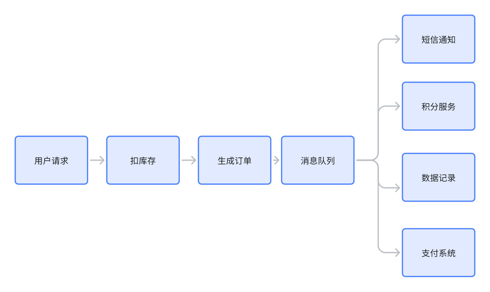

如果每一步都需要200ms左右，那这个调用链路和响应速度就会随着业务的扩展持续变长

因此我们可以对一些没有严格要求同步的服务，采用消息队列通知的方法异步处理

引入消息队列异步处理：

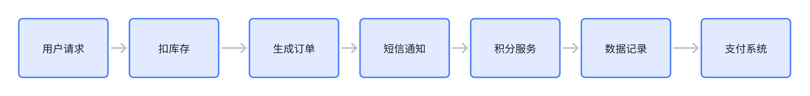

## 解耦

如上图，如果需要加新业务，只需要订阅消息队列的消息，不用去修改其他模块的代码

## 削峰

后端服务相对而言都是比较「弱」的，因为业务较重，处理时间较长。像一些例如秒杀活动爆发式流量打过来可能就顶不住了。因此需要引入一个中间件来做缓冲，消息队列再适合不过了。

网关的请求先放入消息队列中，后端服务尽自己最大能力去消息队列中消费请求。超时的请求可以直接返回错误。

当然还有一些服务特别是某些后台任务，不需要及时地响应，并且业务处理复杂且流程长，那么过来的请求先放入消息队列中，后端服务按照自己的节奏处理。这也是很 nice 的。


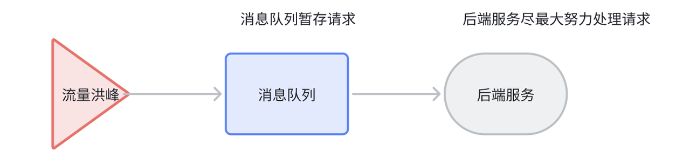

# **消息队列基本概念**

消息队列有两种模型：**队列模型**和**发布/订阅模型**。

## **队列模型**

生产者往某个队列里面发送消息，一个队列可以存储多个生产者的消息，一个队列也可以有多个消费者， 但是消费者之间是竞争关系，即每条消息只能被一个消费者消费。

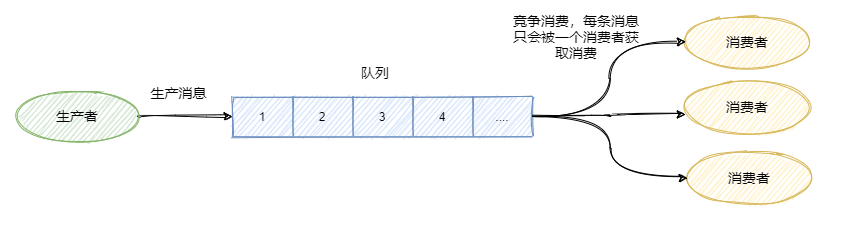

## **发布/订阅模型**

**为了解决一条消息能被多个消费者消费的问题**，发布/订阅模型就来了。该模型是将消息发往一个`Topic`即主题中，所有订阅了这个 `Topic` 的订阅者都能消费这条消息。

其实可以这么理解，发布/订阅模型等于我们都加入了一个群聊中，我发一条消息，加入了这个群聊的人都能收到这条消息。那么队列模型就是一对一聊天，我发给你的消息，只能在你的聊天窗口弹出，是不可能弹出到别人的聊天窗口中的。

讲到这有人说，那我一对一聊天对每个人都发同样的消息不就也实现了一条消息被多个人消费了嘛。

是的，通过多队列全量存储相同的消息，即数据的冗余可以实现一条消息被多个消费者消费。`RabbitMQ` 就是采用队列模型，通过 `Exchange` 模块来将消息发送至多个队列，解决一条消息需要被多个消费者消费问题。

这里还能看到假设群聊里除我之外只有一个人，那么此时的发布/订阅模型和队列模型其实就一样了。

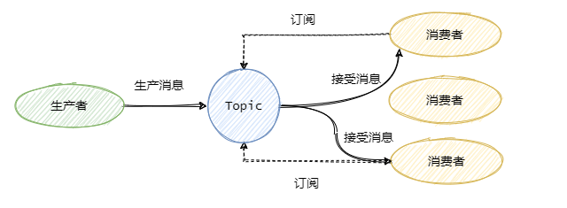

## **小结一下**

队列模型每条消息只能被一个消费者消费，而发布/订阅模型就是为让一条消息可以被多个消费者消费而生的，当然队列模型也可以通过消息全量存储至多个队列来解决一条消息被多个消费者消费问题，但是会有数据的冗余。

**发布/订阅模型兼容队列模型**，即只有一个消费者的情况下和队列模型基本一致。

`RabbitMQ` 采用队列模型，`RocketMQ`和`Kafka` 采用发布/订阅模型。

**接下来的内容都基于发布/订阅模型**。

## **常用术语**

一般我们称发送消息方为生产者 `Producer`，接受消费消息方为消费者`Consumer`，消息队列服务端为`Broker`。

消息从`Producer`发往`Broker`，`Broker`将消息存储至本地，然后`Consumer`从`Broker`拉取消息，或者`Broker`推送消息至`Consumer`，最后消费。

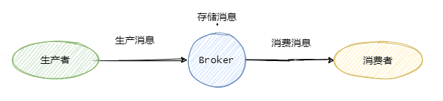

为了提高并发度，往往**发布/订阅模型**还会引入**队列**或者**分区**的概念。即消息是发往一个主题下的某个队列或者某个分区中。`RocketMQ`中叫队列，`Kafka`叫分区，本质一样。

例如某个主题下有 5 个队列，那么这个主题的并发度就提高为 5 ，同时可以有 5 个消费者**并行消费**该主题的消息。一般可以采用轮询或者 `key hash` 取余等策略来将同一个主题的消息分配到不同的队列中。

与之对应的消费者一般都有组的概念 `Consumer Group`, 即消费者都是属于某个消费组的。一条消息会发往多个订阅了这个主题的消费组。

假设现在有两个消费组分别是`Group 1` 和 `Group 2`，它们都订阅了`Topic-a`。此时有一条消息发往`Topic-a`，那么这两个消费组都能接收到这条消息。

然后这条消息实际是写入`Topic`某个队列中，消费组中的某个消费者对应消费一个队列的消息。

在物理上除了副本拷贝之外，一条消息在`Broker`中只会有一份，每个消费组会有自己的`offset`即消费点位来标识消费到的位置。在消费点位之前的消息表明已经消费过了。当然这个`offset`是队列级别的。每个消费组都会维护订阅的`Topic`下的每个队列的`offset`。

来个图看看应该就很清晰了。

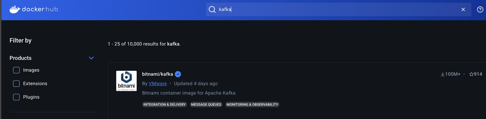

基本上熟悉了消息队列常见的术语和一些概念之后，咱们再来看看消息队列常见的核心面试点。

# **如何保证消息不丢失**

就我们市面上常见的消息队列而言，只要**配置得当**，我们的消息就不会丢。

先来看看这个图，

可以看到一共有三个阶段，分别是**生产消息、存储消息和消费消息**。我们从这三个阶段分别入手来看看如何确保消息不会丢失。

## **生产消息**

生产者发送消息至`Broker`，需要处理`Broker`的响应，不论是同步还是异步发送消息，同步和异步回调都需要做好`try-catch`，妥善的处理响应，如果`Broker`返回写入失败等错误消息，需要重试发送。当多次发送失败需要作报警，日志记录等。

这样就能保证在生产消息阶段消息不会丢失。

## **存储消息**

存储消息阶段需要在**消息刷盘之后**再给生产者响应，假设消息写入缓存中就返回响应，那么机器突然断电这消息就没了，而生产者以为已经发送成功了。

如果`Broker`是集群部署，有多副本机制，即消息不仅仅要写入当前`Broker`,还需要写入副本机中。那配置成至少写入两台机子后再给生产者响应。这样基本上就能保证存储的可靠了。一台挂了还有一台还在呢（假如怕两台都挂了..那就再多些）。

那假如来个地震机房机子都挂了呢？emmmmmm...大公司基本上都有异地多活。

那要是这几个地都地震了呢？emmmmmm...这时候还是先关心关心人吧。


## **消费消息**

这里经常会有同学犯错，有些同学当消费者拿到消息之后直接存入内存队列中就直接返回给`Broker`消费成功，这是不对的。

你需要考虑拿到消息放在内存之后消费者就宕机了怎么办。所以我们应该在**消费者真正执行完业务逻辑之后，再发送给`Broker`消费成功**，这才是真正的消费了。

所以只要我们在消息业务逻辑处理完成之后再给`Broker`响应，那么消费阶段消息就不会丢失。

## **小结一下**

可以看出，保证消息的可靠性需要**三方配合**。

`生产者`需要处理好`Broker`的响应，出错情况下利用重试、报警等手段。

`Broker`需要控制响应的时机，单机情况下是消息刷盘后返回响应，集群多副本情况下，即发送至两个副本及以上的情况下再返回响应。

`消费者`需要在执行完真正的业务逻辑之后再返回响应给`Broker`。

但是要注意**消息可靠性增强了，性能就下降了**，等待消息刷盘、多副本同步后返回都会影响性能。因此还是看业务，例如日志的传输可能丢那么一两条关系不大，因此没必要等消息刷盘再响应。

# **如果处理重复消息**

我们先来看看能不能避免消息的重复。

假设我们发送消息，就管发，不管`Broker`的响应，那么我们发往`Broker`是不会重复的。

但是一般情况我们是不允许这样的，这样消息就完全不可靠了，我们的基本需求是消息至少得发到`Broker`上，那就得等`Broker`的响应，那么就可能存在`Broker`已经写入了，当时响应由于网络原因生产者没有收到，然后生产者又重发了一次，此时消息就重复了。

再看消费者消费的时候，假设我们消费者拿到消息消费了，业务逻辑已经走完了，事务提交了，此时需要更新`Consumer offset`了，然后这个消费者挂了，另一个消费者顶上，此时`Consumer offset`还没更新，于是又拿到刚才那条消息，业务又被执行了一遍。于是消息又重复了。

可以看到正常业务而言**消息重复是不可避免的**，因此我们只能从**另一个角度**来解决重复消息的问题。

关键点就是**幂等**。既然我们不能防止重复消息的产生，那么我们只能在业务上处理重复消息所带来的影响。


## **幂等处理重复消息**

幂等是数学上的概念，我们就理解为同样的参数多次调用同一个接口和调用一次产生的结果是一致的。

例如这条 SQL`update t1 set money = 150 where id = 1 and money = 100;` 执行多少遍`money`都是150，这就叫幂等。

因此需要改造业务处理逻辑，使得在重复消息的情况下也不会影响最终的结果。

可以通过上面我那条 SQL 一样，做了个**前置条件判断**，即`money = 100`情况，并且直接修改，更通用的是做个`version`即版本号控制，对比消息中的版本号和数据库中的版本号。

或者通过**数据库的约束例如唯一键**，例如`insert into update on duplicate key...`。

或者**记录关键的key**，比如处理订单这种，记录订单ID，假如有重复的消息过来，先判断下这个ID是否已经被处理过了，如果没处理再进行下一步。当然也可以用全局唯一ID等等。

基本上就这么几个套路，**真正应用到实际中还是得看具体业务细节**。

# **如何保证消息的有序性**

有序性分：**全局有序和部分有序**。

## **全局有序**

如果要保证消息的全局有序，首先只能由一个生产者往`Topic`发送消息，并且一个`Topic`内部只能有一个队列（分区）。消费者也必须是单线程消费这个队列。这样的消息就是全局有序的！

不过一般情况下我们都不需要全局有序，即使是同步`MySQL Binlog`也只需要保证单表消息有序即可。

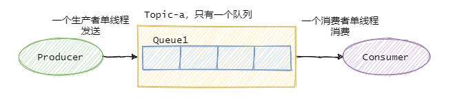

## **部分有序**

因此绝大部分的有序需求是部分有序，部分有序我们就可以将`Topic`内部划分成我们需要的队列数，把消息通过特定的策略发往固定的队列中，然后每个队列对应一个单线程处理的消费者。这样即完成了部分有序的需求，又可以通过队列数量的并发来提高消息处理效率。

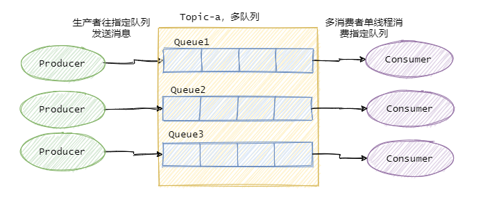

图中我画了多个生产者，一个生产者也可以，只要同类消息发往指定的队列即可。

# **如果处理消息堆积**

消息的堆积往往是因为**生产者的生产速度与消费者的消费速度不匹配**。有可能是因为消息消费失败反复重试造成的，也有可能就是消费者消费能力弱，渐渐地消息就积压了。

因此我们需要**先定位消费慢的原因**，如果是`bug`则处理 `bug` ，如果是因为本身消费能力较弱，我们可以优化下消费逻辑，比如之前是一条一条消息消费处理的，这次我们批量处理，比如数据库的插入，一条一条插和批量插效率是不一样的。

假如逻辑我们已经都优化了，但还是慢，那就得考虑水平扩容了，增加`Topic`的队列数和消费者数量，**注意队列数一定要增加**，不然新增加的消费者是没东西消费的。**一个Topic中，一个队列只会分配给一个消费者**。

当然你消费者内部是单线程还是多线程消费那看具体场景。不过要注意上面提高的消息丢失的问题，如果你是将接受到的消息写入**内存队列**之后，然后就返回响应给`Broker`，然后多线程向内存队列消费消息，假设此时消费者宕机了，内存队列里面还未消费的消息也就丢了。

# 常见的消息队列选型

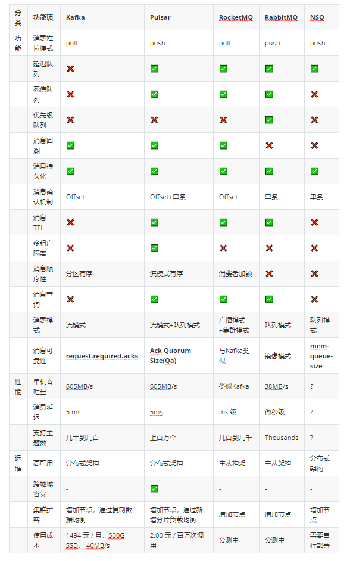

先来个汇总，接下来会对消息队列中间件的各项功能进行逐个分析。

* **消费推拉模式**

客户端消费者获取消息的方式，Kafka和RocketMQ是通过长轮询Pull的方式拉取消息，RabbitMQ、Pulsar、NSQ都是通过Push的方式。

pull类型的消息队列更适合高吞吐量的场景，允许消费者自己进行流量控制，根据消费者实际的消费能力去获取消息。而push类型的消息队列，实时性更好，但需要有一套良好的流控策略（backpressure）当消费者消费能力不足时，减少push的消费数量，避免压垮消费端。

* **延迟队列**

消息延迟投递，当消息产生送达消息队列时，有些业务场景并不希望消费者立刻收到消息，而是等待特定时间后，消费者才能拿到这个消息进行消费。延迟队列一般分为两种，基于消息的延迟和基于队列的延迟。基于消息的延迟指为每条消息设置不同的延迟时间，当队列有新消息进入的时候根据延迟时间排序，当然这样会对性能造成较大影响。另一种基于队列的延迟指的是设置不同延迟级别的队列，队列中每个消息的延迟时间都是相同的，这样免去了基于延迟时间排序对性能带来的损耗，通过一定的扫描策略即可投递超时的消息。

延迟消息的使用场景比如异常检测重试，订单超时取消等，例如：

* 服务请求异常，需要将异常请求放到单独的队列，隔5分钟后进行重试；

* 用户购买商品，但一直处于未支付状态，需要定期提醒用户支付，超时则关闭订单；

* 面试或者会议预约，在面试或者会议开始前半小时，发送通知再次提醒。

Kafka不支持延迟消息。Pulsar支持秒级的延迟消息，所有延迟投递的消息会被Delayed Message Tracker记录对应的index，consumer在消费时，会先去Delayed Message Tracker检查，是否有到期需要投递的消息，如果有到期的消息，则从Tracker中拿出对应的index，找到对应的消息进行消费，如果没有到期的消息，则直接消费正常的消息。对于长时间的延迟消息，会被存储在磁盘中，当快到延迟间隔时才被加载到内存里。

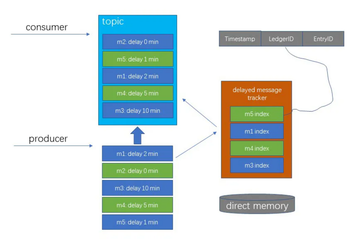

RocketMQ开源版本延迟消息临时存储在一个内部主题中，不支持任意时间精度，支持特定的level，例如定时5s，10s，1m等。

RabbitMQ需要安装一个rabbitmq\_delayed\_message\_exchange插件。

NSQ通过内存中的优先级队列来保存延迟消息，支持秒级精度，最多2个小时延迟。

* **死信队列**

由于某些原因消息无法被正确的投递，为了确保消息不会被无故的丢弃，一般将其置于一个特殊角色的队列，这个队列一般称之为死信队列。与此对应的还有一个“回退队列”的概念，试想如果消费者在消费时发生了异常，那么就不会对这一次消费进行确认（Ack）, 进而发生回滚消息的操作之后消息始终会放在队列的顶部，然后不断被处理和回滚，导致队列陷入死循环。为了解决这个问题，可以为每个队列设置一个回退队列，它和死信队列都是为异常的处理提供的一种机制保障。实际情况下，回退队列的角色可以由死信队列和重试队列来扮演。

Kafka没有死信队列，通过Offset的方式记录当前消费的偏移量。

Pulsar有重试机制，当某些消息第一次被消费者消费后，没有得到正常的回应，则会进入重试Topic中，当重试达到一定次数后，停止重试，投递到死信Topic中。

RocketMQ通过DLQ来记录所有消费失败的消息。

RabbitMQ是利用类似于延迟队列的形式实现死信队列。

NSQ没有死信队列。

* **优先级队列**

优先级队列不同于先进先出队列，优先级高的消息具备优先被消费的特权，这样可以为下游提供不同消息级别的保证。不过这个优先级也是需要有一个前提的：如果消费者的消费速度大于生产者的速度，并且消息中间件服务器（一般简单的称之为Broker）中没有消息堆积，那么对于发送的消息设置优先级也就没有什么实质性的意义了，因为生产者刚发送完一条消息就被消费者消费了，那么就相当于Broker中至多只有一条消息，对于单条消息来说优先级是没有什么意义的。

Kafka、RocketMQ、Pulsar、NSQ不支持优先级队列，可以通过不同的队列来实现消息优先级。

RabbitMQ支持优先级消息。

* **消息回溯**

一般消息在消费完成之后就被处理了，之后再也不能消费到该条消息。消息回溯正好相反，是指消息在消费完成之后，还能消费到之前被消费掉的消息。对于消息而言，经常面临的问题是“消息丢失”，至于是真正由于消息中间件的缺陷丢失还是由于使用方的误用而丢失一般很难追查，如果消息中间件本身具备消息回溯功能的话，可以通过回溯消费复现“丢失的”消息进而查出问题的源头之所在。消息回溯的作用远不止与此，比如还有索引恢复、本地缓存重建，有些业务补偿方案也可以采用回溯的方式来实现。

Kafka支持消息回溯，可以根据时间戳或指定Offset，重置Consumer的Offset使其可以重复消费。

Pulsar支持按时间对消息进行回溯。

RocketMQ支持按时间回溯，实现的原理跟Kafka一致。

RabbitMQ不支持回溯，消息一旦标记确认就会被标记删除。

NSQ一般消息是不可回溯的，但可以通过nsq\_to\_file工具，将消息写入到文件，然后从文件里重放消息。

* **消息持久化**

流量削峰是消息中间件的一个非常重要的功能，而这个功能其实得益于其消息堆积能力。从某种意义上来讲，如果一个消息中间件不具备消息堆积的能力，那么就不能把它看做是一个合格的消息中间件。消息堆积分内存式堆积和磁盘式堆积。一般来说，磁盘的容量会比内存的容量要大得多，对于磁盘式的堆积其堆积能力就是整个磁盘的大小。从另外一个角度讲，消息堆积也为消息中间件提供了冗余存储的功能。

Kafka和RocketMQ直接将消息刷入磁盘文件中进行持久化，所有的消息都存储在磁盘中。只要磁盘容量够，可以做到无限消息堆积。

RabbitMQ 是典型的内存式堆积，但这并非绝对，在某些条件触发后会有换页动作来将内存中的消息换页到磁盘（换页动作会影响吞吐），或者直接使用惰性队列来将消息直接持久化至磁盘中。

Pulsar消息是存储在BookKeeper存储集群上，也是磁盘文件。

NSQ通过nsq\_to\_file工具，将消息写入到文件。

* **消息确认机制**

消息队列需要管理消费进度，确认消费者是否成功处理消息，使用push的方式的消息队列组件往往是对单条消息进行确认，对于未确认的消息，进行延迟重新投递或者进入死信队列。

Kafka通过Offset的方式确认消息。

RocketMQ与Kafka类似也会提交Offset，区别在于消费者对于消费失败的消息，可以标记为消息消费失败，Broker会重试投递，如果累计多次消费失败，会投递到死信队列。

RabbitMQ和NSQ类似，消费者确认单条消息，否则会重新放回队列中等待下次投递。

Pulsar使用专门的Cursor管理。累积确认和Kafka效果一样；提供单条或选择性确认。

* **消息TTL**

消息TTL表示一条消息的生存时间，如果消息发出来后，在TTL的时间内没有消费者进行消费，消息队列会将消息删除或者放入死信队列中。

Kafka根据设置的保留期来删除消息。有可能消息没被消费，过期后被删除。不支持TTL。

Pulsar支持TTL，如果消息未在配置的TTL时间段内被任何消费者使用，则消息将自动标记为已确认。消息保留期与消息TTL之间的区别在于：消息保留期作用于标记为已确认并设置为已删除的消息，而TTL作用于未ack的消息。上面的图例中说明了Pulsar中的TTL。例如，如果订阅B没有活动消费者，则在配置的TTL时间段过后，消息M10将自动标记为已确认，即使没有消费者实际读取该消息。

RocketMQ提及到消息TTL的资料比较少，不过看接口似乎是支持的。

RabbitMQ有两种方式，一个是声明队列的时候在队列属性中设置，整个队列中的消息都有相同的有效期。还可以发送消息的时候给消息设置属性，可以位每条消息都设置不同的TTL。

NSQ似乎还没支持，有一个Feature Request的Issue处于Open状态。

* **多租户隔离**

多租户是指通过一个软件实例为多个租户提供服务的能力。租户是指对系统有着相同“视图”的一组用户。不支持多租户的系统里边，往往要为不同用户或者不同集群创建多个消息队列实例实现物理隔离，这样会带来较高的运维成本。作为一种企业级的消息系统，Pulsar的多租户能力按照设计可满足下列需求：

* 确保严苛的SLA可顺利满足。

* 保证不同租户之间的隔离。

* 针对资源利用率强制实施配额。

* 提供每租户和系统级的安全性。

* 确保低成本运维以及尽可能简单的管理。

Pulsar通过下列方式满足了上述需求：

* 通过为每个租户进行[身份验证](https://cloud.tencent.com/product/idam?from_column=20065\&from=20065)、授权和ACL（访问控制列表）获得所需安全性。

* 为每个租户强制实施存储配额。

以策略的方式定义所有隔离机制，策略可在运行过程中更改，借此降低运维成本并简化管理工作。

* **消息顺序性**

消息顺序性是指保证消息有序。消息消费顺序跟生产的顺序保持一致。

Kafka保证了分区内的消息有序。

Pulsar支持两种消费模式，独占订阅的流模式只保证了消息的顺序性，共享订阅队列模型不保证有序性。

RocketMQ需要用到锁来保证一个队列同时只有一个消费者线程进行消费，保证消息的有序性。

RabbitMQ顺序性的条件比较苛刻，需要单线程发送、单线程消费，并且不采用延迟队列、优先级队列等高级功能。

NSQ是利用了golang自身的case/select实现的消息分发，本身不提供有序性保障，不能够把特性消息和消费者对应起来，无法实现消息的有序性。

* **消息查询**

在实际开发中，经常要查看MQ中消息的内容，比如通过某个MessageKey/ID，查询到MQ的具体消息。或者是对消息进行链路追踪，知道消息从哪里来，发送到哪里去，进而快速对问题进行排查定位。

Kafka存储层是以分布式提交日志的形式实现，每次写操作都顺序追加到日志的末尾。读也是顺序读。不支持检索功能。

Pulsar可以通过消息ID，查询到具体某条消息的消息内容、消息参数和消息轨迹。

RocketMQ支持按Message Key、Unique Key、Message Id对消息进行查询。

RabbitMQ使用基于索引的存储系统。这些将数据保存在树结构中，以提供确认单个消息所需的快速访问。由于RabbitMQ的消息在确认后会被删除，因此只能查询未确认的消息。

NSQ自身不支持消息持久化和消息检索，不过可以使用nsq\_to\_http等工具将消息写入可支持索引的存储里。

* **消费模式**

Kafka有两种消费模式，最终都会保证一个分区只有1个消费者在消费：

* subscribe方式：当主题分区数量变化或者consumer数量变化时，会进行rebalance；注册rebalance监听器，可以手动管理offset不注册监听器，kafka自动管理。

* assign方式：手动将consumer与partition进行对应，kafka不会进行rebanlance。

Pulsar有以下四种消费模式，其中独占模式和灾备模式跟Kafka类似，为流模型，每个分区只有1个消费者消费，能保证消息有序性。共享模式和Key共享模式为队列模型，多个消费者能提高消费速度，但不能保证有序性。

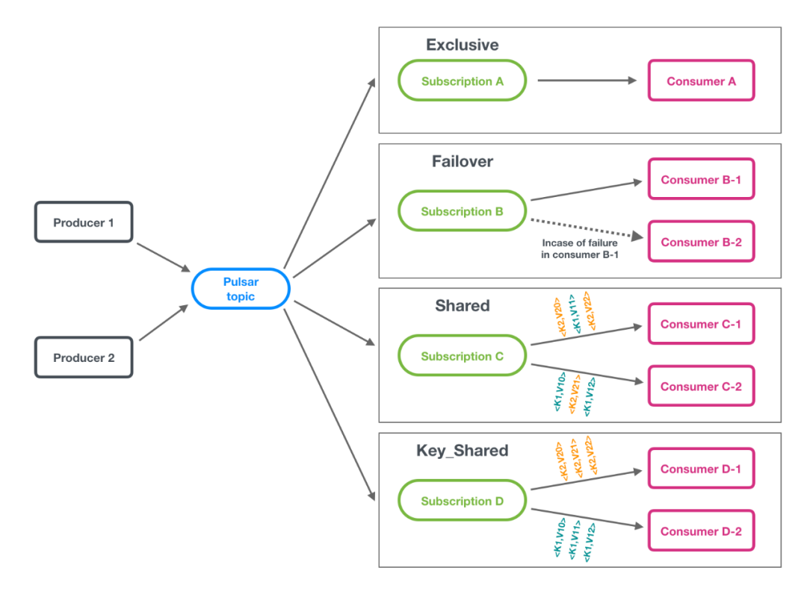

* Exclusive独占模式（默认模式）：一个Subscription只能与一个Consumer关联，只有这个Consumer可以接收到Topic的全部消息，如果该Consumer出现故障了就会停止消费。

* 灾备模式（Failover）：当存在多个consumer时，将会按字典顺序排序，第一个consumer被初始化为唯一接受消息的消费者。当第一个consumer断开时，所有的消息（未被确认和后续进入的）将会被分发给队列中的下一个consumer。

* 共享模式（Shared）：消息通过round robin轮询机制（也可以自定义）分发给不同的消费者，并且每个消息仅会被分发给一个消费者。当消费者断开连接，所有被发送给他，但没有被确认的消息将被重新安排，分发给其它存活的消费者。

* KEY共享模式（Key\_Shared）：当存在多个consumer时，将根据消息的 key进行分发，key相同的消息只会被分发到同一个消费者。

RocketMQ有两种消费模式，BROADCASTING广播模式，CLUSTERING集群模式。

广播消费指的是：一条消息被多个consumer消费，即使这些consumer属于同一个ConsumerGroup，消息也会被ConsumerGroup中的每个Consumer都消费一次，广播消费中ConsumerGroup概念可以认为在消息划分方面无意义。

集群消费模式：一个ConsumerGroup中的Consumer实例平均分摊消费消息。例如某个Topic有9条消息，其中一个ConsumerGroup有3个实例（可能是3个进程，或者3台机器），那么每个实例只消费其中部分，消费完的消息不能被其他实例消费。

RabbitMQ和NSQ的消费比较类似，都是跟Pulsar共享模式类似的，队列的形式，增加一个消费者组里的消费者数量能提高消费速度。

* **消息可靠性**

消息丢失是使用消息中间件时所不得不面对的一个同点，其背后消息可靠性也是衡量消息中间件好坏的一个关键因素。尤其是在金融支付领域，消息可靠性尤为重要。比如当服务出现故障时，一些对于生产者来说已经生产成功的消息，是否会在高可用切换时丢失。同步刷盘是增强一个组件可靠性的有效方式，消息中间件也不例外，Kafka和RabbitMQ都可以支持同步刷盘，但绝大多数情景下，一个组件的可靠性不应该由同步刷盘这种极其损耗性能的操作来保障，而是采用多副本的机制来保证。

Kafka可以通过配置request.required.acks参数设置可靠级别，表示一条消息有多少个副本确认接收成功后，才被任务发送成功。

* request.required.acks=-1 (全量同步确认，强可靠性保证)

* request.required.acks=1(leader确认收到，默认)

* request.required.acks=0 (不确认，但是吞吐量大)

Pulsar有跟Kafka类似的概念，叫Ack Quorum Size(Qa)，Qa是每次写请求发送完毕后需要回复确认的Bookie的个数，其数值越大则需要确认写成功的时间越长，其值上限是副本数Qw。为了一致性，Qa应该是：(Qw+1)/2或者更，即为了确保[数据安全](https://cloud.tencent.com/product/dsgc?from_column=20065\&from=20065)性，Qa下限是 (Qw+1)/2。

RocketMQ与Kafka类似。

RabbitMQ是主从架构，通过镜像环形队列实现多副本及强一致性语义的。多副本可以保证在master节点宕机异常之后可以提升slave作为新的master而继续提供服务来保障可用性。

NSQ会通过go-diskqueue组件将消息落盘到本地文件中，通过mem-queue-size参数控制内存中队列大小，如果mem-queue-size=0每条消息都会存储到磁盘里，不用担心节点重启引起的消息丢失。但由于是存储在本


# 简单实战——部署与连接kafka集群

## 概念

一个Kafka集群是由下列几种类型的节点构成的，它们充当着不同的作用：

Broker节点：即代理节点，是Kafka中的工作节点，充当消息队列的角色，负责储存和处理消息，每个Broker都是一个独立的Kafka服务器，可以在不同的机器上运行，除此之外Broker还负责分区（partition）的管理，将主题（topic）划分为多个分区，并分布在集群的不同Broker上

Controller节点：即控制器节点，是集群中的特殊节点，负责储存和管理整个集群元数据和状态，它能够监控整个集群中的Broker，在需要时还能够进行平衡操作

混合节点：即同时担任Broker和Controller节点角色的节点

### Zookeeper模式集群

这是一种比较简单，相对“传统”的搭建方式了！在这种模式下，每个Kafka节点都是依赖于Zookeeper的，使用Zookeeper存储集群中所有节点的元数据。

只要所有的Kafka节点连接到同一个Zookeeper上面（或者同一个Zookeeper集群），这些Kafka节点就构成了一个集群。所以说就算是只有一个Kafka节点在运行，这一个节点也可以称作一个集群。

在Zookeeper模式集群中，Zookeeper节点（或者集群）就充当了Controller的角色，而所有的Kafka节点就充当着Broker的角色

### KRaft模式集群

在上述传统方案中，Kafka需要依赖Zookeeper完成元数据存放和共享，这样也就暴露出了一些问题：

搭建Kafka集群时还需要额外搭建Zookeeper，增加了运维成本

Zookeeper是强一致性的组件（符合CP理论），如果集群中数据发生变化，那么必须要等到其它节点都同步，至少超过一半同步完成，这样节点数多性能差

KRaft模式是新版本Kafka中推出的集群模式，这种模式下就完全不需要Zookeeper了！只需要数个Kafka节点就可以直接构成集群，在这时集群中的Kafka节点既有可能是Controller节点也可能是Broker节点，在这个模式中，我们不仅可以手动配置某个节点的角色（是Controller还是Broker），还可以使其同时担任Broker和Controller角色（混合节点）。

在KRaft模式中，集群的节点会通过投票选举的方式，选择出一个主要的Controller节点，这个节点也称作领导者，它将负责维护整个集群的元数据和状态信息，那么其它的Controller节点或者混合节点就称之为追随者，它们会从领导者同步集群元数据和状态信息。如果领导者宕机了，所有的节点会重新投票选举一个新的领导者。

在选举过程中，所有的节点都会参与投票过程，而候选节点只会是Controller节点或者混合节点（即Broker节点不会被选举为领导者）。


需要注意的是，在默认情况下Kafka集群中的Broker节点和Controller节点通常会监听不同的端口：


Broker节点是Kafka集群中的数据节点（消息队列），它们负责接收客户端的消息和传递消息给客户端，默认情况下，每个Broker节点会监听9092端口，该端口用于与客户端进行通信，客户端可以将消息发送到这个端口，或者从这个端口接收消息，这个端口可以称作客户端通信端口

Controller节点是Kafka集群中的控制器节点，负责管理集群的状态和元数据，Controller节点监听的端口通常是9093，该端口用于集群中其他节点获取元数据或在混合节点选举新的Controller时进行通信，通过该端口，其他节点可以与Controller节点交互，获取集群的元数据信息或参与控制器的选举过程，这个端口可以称作控制器端口

混合节点（即同时担任Broker和Controller角色的节点）中，这两个端口都会被使用，默认情况下混合节点将监听9092端口接收和传递消息给客户端，并监听9093端口用于与其他节点进行元数据交换和控制器选举通信，可见混合节点会同时使用两个端口分别作为客户端通信端口与控制器端口

所以需要根据实际情况配置网络设置和防火墙规则，以确保Kafka集群中的节点能够在正确的端口上进行通信。上述提到的两种端口也是可以修改的，当然不建议修改。

同样地，就算是你只是搭建了一个Kafka节点，这一个节点也仍然被视为一个Kafka集群，并且KRaft模式下如果只需要建立一个节点，那么这个节点必须是混合节点。


## 部署

对于常用的中间件，可以轻松地在dockerhub找到镜像

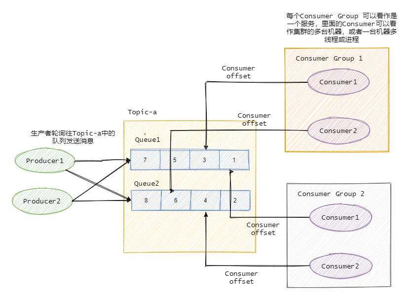

这里直接使用bitnami社区的kafka，下载量很多，而且文档完整

他们的文档：https://github.com/bitnami/containers/blob/main/bitnami/kafka/README.md

仔细阅读文档后，对项目中提供的傻瓜式🤪一键部署kafka集群的docker-compose-cluster.yml“稍作修改”（如果要配置ssl证书和设置密码啥的工作量会大一些），就可以投入使用了

这里粘一下我修改好之后的docker-compose文件，对外暴露了端口，添加了用户密码的校验

```yaml
services:
  kafka-0:
    image: docker.io/bitnami/kafka:3.9
    ports:
      # kafka-0 暴露 9094 端口
      - "9094:9094"
    environment:
      # Kafka KRaft 配置
      - KAFKA_CFG_NODE_ID=0
      - KAFKA_CFG_PROCESS_ROLES=controller,broker
      - KAFKA_CFG_CONTROLLER_QUORUM_VOTERS=0@kafka-0:9093,1@kafka-1:9093,2@kafka-2:9093
      - KAFKA_KRAFT_CLUSTER_ID=abcdefghijklmnopqrstuv
      # 监听器配置 - 修改为支持SASL
      - KAFKA_CFG_LISTENERS=SASL_PLAINTEXT://:9092,CONTROLLER://:9093,SASL_EXTERNAL://0.0.0.0:9094
      - KAFKA_CFG_ADVERTISED_LISTENERS=SASL_PLAINTEXT://kafka-0:9092,SASL_EXTERNAL://你的ip:9094
      - KAFKA_CFG_LISTENER_SECURITY_PROTOCOL_MAP=SASL_PLAINTEXT:SASL_PLAINTEXT,CONTROLLER:PLAINTEXT,SASL_EXTERNAL:SASL_PLAINTEXT
      - KAFKA_CFG_CONTROLLER_LISTENER_NAMES=CONTROLLER
      - KAFKA_CFG_INTER_BROKER_LISTENER_NAME=SASL_PLAINTEXT
      # SASL配置
      - KAFKA_CFG_SASL_ENABLED_MECHANISMS=PLAIN
      - KAFKA_CFG_SASL_MECHANISM_INTER_BROKER_PROTOCOL=PLAIN
      # cluster
      - KAFKA_CFG_OFFSETS_TOPIC_REPLICATION_FACTOR=3
      - KAFKA_CFG_TRANSACTION_STATE_LOG_REPLICATION_FACTOR=3
      - KAFKA_CFG_TRANSACTION_STATE_LOG_MIN_ISR=2
      # 认证配置
      - KAFKA_CLIENT_USERS=user
      - KAFKA_CLIENT_PASSWORDS=password
    volumes:
      - kafka_0_data:/bitnami/kafka

  kafka-1:
    image: docker.io/bitnami/kafka:3.9
    ports:
      # kafka-1 暴露 9095 端口
      - "9095:9094"
    environment:
      - KAFKA_CFG_NODE_ID=1
      - KAFKA_CFG_PROCESS_ROLES=controller,broker
      - KAFKA_CFG_CONTROLLER_QUORUM_VOTERS=0@kafka-0:9093,1@kafka-1:9093,2@kafka-2:9093
      - KAFKA_KRAFT_CLUSTER_ID=abcdefghijklmnopqrstuv
      # 监听器配置 - 修改为支持SASL
      - KAFKA_CFG_LISTENERS=SASL_PLAINTEXT://:9092,CONTROLLER://:9093,SASL_EXTERNAL://0.0.0.0:9094
      - KAFKA_CFG_ADVERTISED_LISTENERS=SASL_PLAINTEXT://kafka-1:9092,SASL_EXTERNAL://你的ip:9095
      - KAFKA_CFG_LISTENER_SECURITY_PROTOCOL_MAP=SASL_PLAINTEXT:SASL_PLAINTEXT,CONTROLLER:PLAINTEXT,SASL_EXTERNAL:SASL_PLAINTEXT
      - KAFKA_CFG_CONTROLLER_LISTENER_NAMES=CONTROLLER
      - KAFKA_CFG_INTER_BROKER_LISTENER_NAME=SASL_PLAINTEXT
      # SASL配置
      - KAFKA_CFG_SASL_ENABLED_MECHANISMS=PLAIN
      - KAFKA_CFG_SASL_MECHANISM_INTER_BROKER_PROTOCOL=PLAIN
      # cluster
      - KAFKA_CFG_OFFSETS_TOPIC_REPLICATION_FACTOR=3
      - KAFKA_CFG_TRANSACTION_STATE_LOG_REPLICATION_FACTOR=3
      - KAFKA_CFG_TRANSACTION_STATE_LOG_MIN_ISR=2
      # 认证配置
      - KAFKA_CLIENT_USERS=user
      - KAFKA_CLIENT_PASSWORDS=password
    volumes:
      - kafka_1_data:/bitnami/kafka

  kafka-2:
    image: docker.io/bitnami/kafka:3.9
    ports:
      # kafka-2 暴露 9096 端口
      - "9096:9094"
    environment:
      - KAFKA_CFG_NODE_ID=2
      - KAFKA_CFG_PROCESS_ROLES=controller,broker
      - KAFKA_CFG_CONTROLLER_QUORUM_VOTERS=0@kafka-0:9093,1@kafka-1:9093,2@kafka-2:9093
      - KAFKA_KRAFT_CLUSTER_ID=abcdefghijklmnopqrstuv
      # 监听器配置 - 修改为支持SASL
      - KAFKA_CFG_LISTENERS=SASL_PLAINTEXT://:9092,CONTROLLER://:9093,SASL_EXTERNAL://0.0.0.0:9094
      - KAFKA_CFG_ADVERTISED_LISTENERS=SASL_PLAINTEXT://kafka-2:9092,SASL_EXTERNAL://你的ip:9096
      - KAFKA_CFG_LISTENER_SECURITY_PROTOCOL_MAP=SASL_PLAINTEXT:SASL_PLAINTEXT,CONTROLLER:PLAINTEXT,SASL_EXTERNAL:SASL_PLAINTEXT
      - KAFKA_CFG_CONTROLLER_LISTENER_NAMES=CONTROLLER
      - KAFKA_CFG_INTER_BROKER_LISTENER_NAME=SASL_PLAINTEXT
      # SASL配置
      - KAFKA_CFG_SASL_ENABLED_MECHANISMS=PLAIN
      - KAFKA_CFG_SASL_MECHANISM_INTER_BROKER_PROTOCOL=PLAIN
      # cluster
      - KAFKA_CFG_OFFSETS_TOPIC_REPLICATION_FACTOR=3
      - KAFKA_CFG_TRANSACTION_STATE_LOG_REPLICATION_FACTOR=3
      - KAFKA_CFG_TRANSACTION_STATE_LOG_MIN_ISR=2
      # 认证配置
      - KAFKA_CLIENT_USERS=user
      - KAFKA_CLIENT_PASSWORDS=password
    volumes:
      - kafka_2_data:/bitnami/kafka

volumes:
  kafka_0_data:
    driver: local
  kafka_1_data:
    driver: local
  kafka_2_data:
    driver: local
```

生产者示例

```go
func main() {
    topic := "my-topic"
    partition := 0

    // 创建SASL认证机制（使用用户名和密码）
    mechanism := plain.Mechanism{
       Username: "user",
       Password: "password",
    }

    // 创建无TLS的Dialer（因为我们配置的是SASL_PLAINTEXT）
    dialer := &kafka.Dialer{
       Timeout:       10 * time.Second,
       DualStack:     true,
       SASLMechanism: mechanism,
    }

    // 连接至Kafka集群的Leader节点
    conn, err := dialer.DialLeader(context.Background(), "tcp", "你的ip:9094", topic, partition)
    if err != nil {
       log.Fatal("failed to dial leader:", err)
    }

    // 设置发送消息的超时时间
    conn.SetWriteDeadline(time.Now().Add(10 * time.Second))

    // 发送消息
    _, err = conn.WriteMessages(
       kafka.Message{Value: []byte("原神启动!")},
       kafka.Message{Value: []byte("星铁启动!")},
       kafka.Message{Value: []byte("绝区零启动!")},
    )
    if err != nil {
       log.Fatal("failed to write messages:", err)
    }
    fmt.Println("write messages success")

    // 关闭连接
    if err := conn.Close(); err != nil {
       log.Fatal("failed to close writer:", err)
    }
}
```

消费者示例

```go
func main() {
    // 配置信息
    topic := "my-topic"
    groupID := "my-consumer-group"
    brokers := []string{"你的ip:9094"}

    // 创建SASL认证机制
    mechanism := plain.Mechanism{
       Username: "user",
       Password: "password",
    }

    // 配置Dialer (不使用TLS，因为我们使用的是SASL_PLAINTEXT)
    dialer := &kafka.Dialer{
       Timeout:       10 * time.Second,
       DualStack:     true,
       SASLMechanism: mechanism,
    }

    // 创建Reader配置
    r := kafka.NewReader(kafka.ReaderConfig{
       Brokers:         brokers,
       Topic:           topic,
       GroupID:         groupID,           // 消费者组ID
       MinBytes:        10e3,              // 10KB 最小批处理大小
       MaxBytes:        10e6,              // 10MB 最大批处理大小
       MaxWait:         1 * time.Second,   // 最长等待时间
       StartOffset:     kafka.FirstOffset, // 从最早的消息开始（可选用 kafka.LastOffset 从最新的开始）
       ReadLagInterval: -1,                // 禁用滞后报告
       Dialer:            dialer,            // 使用带SASL的dialer
    })

    // 捕获中断信号以优雅退出
    sigchan := make(chan os.Signal, 1)
    signal.Notify(sigchan, syscall.SIGINT, syscall.SIGTERM)

    // 创建上下文，允许我们控制消费循环
    ctx, cancel := context.WithCancel(context.Background())
    defer cancel()

    // 在单独的goroutine中处理信号
    go func() {
       sig := <-sigchan
       fmt.Printf("捕获到信号: %v, 正在关闭消费者...\n", sig)
       cancel()
    }()

    fmt.Println("开始消费消息，按 Ctrl+C 停止...")

    // 消费消息循环
    for {
       select {
       case <-ctx.Done():
          fmt.Println("上下文已取消，退出消费循环")
          if err := r.Close(); err != nil {
             log.Fatalf("关闭reader失败: %v", err)
          }
          return
       default:
          // 读取消息
          m, err := r.ReadMessage(ctx)
          if err != nil {
             // 检查是否因为上下文取消而中断
             if ctx.Err() != nil {
                continue
             }
             log.Printf("读取消息失败: %v", err)
             continue
          }

          // 处理消息
          fmt.Printf("收到消息: 主题=%s, 分区=%d, 偏移量=%d, 键=%s, 值=%s\n",
             m.Topic, m.Partition, m.Offset, string(m.Key), string(m.Value))

          // 这里可以添加您的业务逻辑来处理消息

          // kafka-go 自动处理提交偏移量，除非您使用了CommitMessages方法手动控制
       }
    }
}
```

关于更多的怎么使用go语言操作kafka这里就不多赘述了，网上的资料很多，可以很方便的集成到项目中

**注意**：**任何**运行在生产环境的中间件都需要安全验证（即使是内网部署最好也添加）


# 作业：

1.背一背这一块的八股

每种消息队列的设计原理都不太一样，网上关于rabbitmq和kafka的八股会多一些，可以先选一个着重开始看

2.有兴趣可以自己部署一个mq添加到项目中


