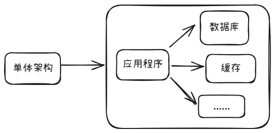
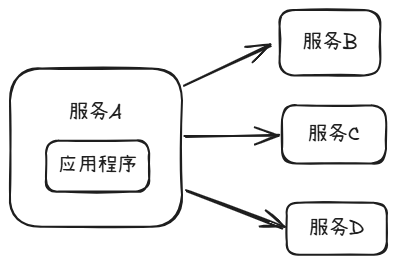
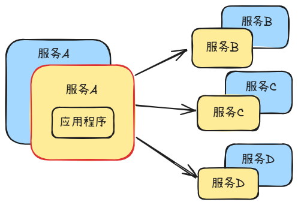
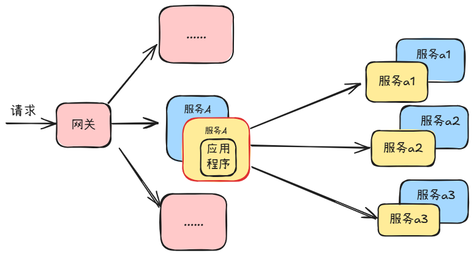
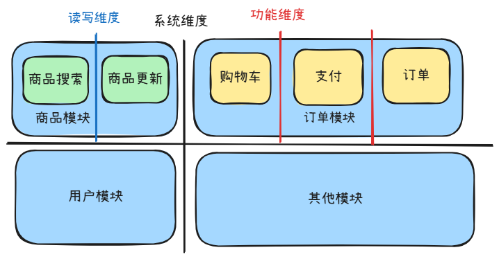
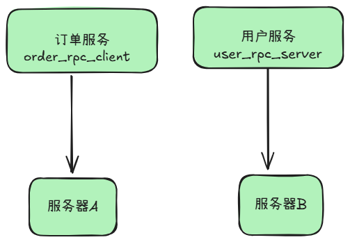
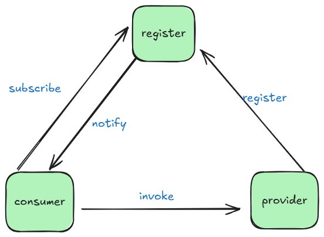
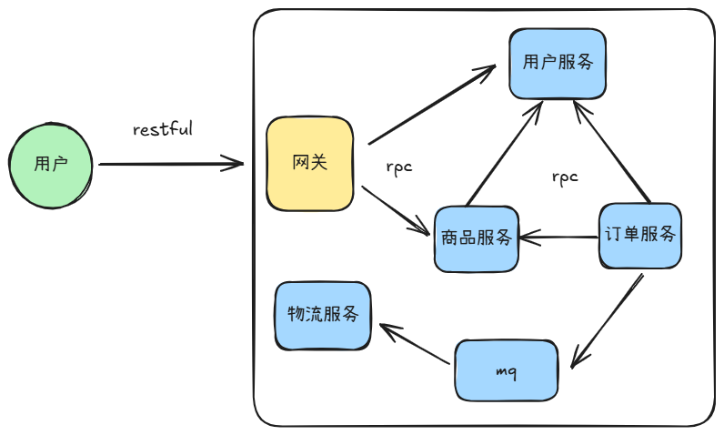
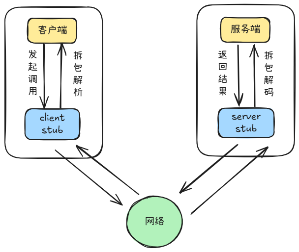

## 微服务基础理论

### 架构演变

#### 单体架构




**单体架构就是数据库，缓存等一系列组件都在一台机器上面**，

单体应用的优点

- **开发效率高**：功能都在单个程序内部，便于软件设计和开发规划。
- **容易部署成本低**：程序单一不存在分布式集群的复杂部署环境，降低了部署难度。
- **容易测试**：没有各种复杂的服务调用关系，都是内部调用方便测试。

单体架构的缺点就是，在数据，缓存，文件等不断增多的情况下，一台服务器资源有限经受不了这种压力，于是就提出了一种分布式的解决方案

#### 分布式设计



这种设计将各个服务都部署到不同的机器上面进行运行，这样各个服务之前不会进行资源的竞争，压力就小了很多，但是在这种情况下面就会出现一个问题：**由于机器部署了多台，每个服务都可能出现宕机的情况，于是提出了集群在保障了基本的高可用。**

#### 集群



我们可以部署一台不同的机器跑相同的服务，再通过合理的负载均衡策略，将请求分散到不同的服务器上面，这样的话就保障了一定的高可用，比如我们有两台机器，如果其中的一台机器挂掉了，另一台机器就可以承担整个请求的任务了。

但是当前的集群也会有一个新的问题的：**比如这里的服务ABC，每个服务的请求量和业务复杂度都是不同的，那么就会出现有一些服务的请求和复杂度特别高，那么我们就会对一些服务进行拆分更微小的服务，降低耦合度，这样就形成了我们的微服务。**

#### 微服务



从单体整个应用程序开始进行拆分，拆分为多个服务，并根据每个服务各自的特点拆分成更微笑的服务，最终就成就了我们的微服务。在微服务前有一个网关，通过负载均衡和nginx反向代理进入我们的网关，通过网关会找到我们相关的服务。

但是微服务也不是万能的，这种架构会增加整个项目的复杂度

### 微服务拆分原则

在服务拆分的时候，是否就一定是拆分得越细越好吗？

当一个项目拆分的时候，拆分的服务越多，从理论上来说它的可维护性也就越好。但是这不是适用于所有团队，拆分得越细，需要得团队人数就越多，项目得复杂度也就越高。

**系统维度拆分：**根据系统**一类功能聚集在一起的模块**进行拆分，系统维度是最基本的拆分单位。

**功能维度拆分：**针对一些**复杂度较高或重要的功能**进行拆分。

**读写维度拆分：**针对数据操作存在**较大读写差的功能或模块**进行拆分。



**AOP维度拆分**：针对**面向切面编程的功能模块**进行拆分

分层维度拆分：根据项目**编码中的分层设计**作为维度进行拆分。

### 微服务通信机制

#### RPC通信机制

RPC是什么，如何实现服务通信

**定义**：是一种用于不同计算机之间通信的协议。它允许一个计算机程序调用另一个计算机上的函数或者方法。

在单体架构中，我们只需要得到这个服务对象就可以调用其方法，但是在服务拆分之后变成了两台机器，就不能这样调用了，那应该怎么办呢？此时我们就有一个意愿，就是在服务拆分之后我们仍然能够像本地那样调用,RPC就诞生了。所以RPC的存在就是把远程的服务调用变得跟本地类似



我们在远程调用的时候会有几个问题

- **我们应该怎么找到目标服务？**

通过IP和端口，IP就是机器的IP地址（如果有域名可以替换成域名），端口就是服务端口（程序）

**在微服务架构中，服务发现（Service Discovery）是动态定位目标服务实例的核心机制**

**服务注册与服务发现**



**provider ： 服务提供者**

**consumer ： 服务消费者**

**register ： 注册中心**

##### 服务注册

每个微服务在启动时，将自己的网络地址等信息（微服务的ServiceName、IP、Port、MetaData等）注册到注册中心如：Consul，etcd等。注册中心存储这些数据。


**定时续期**

定时续期相当于 `keep alive`，定期告诉 `Service Registry` 自己还在，能够继续服务

服务消费者从注册中心查询服务提供者的地址，并通过该地址调用服务提供者的接口。


##### 退出撤销

当进程退出时，我们应该主动去撤销注册信息，便于调用方及时将请求分发到别的节点。同时，go-zero这个微服务框架 通过自适应的负载均衡来保证即使节点退出没有主动注销，也能及时摘除该节点

##### 服务发现

**服务发现的方式一般有两种：**

1、拉取的方式：服务消费方（Consumer）主动向注册中心发起服务查询的请求。

2、推送的方式：服务订阅/通知变更（下发）：服务消费方（Consumer）主动向注册中心订阅某个服务，当注册中心中该服务信息发生变更时，注册中心主动通知消费者。

**健康检查**

主动探测：注册中心定期调用服务的健康检查接口。

心跳机制：服务定期发送心跳包，超时未收到则标记实例为不健康

简单示例

```go
package main

import (
	"context"
	"fmt"
	"time"
	"go.etcd.io/etcd/client/v3"
)

// 服务注册到 etcd
func registerWithEtcd(serviceName, addr string) {
	cli, err := clientv3.New(clientv3.Config{
		Endpoints:   []string{"localhost:2379"},
		DialTimeout: 5 * time.Second,
	})
	if err != nil {
		panic(err)
	}
	defer cli.Close()

	// 创建租约
	leaseResp, err := cli.Grant(context.Background(), 10) // 10秒租约
	if err != nil {
		panic(err)
	}

	// 注册服务
	key := fmt.Sprintf("/services/%s/%s", serviceName, addr)
	_, err = cli.Put(context.Background(), key, addr, clientv3.WithLease(leaseResp.ID))
	if err != nil {
		panic(err)
	}

	// 自动续约保持心跳
	keepAliveCh, err := cli.KeepAlive(context.Background(), leaseResp.ID)
	if err != nil {
		panic(err)
	}

	// 后台续约协程
	go func() {
		for range keepAliveCh {
			// 续约成功
		}
	}()
}

// 服务发现（从 etcd 获取实例列表）
func discoverFromEtcd(serviceName string) []string {
	cli, err := clientv3.New(clientv3.Config{
		Endpoints:   []string{"localhost:2379"},
		DialTimeout: 5 * time.Second,
	})
	if err != nil {
		panic(err)
	}
	defer cli.Close()

	// 查询服务实例
	resp, err := cli.Get(context.Background(), fmt.Sprintf("/services/%s/", serviceName), clientv3.WithPrefix())
	if err != nil {
		panic(err)
	}

	var instances []string
	for _, kv := range resp.Kvs {
		instances = append(instances, string(kv.Value))
	}
	return instances
}

// 示例使用
func main() {
	// 注册服务
	go registerWithEtcd("order-service", "192.168.1.100:8080")

	// 服务发现
	instances := discoverFromEtcd("order-service")
	fmt.Println("Available instances:", instances)
}
```


- **我们的调度目标是什么？**

调用的服务方法比如：userServer中的GetUser方法

- **数据传输用什么协议？**

可以用JSON/xml/binary等等

#### Restful API和消息队列通信



用户将请求发送与网关，网关将用户的请求分发给各个服务，网关与服务之间的通信可以采用RPC，用户在请求网关的时候一般就是用的restful API，即用户采用API访问网关，网关采用RPC的方式访问各个服务。我们也会用消息队列进行服务之间的通信，比如这里物流服务会向订单服务中订阅完成发货的消息，这个就形成了物流服务和订单服务之间的通信。同时这样也降低了物流服务和订单服务和耦合。

**请求流程**



在客户端和服务端之间都会有一个叫存根的东西，这个存根的目的就是去记录，服务端和客户端需要调用的方法，以及方法的参数，方法的相应相关的信息，对于客户来说，这个客户端的存根就是对服务端所定义服务的描述，而服务端的存根来说就是对服务来说是一个接口的约束，客户端调用的时候会先通过存根知道服务有哪一个方法，依照存根的描述编辑好并发起一个调度，再通过内部的调度机制，通过网络传输到服务端，服务端的存根会调服务端具体的方法，服务端完成请求之后，同样会把结果返回，通过服务端的存根最终又通过网络，客户端接收之后进行拆包。

中间会进行数据的格式序列化和反序列化，客户端发送的时候这里会进行序列化，然后在服务端接收的时候会进行反序列化。

### 微服务框架

### Go-zero

go-zero是一个集成了各种工程实践的 web 和 RPC 框架。通过弹性设计保障了大并发服务端的稳定性，经受了充分的实战检验。


[GitHub](https://github.com/zeromicro/go-zero)

[官方文档](https://go-zero.dev/)

[go-zero-looklook](https://github.com/Mikaelemmmm/go-zero-looklook)

### Kitex

Kitex 字节跳动内部的 Golang 微服务 RPC 框架，具有**高性能**、**强可扩展**的特点，在字节内部已广泛使用。如果对微服务性能有要求，又希望定制扩展融入自己的治理体系，Kitex 会是一个不错的选择。

[Github](https://github.com/cloudwego/kitex)

[官方文档](https://www.cloudwego.io/zh/docs/kitex/)

[biz-demo](https://github.com/cloudwego/biz-demo)

### 作业

1.观看各个微服务框架的官方文档，尝试做一个demo。

2.可以去了解一下微服务的开源项目，能看懂多少是多少。

无需提交