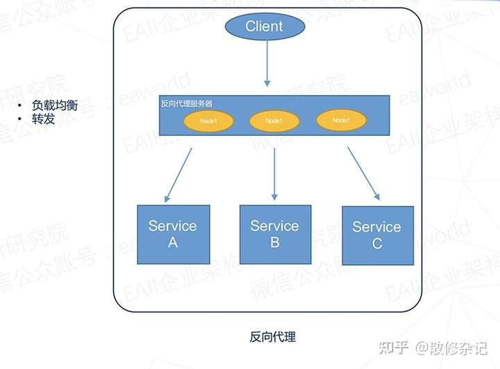
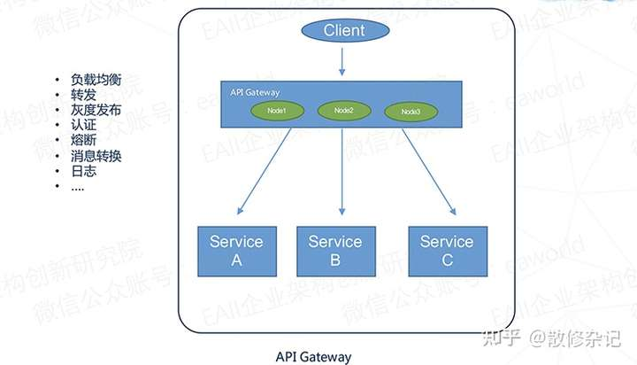

# 第16节 API网关与反向代理

## API网关的基本概念与价值
**API 网关（API Gateway）** 是微服务架构中的核心组件，负责充当客户端与后端一组服务之间的单一入口。客户端所有请求先发送给API网关，由网关根据请求内容将其转发给适当的后端微服务 ([深入理解微服务架构中的API网关-阿里云开发者社区](https://developer.aliyun.com/article/1534666))。通过API网关，系统可以实现以下价值：

- **统一入口，简化调用**：客户端只需与API网关交互，无需知道内部有多少微服务，减少了客户端复杂性和耦合。网关封装了系统内部的复杂结构，就像提供一个统一的门面，隐藏了微服务的细节。
- **丰富的功能**：API网关通常不仅具备基础的请求路由和转发能力，还提供**认证授权、安全校验、流量控制、监控日志**等跨服务的通用功能。这些功能提高了系统的安全性和可靠性，例如在网关统一做身份验证和鉴权，保证只有合法请求进入系统。
- **协议适配与聚合**：网关可以支持不同通信协议间的转换（如HTTP与WebSocket），以及将多个服务的数据聚合后再返回给客户端，减少客户端多次调用。比如一个电商场景下，客户端请求订单详情，网关可同时调用订单服务和商品服务，整合结果后一次性返回。
- **集中治理与监控**：通过网关可以收集所有请求的日志和性能指标，方便进行统一的监控与告警。运维人员可以在网关层面看到整体流量情况、错误情况，从而更好地治理服务。
- **降低耦合**：网关将客户端与具体服务解耦。服务端可以自由演进（例如拆分或重构微服务）而无需直接影响到客户端，只要网关层映射关系更新即可。

综上，API网关在微服务架构中价值突出，相当于整个系统的“入口控制器”，帮助我们在入口处解决**认证、安全、流量管控**等共性问题，简化内部服务设计 (。

## API网关与反向代理的区别和联系

 [API网关（API Gateway）和反向代理有什么区别？ - MaxBruce - 博客园](https://www.cnblogs.com/bruce1992/p/16286562.html)

**反向代理** 也是一种位于客户端和服务器之间的中间层，它帮客户端将请求转发给后端服务器，实现负载均衡和隐藏服务真实地址等功能。典型的反向代理服务器如 Nginx，其主要职责是依据配置将外部请求路由到内部的服务器集群。反向代理通常由运维人员维护，通过静态配置文件增删后端节点，并具备基本的负载均衡和缓存功能。

然而，API网关可以被看作是一种**特殊的反向代理**，它针对服务的API层做了进一步的扩展和增强。两者的主要区别和联系体现在：

- **功能范围**：反向代理通常只具备基础的请求转发和负载均衡功能，需要额外编写脚本或插件才能实现认证、限流等其它能力。API网关则在此基础上增加了**统一认证鉴权、灰度发布、熔断器、协议转换、日志监控**等丰富功能。换言之，网关是“功能超集”，包含了反向代理的功能并扩展了更多面向微服务的治理能力。
- **服务定位**：反向代理多用于传统Web架构，面向运维场景，通常针对静态内容或简单的HTTP服务做转发；API网关主要服务于微服务/API架构，面向开发场景，对内部众多服务的API进行统一管理和保护 ([网关V.S反向代理-腾讯云开发者社区-腾讯云](https://cloud.tencent.com/developer/article/1791690))。
- **动态能力**：反向代理的配置往往是静态的（比如修改Nginx配置然后重启生效），对于微服务的弹性扩容支持不够友好。API网关通常具备动态路由和服务发现能力，可以在服务实例增加或减少时自动更新路由，而无需重启网关服务。这使得API网关更适应微服务环境下服务实例频繁变动的需求。
- **性能开销**：由于反向代理功能精简，性能开销较小且成熟稳定。在简单场景下，如果不需要API网关提供的高级功能，仅使用反向代理即可满足需求且维护成本更低。但是当我们需要那些高级特性或希望在网关集中处理各种策略时，就应考虑引入API网关。

*反向代理示意图：客户端请求首先到达反向代理服务器（如Nginx集群），由其根据配置将请求转发给后端的Service A/B/C，实现**负载均衡**和**转发**功能。反向代理本身不修改请求，仅充当流量中转。*

*API网关示意图：客户端所有请求经过API Gateway统一入口。网关不仅执行**负载均衡**和**转发**，还增加了**灰度发布**、**认证鉴权**、**熔断**、**日志**等功能，对服务API进行管理和保护。网关节点通常支持动态扩展，从而在微服务体系中提供强大的网关能力。*
 
值得注意的是，API网关和反向代理并非对立存在。在大型架构中，两者可以组合使用：例如前端使用Nginx作为第一层反向代理缓存静态内容，并做基础的负载均衡，后面再接入专门的API网关处理认证和细粒度路由。这种搭配发挥各自优势。此外，随着云原生的发展，一些现代代理（如 Envoy、Traefik）融合了反向代理与网关的特性，可通过动态配置甚至**可编程**的方式同时满足运维和开发需求。

**小结**：API网关是面向微服务的高级反向代理，解决了反向代理无法涵盖的服务治理需求。如果仅需简单转发，可用反向代理；但在需要**服务发现、统一鉴权、限流熔断、协议适配**等场景时，API网关是更好的选择。

## Hertz 框架简介
**Hertz** 是字节跳动开源的 Go 语言微服务 HTTP 框架，由字节跳动内部服务框架团队打造 ([hertz/README_cn.md at develop · cloudwego/hertz · GitHub](https://github.com/cloudwego/hertz/blob/develop/README_cn.md))。在设计之初，Hertz 借鉴了已有开源框架（如 fasthttp、Gin、Echo）的优点，并结合了字节跳动内部大规模微服务的需求，使其具备**高易用性、高性能、高扩展性**等特性。Hertz 于 2022 年在 ByteDance 内部经过一年多的验证后开源，目前属于字节跳动云原生体系 **CloudWeGo** 项目矩阵的一部分。

- **背景与缘起**：字节跳动内部早期使用的是对 Gin 框架的定制版，但随着业务高速发展，Gin 基于标准 `net/http` 的实现在**性能优化和扩展性**上遇到了瓶颈 ([字节跳动开源 Go HTTP 框架 Hertz 设计实践_go hertz-CSDN博客](https://blog.csdn.net/weixin_44186218/article/details/125433628))。2020 年起，字节跳动团队研发了 Hertz，采用自研的 Netpoll 高性能网络库和分层架构，以更好满足超大规模流量场景下对**低延迟**和**灵活扩展**的需求。
- **性能与规模**：Hertz 已成为字节内部最大的HTTP框架，线上已有超过1万多个服务实例基于Hertz运行，峰值总QPS超过4亿。在一些典型服务（比如网关服务）中，从Gin迁移到Hertz后，CPU使用率降低了30%~60%，请求延迟也显著降低。这表明 Hertz 在高并发场景下具有卓越的性能优势和资源效率。
- **特点**：Hertz 提供与 Gin 类似的易用编程接口（路由定义、中间件机制等），上手成本低。同时它支持原生 HTTP/1.1，并通过**可插拔的扩展**支持 HTTP/2、WebSocket 等协议。其分层设计使开发者可以根据需要替换底层组件（如网络库）或定制路由、序列化方式，从而在**框架可定制性**方面优于很多同类框架。
- **应用场景**：Hertz 非常适合构建对性能有高要求的**微服务、API 服务**以及实时高并发应用。在字节内部，Hertz 被广泛用于各业务线服务，还支撑了内部基础设施组件，如函数计算平台、压测平台、各种业务网关、服务网格控制面等。这也证明了 Hertz 在**API网关**等场景下的成熟应用。

总之，Hertz 是一个面向云原生微服务的现代化 Go 框架。如果你的微服务需要追求高性能、低延迟，并希望框架易于扩展定制，那么 Hertz 会是一个不错的选择。

## 使用 Hertz 实现 API网关的核心功能
下面我们将基于 Hertz 框架，演示如何构建一个具备核心能力的API网关。我们将逐步介绍实现**路由转发、服务发现、JWT鉴权、限流、日志和链路追踪**等功能的要点，并提供相应的代码示例，帮助理解如何将理论应用于实践。

### 路由转发（请求分发）
**路由转发**是API网关最基本的职责，即根据请求的URL路径或其他信息，将请求路由到对应的后端服务 。在Hertz中，我们可以方便地定义路由规则，并在处理函数中编写转发逻辑：

- **路由定义**：Hertz 的路由支持参数和通配符。例如，我们可以使用 `router.Any("/:service/*path", handler)` 来匹配任意HTTP方法、以服务名称开头的请求路径。`:service` 将捕获URL中的服务标识，`*path` 则匹配其后的所有子路径 ([解锁Hertz 路由：构建高效API 的魔法钥匙- 厚礼蝎 - 博客园](https://www.cnblogs.com/guangdelw/p/18735494))。这样一条路由就能泛化地处理如 `/user-service/xxx`、`/order-service/yyy/zzz` 等不同服务的请求。
- **转发实现**：拿到请求后，需要根据`:service`参数确定后端目标地址，并将请求内容转发过去。转发可以通过两种方式实现：
  1. **使用HTTP客户端转发**：手动创建一个HTTP请求，将原始请求的数据复制过去，然后使用Go的HTTP客户端（或Hertz提供的 `pkg/app/client`）发送请求并获取响应，再将响应返回给客户端。
  2. **使用Hertz内置反向代理**：Hertz 提供了 `hertz-contrib/reverseproxy` 扩展，实现类似`httputil.ReverseProxy`的功能。我们可以创建一个 `ReverseProxy` 实例并调用其 `ServeHTTP` 方法，将Hertz收到的请求直接代理到目标服务。该扩展支持自定义请求修改（director）等高级功能，默认情况下请求头和请求体会原封不动转发，满足大部分需求 ([正向代理和反向代理 | CloudWeGo](https://www.cloudwego.io/zh/docs/hertz/tutorials/basic-feature/proxy/))。

**路径重写**：在转发过程中，经常需要对请求路径做调整。例如客户端请求路径为`/user-service/api/v1/users`，网关识别出服务名`user-service`后，实际应转发到用户服务的 `/api/v1/users` 路径上。实现上可以通过字符串操作去除路径中的服务名前缀，然后再发起请求。若使用Hertz的ReverseProxy，可以通过设置自定义director函数，在请求转发前修改`req.URI().SetPath(newPath)`来实现路径改写。

**示例**：假设我们的网关需要将`/user-service/*`的请求转发到本地启动的用户服务(`127.0.0.1:8081`)，`/order-service/*`转发到订单服务(`127.0.0.1:8082`)。可以按如下方式设置路由和转发：

```go
// 定义服务名到后端地址的映射
var serviceMap = map[string]string{
    "user-service": "http://127.0.0.1:8081",  // 用户服务地址
    "order-service": "http://127.0.0.1:8082", // 订单服务地址
}

// 创建 Hertz 服务实例
h := server.Default(server.WithHostPorts(":8080"))  // 网关监听 8080 端口

// 路由: 健康检查
h.GET("/ping", func(ctx context.Context, c *app.RequestContext) {
    c.String(consts.StatusOK, "pong")
})

// 路由: 动态转发微服务请求
h.Any("/:service/*path", func(ctx context.Context, c *app.RequestContext) {
    service := c.Param("service")         // 获取服务名
    target, ok := serviceMap[service]     // 查找对应的服务地址
    if !ok {
        c.String(consts.StatusNotFound, "Unknown service")
        return
    }
    // 构造转发的目标URL：目标服务地址 + 请求路径
    forwardPath := c.Param("path")        // 获取通配的路径部分（含前导"/"）
    // 例如 service="user-service", forwardPath="/api/v1/users"
    targetURL := target + forwardPath    // e.g. "http://127.0.0.1:8081/api/v1/users"

    // 使用标准库 http 客户端转发请求
    req, err := http.NewRequest(string(c.Request.Method()), targetURL, bytes.NewReader(c.Request.Body()))
    if err != nil {
        c.String(consts.StatusInternalServerError, "proxy error")
        return
    }
    // 复制请求头
    c.Request.Header.CopyTo(&req.Header)

    resp, err := http.DefaultClient.Do(req)  // 发送请求到目标服务
    if err != nil {
        c.String(consts.StatusBadGateway, "backend not available")
        return
    }
    defer resp.Body.Close()

    // 将后端响应复制回客户端
    for k, vv := range resp.Header {
        for _, v := range vv {
            c.Response.Header.Add(k, v)
        }
    }
    c.Response.SetStatusCode(resp.StatusCode)
    bodyBytes, _ := io.ReadAll(resp.Body)
    c.Write(bodyBytes)
})
```

上例中，我们通过一个通用的处理函数拦截所有 `/:service/*path` 请求，根据`serviceMap`找到后端服务的地址，然后使用标准库HTTP客户端将请求的**方法、路径、头、体**传递给后端服务，并将后端响应返回给客户端。这样，网关就起到了请求**代理转发**的作用。实际应用中，可以将HTTP客户端复用（如上例简单使用了`http.DefaultClient`），以提升性能（关于连接池请见后文性能调优部分）。

*注意*：为了简单明了，我们直接使用了标准`net/http`客户端完成转发。在生产环境中，可以考虑使用 **Hertz** 官方提供的 `reverseproxy` 扩展来获得更高性能和更多特性。例如，可以预先创建 `userProxy := reverseproxy.NewSingleHostReverseProxy("http://127.0.0.1:8081")` 然后在处理函数中调用 `userProxy.ServeHTTP(ctx, c)` 来转发请求。Hertz `reverseproxy` 默认不修改Host头且会保留请求的querystring和body，非常适合做网关转发。如果需要动态选择后端，可以结合上面的map机制，在代码中根据service选择不同的ReverseProxy实例或者动态设置其target。这种方式能充分利用Hertz的非阻塞IO和高效内存管理，性能会更优。

### 服务注册与发现
在微服务集群中，服务实例通常会动态增加、缩减甚至变化IP地址。**服务注册与发现**机制使API网关能够自动感知服务拓扑变化，动态更新路由目标，而无需手工修改配置。

实现服务发现有几种典型方案：
- **集中式注册中心**：部署如 *Consul、Etcd、Eureka、Nacos* 等服务注册中心。各微服务启动时向注册中心登记自己的地址和健康状态，网关通过订阅注册中心的变更来获取实时的服务列表。Hertz框架提供了服务注册与发现的扩展接口，支持对接 Etcd、Eureka、Polarismesh 等组件 ([服务注册与发现扩展 | CloudWeGo](https://www.cloudwego.io/zh/docs/hertz/tutorials/framework-exten/service_discovery/))。通过这些扩展，Hertz 网关可以很方便地拉取可用服务实例列表，并基于负载均衡策略选择一个实例转发请求。
- **客户端注册上报**：网关本身维护一个服务注册表，提供如 `/register` 等管理接口。各服务在启动或变更时主动调用网关的注册接口登记信息。网关收到注册请求后，将服务名和地址存入内存或数据库，并在转发时查表路由。上文示例的 `serviceMap` 可视为一种简化的注册表。在实际实现中，需要考虑数据持久化和多实例网关的数据同步。
- **配置中心**：在配置中心（如Apollo、Spring Config等）维护服务地址列表，由网关动态拉取配置。虽然不如注册中心自动，但对于少量服务的静态拓扑也可以起到类似作用。

**Hertz服务发现扩展**：CloudWeGo/Hertz 提供了统一的服务发现接口 `Discovery`，并内置/扩展支持多种注册中心。例如，可以使用 `github.com/hertz-contrib/registry/etcd` 来对接 etcd。当启用该扩展后，我们可以将上面示例中手工维护的 `serviceMap` 替换为调用注册中心查询服务地址列表。例如：

```go
import etcdRegistry "github.com/hertz-contrib/registry/etcd"
discovery, _ := etcdRegistry.NewEtcdDiscovery([]string{"127.0.0.1:2379"})
```

之后可通过 `discovery.GetResolver(serviceName)` 获取某服务的地址列表，并结合负载均衡策略选取一个地址进行转发。Hertz也支持将服务发现直接集成到 ReverseProxy 中，实现**自动发现和路由**（类似 Ribbon + Zuul 的组合）。总而言之，通过服务发现机制，API网关可以适应云环境下弹性变化的服务，使路由更加智能和可靠。

*课堂提示*：在我们的示例项目中，为简化实现采用静态映射的方式。如需体验服务发现，读者可以进一步探索 Hertz 官方示例中的“使用服务发现”案例，学习如何集成 Nacos 等注册中心进行自动服务发现。

### JWT鉴权（身份认证与授权）
API网关通常是执行**身份认证与权限校验**的最佳场所。常见做法是使用 **JWT（JSON Web Token）** 来传递和验证用户身份。JWT是在客户端登录后获取的一串签名令牌，随每个请求放入HTTP头（如`Authorization: Bearer <token>`）。网关负责验证该token的有效性，解析出其中的用户信息或权限，然后决定是否放行请求。

**Hertz 对 JWT 的支持**：Hertz 提供了开源中间件来简化 JWT 的认证流程。例如 `hertz-contrib/jwt` 库实现了一个JWT中间件，可以自动完成 token 的解析和校验。当我们将该中间件挂载在某些路由上时，请求进入路由处理前若未携带有效JWT，将被拦截并返回401未经授权错误。

使用步骤：
1. **配置JWT中间件**：包括设定签名密钥`Key`、令牌有效期`Timeout`、签名方法等。Hertz的 `HertzJWTMiddleware` 结构体定义了JWT的配置项并提供默认配置，开发者也可以根据需要调整 ([JWT 认证 | CloudWeGo](https://www.cloudwego.io/zh/docs/hertz/tutorials/third-party/middleware/jwt/))。例如：
   ```go
   authMiddleware, _ := jwt.New(&jwt.HertzJWTMiddleware{
       Key:        []byte("MySecretKey"),       // 用于签名/验证JWT的密钥
       Timeout:    time.Hour * 2,               // Token有效期，例如2小时
       TokenLookup: "header:Authorization, bearer", // 从Header取JWT
       // 可选回调: 验证用户凭据、定义Payload、Unauthorized响应等等
   })
   ```
   上述配置简单指定了密钥和过期时间，以及从HTTP头获取token的方式。还可以自定义认证逻辑（如`Authenticator`函数用于验证用户名密码以签发token）、`PayloadFunc`用于在token中加入自定义声明等 ([JWT 认证 | CloudWeGo](https://www.cloudwego.io/zh/docs/hertz/tutorials/third-party/middleware/jwt/))。

2. **应用中间件**：将生成的 `authMiddleware` 应用于需要保护的路由上。我们可以通过路由分组很方便地做到这一点。例如：
   ```go
   // 所有转发的微服务请求都需要JWT鉴权
   secured := h.Group("/", authMiddleware.MiddlewareFunc())
   secured.Any("/:service/*path", proxyHandler)
   ```
   这样，凡是进入`secured`分组的请求都会先经过JWT Middleware的检查。只有携带合法token的请求才会继续执行后续的转发处理；未授权的请求Middleware会自动中止并返回错误，无需我们手动处理。

3. **签发JWT**：通常由独立的认证服务负责（不一定在网关内部实现）。例如可以有一个 `/login` 接口，不经过JWT中间件保护，在网关转发给认证服务。当用户提供正确凭证时，认证服务返回一个JWT令牌。客户端拿到令牌后，后续请求通过网关时带上此令牌即可通行。Hertz JWT中间件也提供了方便的方法如 `authMiddleware.LoginHandler` 来辅助实现登录颁发token的流程 ([JWT 认证 | CloudWeGo](https://www.cloudwego.io/zh/docs/hertz/tutorials/third-party/middleware/jwt/))。在本课例中，我们侧重于验证部分，登录的实现细节可在后续实践中探索。

通过JWT鉴权，API网关可以在入口统一验证用户身份，**减轻后端微服务的负担**（后端服务不需要重复实现鉴权逻辑，只处理通过鉴权的请求）。这一机制也使安全策略集中管理，例如轻松吊销某用户的访问只需让其JWT失效或加入黑名单。Hertz对JWT的支持使得集成这一流程非常简洁 ([JWT 认证](https://www.cloudwego.io/zh/docs/hertz/tutorials/third-party/middleware/jwt/))。

### 限流（Rate Limiting）
**限流**是保护后端服务免于过载、保证服务质量的重要手段。API网关作为所有请求的入口，是实施全局和细粒度限流策略的合适位置。常见的限流策略包括：

- **固定窗口计数**：比如每秒不超过N次请求。
- **滑动窗口/漏桶/令牌桶算法**：这些算法更平滑地控制流量。如**令牌桶**按固定速率生成令牌，请求必须拿到令牌才可继续，从而限制平均速率且允许一定的突发流量。
- **基于响应时间的动态限流**：如谷歌的 BBR 算法，根据系统的当前瓶颈带宽和延迟动态调整允许的并发 ([cloudwego/hertz: Go HTTP framework with high-performance and ...](https://github.com/cloudwego/hertz))。

在网关可以针对不同的API或不同的用户制定不同的限流阈值。例如对敏感的写操作严控每秒请求数，对一般读取操作阈值可高一些；对某些调用频繁的客户也可单独限流。

**Hertz 限流支持**：Hertz 提供了开源社区扩展 `hertz-contrib/limiter`，实现了基于**BBR算法**的限流器 ([hertz/README_cn.md at develop · cloudwego/hertz - GitHub](https://github.com/cloudwego/hertz/blob/develop/README_cn.md?plain=1))。BBR 算法会根据最近的请求平均RTT和系统吞吐率，动态调整允许的并发数，从而更智能地在接近系统极限的情况下控制流量而不过度保守。对于一般应用，也可以使用简单的令牌桶算法实现限流，该扩展同样提供了相应支持。

使用Hertz限流中间件非常简单：
```go
import "github.com/hertz-contrib/limiter"
h.Use(limiter.AdaptiveLimit())  // 全局启用基于BBR的自适应限流
```
一行代码即可为所有路由启用默认的限流策略 ([GitHub - hertz-contrib/limiter: Rate Limiter for Hertz](https://github.com/hertz-contrib/limiter))。此策略会自动监测QPS和请求延迟，并限制过多的并发请求进入处理，从而保护后端。当流量回落时，又会逐步放宽限制，充分利用系统吞吐能力。

如果需要对特定路由/服务定制限流，可以创建Limiter实例并在局部使用。例如：
```go
userLimiter := limiter.NewLimiter(...自定义参数...)
orderLimiter := limiter.NewLimiter(...)
// 在用户服务路由上使用userLimiter
h.POST("/user-service/*path", userLimiter.Handler(), userServiceProxy)
```
这样不同服务可以有不同的限流配置。实际场景中，还可以结合**分布式限流**（如使用Redis原子计数实现集群网关的一致限流），或根据用户身份/IP进行**细粒度限流**（在中间件中区别对待）。由于课件侧重框架使用，这里不展开复杂实现。

总之，限流在API网关层非常关键，它可以**避免单个恶意或异常客户端耗尽服务资源**，保障整体服务的稳定性。借助Hertz的限流中间件，我们可以快速地为网关加上这一“安全阀”，并根据实际需要调整策略参数。

### 日志与链路追踪支持
**日志记录**和**链路追踪**是网关不可或缺的运维能力。网关作为所有请求的入口，应该记录每个请求的关键信息（如时间、来源IP、URL、返回码、耗时），并将请求ID或TraceID在调用链中传递下去，方便以后调试和监控。

**日志（Logging）**：Hertz 框架内置了日志组件 `hlog`，可以很方便地输出结构化日志。同时配合 `requestid` 中间件，可以为每个请求生成或提取一个唯一ID（比如UUID），注入到日志中，方便将同一请求在网关和各微服务的日志关联起来。在网关中，我们通常在进入时记录一条日志，包括请求方法、路径、用户信息（如果有）等，在完成转发得到响应后再记录一条日志包括返回状态和耗时等。

实现上，可以使用 Hertz 提供的中间件：
```go
import "github.com/hertz-contrib/requestid"
h.Use(requestid.New())  // 为每个请求生成 Request-ID
```
然后在自定义的日志中间件或在各处理器里，通过 `c.GetString(requestid.Key)` 获取该ID，将其与日志打印。例如：
```go
h.Use(func(ctx context.Context, c *app.RequestContext) {
    start := time.Now()
    c.Next(ctx)  // 执行后续实际处理
    latency := time.Since(start)
    reqID := requestid.Get(c)  // 或 c.GetString("request-id")
    hlog.Info("request finished",
        zap.String("reqID", reqID),
        zap.String("path", string(c.Request.Path())),
        zap.Int("status", c.Response.StatusCode()),
        zap.Duration("latency", latency),
    )
})
```
通过上述方式，每次请求的进出都会记录日志，包括一个唯一的请求ID，便于后续排查问题时将网关日志与后端日志串联。

**链路追踪（Tracing）**：在微服务体系下，实现**分布式链路追踪**能够极大地方便问题诊断。链路追踪通常使用像 **OpenTelemetry**、Zipkin 或 SkyWalking 这样的框架，在每个服务处理请求时产生trace数据。API网关作为调用链的起点，需要创建一个全局的Trace上下文并传递给后续服务。

Hertz 提供了对 OpenTelemetry 的扩展支持，即 **obs-opentelemetry** 模块 ([Registry - OpenTelemetry](https://opentelemetry.io/ecosystem/registry/))。使用该扩展，我们可以非常简单地把Hertz网关接入OpenTelemetry体系。例如：

```go
import (
    "github.com/hertz-contrib/obs-opentelemetry/provider"
    hztrace "github.com/hertz-contrib/obs-opentelemetry/tracing"
)

// 初始化 OTLP Exporter，将数据发送到OpenTelemetry后端（如Jaeger或Tempo）
p := provider.NewOpenTelemetryProvider(
    provider.WithServiceName("api-gateway"),
    provider.WithExportEndpoint("localhost:4317"),  // OTLP接收端点
    provider.WithInsecure(),
)
defer p.Shutdown(ctx)
// 获取 Hertz Tracer
tracer, cfg := hztrace.NewServerTracer() 
h := server.Default(server.WithTracer(tracer))       // 初始化 Hertz 服务并注入 Tracer
h.Use(hztrace.ServerMiddleware(cfg))                 // 启用链路追踪中间件
```

以上配置后，Hertz会为每个进入的请求创建一个OpenTelemetry Span，并自动将HTTP头中的Trace上下文传播给后端（如加入 `traceparent` 等Header）。在后端服务（若也集成了OpenTelemetry，例如使用Kitex或Hertz），这些信息会被继续传递，从而把整个调用链串联起来。最终，我们可以在分布式追踪系统中看到一条跨越网关和多个微服务的完整调用链路。

需要强调的是，**网关应确保转发请求时传播必要的跟踪Header**（例如常见的 `Trace-Id`、`Span-Id` 或者 W3C Trace Context）。如果不用上述自动集成，也可以手动从进入请求提取这些header并在转发时设置到后端请求头中。

通过完善的日志和追踪，API网关不仅完成流量转发的功能，还成为系统的“观察点”。运维人员可以通过分析网关日志快速定位问题请求，通过追踪了解请求在各服务的耗时分布，从而定位性能瓶颈。这对构建健壮的微服务系统至关重要。

## Hertz API网关示例项目
综合以上各点，我们提供一个完整的 **API网关示例项目** 使用 Hertz 实现。该网关具备基本的路由转发功能，并集成了JWT鉴权和简单限流等能力，以演示一个**具备核心能力的API网关**是如何构建的。

### 场景描述
假设我们有两个后端微服务：
- **用户服务（User Service）**：提供用户注册、登录、查询等接口，部署在 `http://127.0.0.1:8081`。
- **订单服务（Order Service）**：提供订单创建、查询等接口，部署在 `http://127.0.0.1:8082`。

API网关作为前端统一入口，监听在本地主机的8080端口，对外提供：
- `POST /login` 接口：转发到用户服务的登录接口（不需要JWT鉴权，用于获取token）。
- `/user-service/**` 路径：受JWT中间件保护，转发到用户服务对应路径。
- `/order-service/**` 路径：受JWT中间件保护，转发到订单服务对应路径。
- `GET /ping` 接口：网关本身的健康检查（无需鉴权）。

此外，网关对所有受保护接口应用限流策略（假设使用全局限流，每秒不超过一定请求）。

### 代码结构
以下是网关的主要代码（`main.go`）：

```go
package main

import (
    "context"
    "bytes"
    "io"
    "net/http"
    "time"
    "github.com/cloudwego/hertz/pkg/app"
    "github.com/cloudwego/hertz/pkg/app/server"
    "github.com/cloudwego/hertz/pkg/common/utils"
    "github.com/cloudwego/hertz/pkg/protocol/consts"

    "github.com/hertz-contrib/jwt"        // JWT中间件
    "github.com/hertz-contrib/limiter"    // 限流中间件
)

// 简单映射服务名称到后端服务URL前缀
var serviceMap = map[string]string{
    "user-service":  "http://127.0.0.1:8081",
    "order-service": "http://127.0.0.1:8082",
}

func main() {
    // 初始化 Hertz 服务
    h := server.Default(server.WithHostPorts(":8080"))

    // 配置 JWT 中间件
    authMiddleware, _ := jwt.New(&jwt.HertzJWTMiddleware{
        Key:           []byte("SecretKey123"),      // 签名密钥
        Timeout:       time.Hour * 1,               // Token 有效期1小时
        TokenLookup:   "header:Authorization, bearer", // 从Header取JWT
        Unauthorized: func(ctx context.Context, c *app.RequestContext, code int, message string) {
            // 未授权时的自定义响应
            c.JSON(consts.StatusUnauthorized, utils.H{
                "error": message,
            })
        },
    })

    // 全局中间件：启用JWT鉴权和限流（除了明示跳过的路由外）
    h.Use(limiter.AdaptiveLimit())               // 基于BBR算法的全局限流
    secured := h.Group("/", authMiddleware.MiddlewareFunc())  // 受JWT保护的路由组

    // 登录接口 (不在受保护组中)
    h.POST("/login", func(ctx context.Context, c *app.RequestContext) {
        // 将登录请求转发给用户服务的/login接口
        // 这里简单起见，假设用户服务的登录接口路径相同
        targetURL := serviceMap["user-service"] + "/login"
        resp, err := http.Post(targetURL, "application/json", bytes.NewReader(c.Request.Body()))
        if err != nil {
            c.String(consts.StatusBadGateway, "Auth service error")
            return
        }
        defer resp.Body.Close()
        body, _ := io.ReadAll(resp.Body)
        // 将用户服务返回的响应（应包含JWT令牌）直接返回
        c.Response.SetStatusCode(resp.StatusCode)
        c.Write(body)
    })

    // 健康检查接口 (不需要鉴权)
    h.GET("/ping", func(ctx context.Context, c *app.RequestContext) {
        c.JSON(consts.StatusOK, utils.H{
            "msg": "gateway alive",
        })
    })

    // 受保护的用户服务接口转发
    secured.Any("/user-service/*path", func(ctx context.Context, c *app.RequestContext) {
        proxyToService(ctx, c, "user-service")
    })
    // 受保护的订单服务接口转发
    secured.Any("/order-service/*path", func(ctx context.Context, c *app.RequestContext) {
        proxyToService(ctx, c, "order-service")
    })

    // 启动服务
    h.Spin()
}

// proxyToService 将请求转发到指定服务
func proxyToService(ctx context.Context, c *app.RequestContext, service string) {
    targetBase, ok := serviceMap[service]
    if !ok {
        c.String(consts.StatusNotFound, "Unknown service")
        return
    }
    // 构造目标URL：base + 原始路径（去除前缀部分）
    forwardPath := c.Param("path")             // e.g. "/api/v1/users"
    targetURL := targetBase + forwardPath      // 完整目标路径
    // 创建转发请求
    req, err := http.NewRequest(string(c.Request.Method()), targetURL, bytes.NewReader(c.Request.Body()))
    if err != nil {
        c.String(consts.StatusInternalServerError, "Request forwarding error")
        return
    }
    c.Request.Header.CopyTo(&req.Header)       // 复制请求头，包括Authorization等

    // 发送请求到后端服务
    resp, err := http.DefaultClient.Do(req)
    if err != nil {
        c.String(consts.StatusBadGateway, "Failed to reach "+service)
        return
    }
    defer resp.Body.Close()
    // 将后端响应返回给客户端
    c.Response.SetStatusCode(resp.StatusCode)
    for k, vals := range resp.Header {
        for _, v := range vals {
            c.Response.Header.Add(k, v)
        }
    }
    body, _ := io.ReadAll(resp.Body)
    c.Write(body)
}
```

**代码说明**：
- 我们创建了一个 Hertz 网关服务，监听端口8080。
- 使用 Hertz JWT 中间件配置了一个简单的鉴权：密钥`SecretKey123`，约定客户端通过 `Authorization: Bearer <token>` 传递JWT。任何不带有效JWT的请求访问受保护资源都会被拦截。
- 使用 `limiter.AdaptiveLimit()` 全局启用基于BBR的限流，以防止过载。
- 定义了两个开放接口：`/login` 用于登录认证（直接转发给用户服务），`/ping`用于健康检查。这两个接口未加入JWT组，因此客户端可以在未登录时访问它们。
- 对于受保护的业务接口，我们将 `/user-service/*` 和 `/order-service/*` 路径加入 `secured` 组，这意味着这些路径需要JWT鉴权才能访问。相应地，每个组内路径的处理函数调用了我们封装的 `proxyToService` 函数将请求代理到真正的后端服务。
- `proxyToService` 函数按照前述路由转发小节的逻辑实现：根据服务名称查表得到基础URL，拼接上客户端请求路径，使用标准`http.Client`转发请求并写回响应。这里为了专注流程，未对性能细节做优化，例如复用HTTP连接、错误重试等（性能调优部分会讨论）。

**运行示例**：
1. 先启动用户服务和订单服务（可以各自用一个简单的Hertz或Gin服务模拟，对应端口返回简单响应即可）。
2. 启动上述网关服务代码。
3. 客户端调用 `POST http://localhost:8080/login`，网关会将请求转发到用户服务的登录接口。假设用户服务验证成功，返回一个JWT令牌（例如 `{ "token": "<JWT_STRING>" }`）。客户端拿到此token。
4. 随后客户端调用受保护接口，比如获取用户详情：`GET http://localhost:8080/user-service/api/v1/users/me`，并在Header附加 `Authorization: Bearer <JWT_STRING>`. 
   - 网关首先通过JWT中间件验证令牌有效（无效则直接401响应）。
   - 然后进入处理函数，将请求转发到 `http://127.0.0.1:8081/api/v1/users/me`（用户服务）。
   - 用户服务返回实际数据后，网关将其转发回客户端。整个过程中网关充当透明代理，但确保了只有持有合法令牌的请求才能到达后端。
5. 如果在短时间内大量请求涌入（超过限流阈值），Hertz的限流中间件将自动拒绝部分请求（一般返回503状态码），从而保护后端服务稳定。

通过这个示例，我们验证了使用Hertz构建API网关的可行性：**路由转发、鉴权、限流**等都是通过简洁的中间件组合和少量代码实现的。同时 Hertz 高性能的特性保证了网关本身处理高并发的能力。学员可以在此基础上扩展更多功能，例如：增加日志中间件记录请求、对不同服务采用不同的负载均衡策略、结合服务注册中心动态发现服务地址等等。

## 高阶拓展话题
最后，我们讨论两个与API网关关系密切的高阶话题：**服务网格(Service Mesh)** 与 **性能调优**，帮助学员拓展对网关在微服务生态中角色的认识，并了解如何优化网关的性能以应对生产环境需求。

### API网关与服务网格的关系
**服务网格（Service Mesh）**和API网关都是微服务架构中的重要组件，但关注的流量范围不同。简而言之：API网关主要管理**南北向流量**（进出集群的流量），而服务网格主要管理**东西向流量**（微服务内部相互调用的流量） ([服务网格对比 API 网关 · Kubernetes 中文指南——云原生应用架构实战手册](https://jimmysong.io/kubernetes-handbook/usecases/service-mesh-vs-api-gateway.html))。

- **流量方向**：API网关处于系统边缘，负责所有来自客户端的请求进入集群，以及响应返回客户端，可以看作进入系统的关卡。而服务网格通常由部署在每个服务实例旁的**Sidecar代理**（如Envoy）组成，负责拦截和处理服务与服务之间的调用。服务网格并不直接处理来自外部的请求（除非结合Ingress网关），而是关注内部通信，例如服务A调用服务B的过程。
- **功能侧重**：二者在某些功能上有重叠，例如都可以做**负载均衡、熔断、认证、监控**等 ([服务网格对比API 网关· Kubernetes 中文指南](https://jimmysong.io/kubernetes-handbook/usecases/service-mesh-vs-api-gateway.html))。但是API网关往往提供更高级别的API管理功能（比如请求聚合、协议转换、流量控制策略面板等），旨在对外提供一个稳定的接口层。而服务网格更偏底层网络通信治理，比如**自动服务发现、流量加密（mTLS）、细粒度路由（基于Header路由请求）、服务间认证**等，以不侵入应用代码的方式增强微服务间通信的可靠性和安全性。
- **协同关系**：在现代架构中，API网关和服务网格经常配合使用。典型模式是：外部请求先经过API网关（例如Istio的Ingress Gateway就是一种特殊的API网关，基于Envoy实现），然后进入集群内部后，由服务网格的Sidecar接管服务到服务的流量调度 ([服务网格对比 API 网关 · Kubernetes 中文指南——云原生应用架构实战手册](https://jimmysong.io/kubernetes-handbook/usecases/service-mesh-vs-api-gateway.html))。API网关仍然负责统一入口、安全策略和协议转换，而服务网格负责微服务调用的**可观测性**（指标、日志、追踪）和**弹性**（熔断、重试、限流）等。Istio等服务网格通常内置了API网关组件，但其对API的管理能力可能不如专门的API网关产品丰富 ([服务网格对比 API 网关 · Kubernetes 中文指南——云原生应用架构实战手册](https://jimmysong.io/kubernetes-handbook/usecases/service-mesh-vs-api-gateway.html))。

因此，可以将API网关视为服务网格环境下**进入服务网格的流量管控者**。在启用服务网格的场景，API网关依然不可或缺：它为外部提供统一入口，同时把校验过的请求交给Mesh接力处理。而服务网格关注于集群内部流量优化，不直接面向外部。两者配合能够实现**端到端**的流量治理：从用户一直到每个服务的调用，全程都有完善的控制和监视。

需要注意的是，引入服务网格后，由于Sidecar代理已经承担了一部分如认证、加密、路由的工作，API网关可能不需要重复实现某些功能。但在实际应用中，网关的高级功能（比如内容级别的路由、API版本管理、请求payload的校验等）依然很有价值。此外，服务网格通常对**内部**调用做认证授权，但对外部用户的认证仍然是API网关在处理。

总而言之，API网关和服务网格分别解决“**边界**”和“**内部**”的问题：**边界上的统一入口、协议转换和安全控制由API网关负责，服务之间的通信治理由服务网格负责**。两者共同构成了微服务架构下全面的流量管理方案。

### API网关的性能调优建议
在实际生产环境中，API网关往往需要处理高并发、大流量，对性能要求很高。以下是针对使用Go语言（尤其基于Hertz框架）的API网关的一些性能调优建议：

1. **连接池复用**：网关转发请求时，需要作为HTTP客户端去调用后端服务。务必重用HTTP连接以减少握手开销。使用Hertz自带的 `client.Client` 或标准库的 `http.Client` 时，不要每次创建新客户端，而应全局维护一个客户端实例，它会自动管理连接池。确保开启长连接（Keep-Alive），必要时调优客户端的`MaxIdleConns`、`MaxIdleConnsPerHost`等参数，允许较多空闲连接存活以应对突发流量。

2. **异步与并行**：对于某些需要并发访问多个后端服务才能完成的请求，尽量采取并行调用而非串行等待。例如一个请求需要调用用户服务和订单服务两个接口再汇总结果，网关可以通过Go协程并行向两个服务发请求，最快地拿到结果。Hertz本身是非阻塞高并发的，但在我们编写转发逻辑时也要避免不必要的阻塞等待。

3. **缓存**：可以在网关层引入缓存策略，缓存一些频繁访问且变化不频繁的资源，从而减少后端负载和响应时间。例如对某些GET请求结果做秒级缓存，后续相同请求直接由网关返回缓存，不再访问后端。Go提供了并发安全的内存缓存结构（如`sync.Map`或三方库），也可以集成像Redis这样的外部缓存来实现分布式缓存。需要注意缓存的失效策略，保证数据新鲜度。

4. **限流与熔断**：前文已经实现了限流，这里强调根据实际情况调整限流策略的粒度和算法。例如对于核心接口采用更严格的限流，对非关键接口阈值可以放宽。熔断器（Circuit Breaker）也是性能保护手段之一：当探测到某后端服务连续错误或超时率过高，网关可以短暂“熔断”该服务的请求（直接快速失败一段时间），待服务恢复后再逐渐恢复流量。Hertz目前可以借助字节跳动开源的 [gobreaker](https://github.com/sony/gobreaker) 或其他中间件来实现熔断机制。

5. **合理超时设置**：网关在转发请求时，应为后端请求设定合理的timeout，避免某个后端慢响应拖慢整个请求链路。可以根据后端服务SLA和历史延迟来设置超时时间，并在超时或失败时及时返回错误或备用响应（fallback）。这样既提升了用户体验，也防止堆积过多等待中的请求耗尽网关资源。

6. **减少内存拷贝**：在大流量场景下，减少不必要的数据拷贝和内存分配有助于性能。使用Hertz时，由于其底层基于 `netpoll` 和字节缓冲池机制，相比标准`net/http`已经减少了大量内存分配。但在我们编写代码时也要注意，比如读取响应Body时使用`io.Copy`直接转发可以避免一次中间变量的分配。另外可以调大Hertz框架的某些buffer，减少频繁的扩容开销。

7. **日志级别与采样**：详尽的日志和追踪虽然有用，但在极高并发时会带来开销。可以考虑调整日志级别，在高峰期降低日志输出，或者对追踪采样（sampling）只记录部分请求的链路，以减轻性能影响。同时，确保日志输出是非阻塞的（Hertz的hlog默认异步），不要在主流程中同步写磁盘。

8. **水平扩展**：当单实例网关的优化接近极限时，考虑通过**水平扩展**网关节点来承载更大流量。此时需要将网关部署为一个集群，放在例如Kubernetes中，通过上层的负载均衡（如NodePort/Ingress或云LB）分发请求到多个网关实例。要确保无状态处理，这样扩容时不会有会话黏性问题。Hertz框架本身无状态，因此天然适合水平扩展。但如果引入了本地缓存或本地注册表，要注意在多实例时的数据一致性，可通过集中缓存/注册中心来解决。

9. **Profiling与压力测试**：性能调优是一个持续过程。建议使用Go自带的pprof或火焰图工具对网关进行Profiling，找出CPU热点和内存瓶颈，针对性优化。例如通过分析发现某JSON解析耗时过多，可以考虑换更快的编解码器。在每轮优化后，配合压测工具（如wrk, vegeta等）模拟高并发流量来验证性能提升，并确保没有引入新瓶颈。

通过以上手段，我们可以将API网关的性能发挥到最大。当然，调优要以瓶颈为导向，**优先优化短板**。Hertz框架本身已经为高性能打下良好基础（如高效路由和异步IO），我们更多是合理使用这些特性并避免不必要的开销。经过调优的网关将能够稳定支撑起后端微服务集群，在大流量场景下依旧保持**低延迟、高吞吐**，为用户提供良好的体验。

## 总结

- **API网关是什么，为何在微服务架构中不可或缺**：它简化了客户端调用、提供统一安全防线，并集中实现各种横切功能，在微服务体系中扮演“门面”和“守护者”的角色。
- **API网关与反向代理的联系区别**：网关是反向代理的进化，更偏重API层面的管理和策略。两者各有侧重，结合使用能更好地应对不同场景的需求。
- **Hertz框架的优势**：作为字节跳动开源的高性能HTTP框架，Hertz非常适合构建网关等高并发网络服务。我们了解了Hertz的设计初衷和在企业级场景的成功实践，这为我们选型实现网关提供了信心。
- **核心功能实战**：我们逐步实现了路由转发、服务发现（概念讲解）、JWT鉴权、限流以及日志追踪等关键功能在网关层的应用，并提供了示例代码。学员可以以此为基础进行实践操作，亲自运行和测试网关的行为，加深对理论的理解。
- **拓展思考**：我们探讨了API网关在服务网格体系下的定位，明确了网关管控北向流量、服务网格治理东西向流量的分工。同时了解了一些针对网关性能和稳定性的优化技巧，在实际工作中可以参考应用。

**参考资料**：  
- API网关概念和架构作用 ([深入理解微服务架构中的API网关-阿里云开发者社区](https://developer.aliyun.com/article/1534666))
- API网关 vs 反向代理区别
- 字节跳动开源Hertz框架简介 ([hertz/README_cn.md at develop · cloudwego/hertz · GitHub](https://github.com/cloudwego/hertz/blob/develop/README_cn.md)) ([字节跳动开源 Go HTTP 框架 Hertz 设计实践_go hertz-CSDN博客](https://blog.csdn.net/weixin_44186218/article/details/125433628))  
- Hertz对JWT鉴权的支持 ([JWT 认证 | CloudWeGo](https://www.cloudwego.io/zh/docs/hertz/tutorials/third-party/middleware/jwt/))  
- Hertz限流中间件（BBR算法） ([cloudwego/hertz: Go HTTP framework with high-performance and ...](https://github.com/cloudwego/hertz))  
- API网关与服务网格流量范围说明